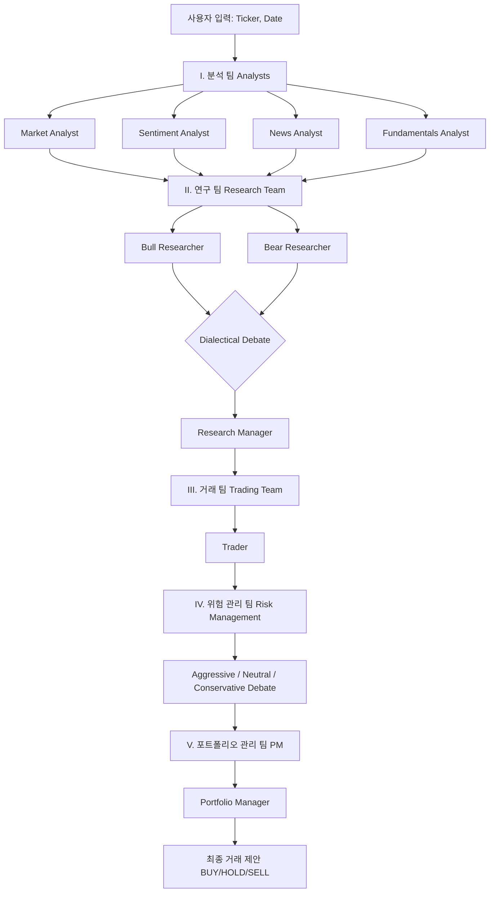

# 📈 TradingAgents: 로컬 LLM 통합 & 한국어 고도화 주식 트레이딩 에이전트 종합 안내서

본 문서는 **Tauric Research**의 오픈소스 멀티 에이전트 금융 트레이딩 프레임워크인 **[TradingAgents](https://github.com/TauricResearch/TradingAgents)**를 기반으로, **사용자의 커스텀 로컬 LLM 연동** 및 **한국어 로컬라이징(현지화) 및 CLI 고도화** 작업을 완료한 시스템의 종합 안내서입니다.

이 문서를 통해 프로젝트의 핵심 아키텍처를 쉽게 이해하고, 즉시 실행 및 검증할 수 있으며, 향후 시스템 개선 및 개발 작업을 원활하게 이어나갈 수 있습니다.

---

## 📂 목차
1. [프로젝트 개요 및 주요 특징](#1-프로젝트-개요-및-주요-특징)
2. [멀티 에이전트 시스템 아키텍처](#2-멀티-에이전트-시스템-아키텍처)
3. [로컬 LLM 통합 기술 세부 정보](#3-로컬-llm-통합-기술-세부-정보)
4. [설치 및 가상 환경 설정](#4-설치-및-가상-환경-설정)
5. [환경 변수 (.env) 설정](#5-환경-변수-env-설정)
6. [사용 방법 및 실행 명령어](#6-사용-방법-및-실행-명령어)
7. [결과물 로그 분석 및 검증](#7-결과물-로그-분석-및-검증)
8. [향후 시스템 확장 및 개선 포인트](#8-향후-시스템-확장-및-개선-포인트)

---

## 1. 프로젝트 개요 및 주요 특징

본 프로젝트는 전통적인 단일 예측 모델 기반의 트레이딩 봇 한계를 넘어, **가상의 전문 투자사(Proprietary Trading Firm) 조직 구조를 모방한 멀티 에이전트 시스템**입니다. **LangGraph**를 기반으로 설계되어 각 역할별 에이전트들이 협력, 토론, 합의 과정을 거쳐 최종 포트폴리오 결정을 내립니다.

### 🌟 핵심 커스터마이징 특징
* **독자적인 로컬 LLM 연동**: 상용 API(OpenAI, Gemini 등) 종속성 없이, 사용자 로컬 장비에서 구동되는 커스텀 API 서버(`http://localhost:8000/api/v1/chat`) 및 초거대 언어 모델(`qwen3.6-27b-uncensored-heretic-v2-native-mtp-preserved`)을 완벽하게 통합했습니다.
* **도구 호출 에뮬레이터 (Tool-Calling Emulator) 개발**: 네이티브 함수 호출(Function Calling) 기능이 없는 로컬 텍스트 모델에서도 LangGraph의 실시간 주식 데이터 수집 및 보조지표 추출 도구들을 매끄럽게 호출할 수 있도록 프롬프트 엔지니어링 및 입출력 인터셉트 기술을 탑재했습니다.
* **CLI 한국어 로컬라이징 및 고도화**: CLI 메인 대시보드 및 단계별 의사결정 설문 프로세스를 전부 직관적이고 친절한 한국어로 전면 리뉴얼했습니다. 로컬 커스텀 모델이 메뉴 기본값으로 탑재되어 번거로운 모델 입력 과정이 생략되었습니다.

---

## 2. 멀티 에이전트 시스템 아키텍처

프레임워크 내부에서는 전문 애널리스트 및 리서치 팀이 구성되어 복잡한 추론 단계를 밟습니다.



### 👥 에이전트 역할 상세 설명
1. **분석 팀 (Analyst Team)**:
   * **Market Analyst**: 주식 기술적 지표 및 이동평균선(SMA, EMA, RSI, MACD, Bollinger Bands 등)을 분석합니다.
   * **Sentiment Analyst**: StockTwits 카시태그 메시지 및 Reddit(r/wallstreetbets 등) 커뮤니티의 소매 투자자 감정 상태를 분석합니다.
   * **News Analyst**: 실시간 주요 글로벌/거시 경제 뉴스 및 기업 공시를 수집합니다.
   * **Fundamentals Analyst**: 재무제표(Balance Sheet, Income Statement, Cash Flow) 등을 종합적으로 검토합니다.
2. **연구 팀 (Research Team)**:
   * **Bull Researcher**: 매수 관점에서 강력한 재무 지표와 차트 돌파 가능성을 옹호합니다.
   * **Bear Researcher**: 매도/리스크 관점에서 벨류에이션 오버슈팅, 부채 부담, 마진 압박을 경고합니다.
   * **Research Manager (Judge)**: 양측의 변증법적 토론(Dialectical Debate) 내용을 요약하고 최적의 진입 시점과 목표 타겟을 설정하여 종합 리서치 보고서를 생성합니다.
3. **거래 팀 (Trading Team)**:
   * **Trader**: 리서치 보고서를 바탕으로 구체적인 거래 집행 전략(목표가, 진입가, 손절가, 포지션 비중)을 작성합니다.
4. **위험 관리 팀 (Risk Management Team)**:
   * 포트폴리오 노출 비중 및 리스크 가이드라인 적합 여부를 검토하고, 공격적/보수적 성향의 에이전트들이 공방을 펼칩니다.
5. **포트폴리오 관리 팀 (Portfolio Management Team)**:
   * **Portfolio Manager**: 최종적인 투자의견(Overweight / Underweight / Hold)을 확정하여 최종 거래안을 승인 및 출력합니다.

---

## 3. 로컬 LLM 통합 기술 세부 정보

사용자의 독자적인 로컬 LLM을 지원하기 위해 설계된 커스텀 어댑터 계층의 구조입니다.

### 🔌 1) 커스텀 LLM 어댑터 (`local_client.py`)
* **위치**: `tradingagents/llm_clients/local_client.py`
* **역할**: LangChain의 추상 클래스인 `BaseChatModel` 및 `BaseLLMClient`를 상속받아 커스텀 API 형식에 맞게 변환합니다.
* **입력 매핑**: LangChain의 `BaseMessage` 히스토리(System, Human, AI, Tool 메시지)를 수집하여, 시스템 지침은 `system_prompt`로, 대화 이력 및 도구 출력 결과는 `input` 필드로 자동 직렬화하여 페이로드를 생성합니다.
* **출력 파싱**: 로컬 API 응답 JSON에서 `"output"` 필드를 뒤져 `type == "message"`인 블록을 추출하고 이를 정규 `AIMessage` 텍스트로 치환합니다.

### 🛠️ 2) 도구 호출 에뮬레이터 (Tool-Calling Emulator)
* **문제점**: 네이티브 OpenAI 함수 호출 규격이 없는 일반 텍스트 추론 모델은 도구(API) 호출을 하지 못하고 정지합니다.
* **해결책**:
  1. `bind_tools(tools)`가 호출되면 바인딩된 모든 도구의 이름, 설명, 인자 스키마를 동적으로 포맷팅하여 `system_prompt`에 자동 주입합니다.
  2. 모델에게 "도구를 호출하려면 반드시 지정된 `json` 블록(예: `{"tool": "get_stock_data", "args": {...}}`)으로만 답변할 것"을 강제합니다.
  3. API 응답 텍스트에 정규식 매칭을 돌려 해당 JSON 블록이 감지되면 즉시 가로채어 LangChain 내부의 `tool_calls` 객체로 변환하여 반환합니다.
  4. 이를 통해 LangGraph 프레임워크가 실시간 데이터 도구들을 정상적으로 작동시킬 수 있습니다.

### 🖥️ 3) CLI 공급자 및 카탈로그 등록
* **공급자 추가**: `cli/utils.py` 내의 `PROVIDERS` 리스트에 `Local Custom LLM` (엔드포인트: `http://localhost:8000/api/v1/chat`, 키: `local`)을 새롭게 바인딩했습니다.
* **기본 모델 등록**: `tradingagents/llm_clients/model_catalog.py`의 `MODEL_OPTIONS["local"]` 카탈로그를 작성하여 사용자의 독자 모델 명칭인 `qwen3.6-27b-uncensored-heretic-v2-native-mtp-preserved`를 퀵/딥 씽킹 모델의 기본 선택지로 사전 정의했습니다.

---

## 4. 설치 및 가상 환경 설정

해당 프로젝트 폴더에서 Python 3.10+ 버전을 사용하여 가상 환경을 구축하고 의존성을 다운로드합니다.

```powershell
# 1. 프로젝트 폴더로 이동
cd D:\DEV\TradingAgents

# 2. Python 가상 환경 생성
python -m venv .venv

# 3. 가상 환경 활성화 (Windows PowerShell 기준)
.venv\Scripts\Activate.ps1

# 4. 프레임워크 의존성 및 패키지를 편집 가능(Editable) 모드로 설치
pip install -e .
```

---

## 5. 환경 변수 (.env) 설정

로컬 API 경로 및 외부 금융 데이터 수집 API 키를 보관하는 핵심 설정 파일입니다.
`D:\DEV\TradingAgents\.env` 파일의 내용입니다.

```env
# LLM 공급자 설정 (local로 지정 시 커스텀 로컬 LLM 구동)
TRADINGAGENTS_LLM_PROVIDER=local
TRADINGAGENTS_DEEP_THINK_LLM=qwen3.6-27b-uncensored-heretic-v2-native-mtp-preserved
TRADINGAGENTS_QUICK_THINK_LLM=qwen3.6-27b-uncensored-heretic-v2-native-mtp-preserved
TRADINGAGENTS_LLM_BACKEND_URL=http://localhost:8000/api/v1/chat

# Finnhub API Key (실시간 글로벌 뉴스, 소셜 미디어 센티먼트, 재무제표 팩터용)
FINNHUB_API_KEY=d8ad2l9r01ql25r72te0d8ad2l9r01ql25r72teg
```

---

## 6. 사용 방법 및 실행 명령어

프로젝트 구동을 위해 준비된 두 가지 주요 실행 방식입니다.

### 🖥️ 방식 A: 대화형 한국어 CLI 대시보드 실행 (강력 추천)
완벽하게 번역되고 로컬 모델 연동이 최적화된 CLI 대시보드를 터미널에서 즉시 실행합니다.

```powershell
.venv\Scripts\python -m cli.main
```
* **동작 및 조작 방법**:
  1. 화면에 대형 웰컴 문구와 가이드라인이 표시됩니다.
  2. 분석할 티커(예: `TSLA`, `AAPL`, `NVDA`)를 입력하고 엔터를 누릅니다.
  3. 분석 날짜(기본값: 오늘 날짜)를 설정하고 엔터를 누릅니다.
  4. 최종 보고서의 출력 언어를 선택합니다. (**`Korean (한국어)`** 선택 가능)
  5. 분석을 진행할 애널리스트 팀을 구성합니다. (스페이스바 조작)
  6. 사용할 LLM 공급자로 목록에서 **`Local Custom LLM`**을 선택합니다.
  7. 사용할 모델을 물어볼 때 자동으로 기본 탑재된 **`qwen3.6-27b-uncensored-...`**를 확인하고 엔터를 누릅니다.
  8. 실시간으로 에이전트들이 도구를 돌려 데이터를 수집하고 토론하는 라이브 그래프 스트리밍 현황판이 아름답게 표시됩니다.

### 🐍 방식 B: 자동화 스크립트 실행 (개발자 및 배치 테스트용)
특정 티커와 날짜를 인자로 넘겨 터미널에 결과를 즉시 반환받는 스크립트입니다.

```powershell
.venv\Scripts\python run_trading.py --ticker AAPL --date 2026-05-25
```
* **옵션**:
  * `--ticker <SYMBOL>`: 분석할 주식 기호 (기본값: AAPL)
  * `--date <YYYY-MM-DD>`: 시뮬레이션 일자 (기본값: 2026-05-25)
  * `--debug`: 활성화 시 에이전트들 간의 내부 주고받는 원시 프롬프트 로그를 상세하게 디버깅 출력합니다.

---

## 7. 결과물 로그 분석 및 검증

시뮬레이션이 성공적으로 완수되면 원시 JSON 상태와 변증법적 토론 마크다운 기록이 디스크에 안전하게 격리 보관됩니다.

### 🗃️ 1) 종합 상태 보관 로그 (JSON)
* **기본 경로**: `C:\Users\user\.tradingagents\logs\<TICKER>\TradingAgentsStrategy_logs\`
* **파일명 예시**: `full_states_log_2026-05-25.json`
* **포함 데이터**:
  * 각 개별 애널리스트의 원시 분석 보고서 텍스트
  * Bull/Bear Researcher 간 나누었던 실시간 옥신각신 토론 히스토리 전량
  * Trader가 설정한 목표가, 진입가, 손절가 세부 매개변수
  * 최종 결정을 확인한 Portfolio Manager의 투자의견 결정 내역

### 📝 2) 마크다운 보고서 보관 로그
* **기본 경로**: `C:\Users\user\.tradingagents\logs\<TICKER>\TradingAgentsStrategy_logs\<DATE>\`
* **보관 방식**:
  * `1_analysts/`: 시장분석, 재무분석, 뉴스분석 개별 마크다운 파일
  * `2_research/`: 매수/매도 토론 과정 및 매니저 판결서 마크다운
  * `3_trading/`: 최종 포지션 구축 계획서
  * `complete_report.md`: 모든 보고서가 합쳐진 인쇄 가능한 대형 통합 마크다운 보고서 파일

---

## 8. 향후 시스템 확장 및 개선 포인트

본 시스템을 유지보수하거나 기여하려는 개발자를 위한 주요 확장 가이드라인입니다.

### 🔍 1) 데이터 수집 도구 추가
만약 한국 시장(KRX)의 전용 API나 네이버 금융 크롤러 도구를 결합하고 싶다면:
1. `tradingagents/agents/utils/agent_utils.py`에 새 함수를 선언하고 데이터 수집 로직을 구현합니다.
2. `tradingagents/agents/analysts/market_analyst.py`의 `tools = [...]` 배열에 구현한 도구를 추가합니다.
3. 로컬 LLM 에뮬레이터가 프롬프트 가이드에 알아서 실시간으로 갱신해 주어 즉각 연동됩니다.

### 📉 2) 로컬 모델의 JSON 구조화 출력 개선
현재 로컬 모델 특성상 엄격한 Pydantic 구조화 출력이 간헐적으로 유효성(Validation) 오류를 낼 수 있습니다.
* 프레임워크에 이미 **Graceful Fallback(자유 텍스트 대체 생성)** 기능이 구현되어 파이프라인 정지 현상은 예방되고 있지만, 더 높은 정확도를 원한다면 `local_client.py`에서 JSON 유효성 검사 루틴을 추가로 삽입하고 에러 메시지를 포함한 셀프 수정(Self-Correction) 피드백 루프 코드를 얹어 보완할 수 있습니다.

### 🏷️ 3) 한글 프롬프트 튜닝
* 기본 에이전트들 간의 전문적인 금융 변증법 토론의 질을 보장하기 위해 내부 대화는 영어로 진행되며, 분석 보고서만 한글로 최종 렌더링되게 설계되어 있습니다.
* 만약 내부 애널리스트와 연구원들의 프롬프트를 전면 한국어로 수정하고 싶다면 `tradingagents/agents/utils/agent_utils.py`의 `get_language_instruction()` 또는 개별 에이전트 프롬프트 파일을 수정하여 프롬프트 레벨의 한글화를 제어할 수 있습니다.
