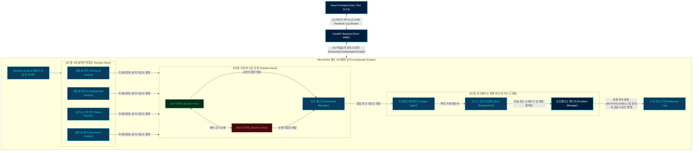

# 📈 NeuralVibe TradingAgents: 풀스택 멀티 에이전트 금융 트레이딩 플랫폼

<div align="center">

<!-- 기술 스택 및 빌드 상태 네온 뱃지 라인업 -->


<br>


<p align="center" style="font-size: 1.2rem; font-weight: bold; margin-top: 15px;">
  글로벌 헤지펀드의 의사결정 체계를 가상 시장에 시뮬레이션하고,<br>
  Bloomberg 감성의 초프리미엄 다크 네온 대시보드를 선사하는 독자적인 풀스택 AI 트레이딩 플랫폼.
</p>

</div>

---

## 🧭 프로젝트 아키텍처 및 데이터 흐름도

본 플랫폼은 비동기 REST API와 실시간 SSE 로깅 스트리밍 브릿지를 통해 프론트엔드와 백엔드가 유기적으로 격리되어 소통하며, 핵심 AI 트레이딩 모델은 100% 무결하게 가동되는 최신 **비침습 상속형 데코레이터 아키텍처**로 설계되었습니다.



---

## 🧠 백엔드(Core Engine) 심층 분석: 주가 의사결정 도출 프로세스

NeuralVibe TradingAgents의 백엔드는 복잡한 원시 데이터를 융합하여 정량적·정성적으로 다각도 필터링을 거치고, 최종적으로 포트폴리오 매니저가 서명하는 투자 실행문(BUY, HOLD, SELL)을 도출하기까지 **5단계 분산 에이전트 합의 파이프라인**을 작동합니다.

### 1단계: 수치 및 오피니언 데이터 흡수 & 4대 전문 분석가
- **데이터 흡수**: `yfinance` 엔진을 통해 대상 티커의 최근 180일간의 가격 정보(오픈, 고가, 저가, 종가, 거래량)를 캔들스틱 단위로 추출하고, 웹 크롤러를 돌려 거시경제 뉴스 헤드라인과 소셜 투자 커뮤니티(Reddit, StockTwits) 피드를 비동기적으로 스크랩합니다.
- **기술적 분석가 (Technical Analyst)**: SMA 50/200 골든크로스/데드크로스 동향, EMA 10의 단기 모멘텀 지지선, RSI 과매수/과매도(70/30) 오실레이터 스코어, MACD 시그널 수렴·발산을 정밀 연산하여 기술적 진입/이탈 타겟을 정의합니다.
- **기본적 분석가 (Fundamentals Analyst)**: 최근 분기 재무제표의 EPS 성장률, 매출 추이, PER/PBR 밸류에이션 밴드, 부채 비율을 가중 계산하여 해당 기업이 지닌 내재적 안전마진을 계측합니다.
- **뉴스 및 감성 분석가 (News & Sentiment Analyst)**: 유동 뉴스 및 소셜 피드의 긍정/부정 비율을 머신러닝 임베딩 점수로 정규화하여 시장 대중들의 단기 탐욕 및 공포 지수를 계량화합니다.

### 2단계: 리서처 아레나 난상 토론 (Debate Arena)
- 분석가들의 팩트 시트가 발행되면, 인지적 편향(Confirmation Bias)을 소멸시키기 위해 **Bullish(상승론자) 리서처**와 **Bearish(하락론자) 리서처**가 아레나 링 위에서 팽팽하게 맞섭니다.
- Bullish 에이전트는 기회 요인과 극대화 가능한 알파 수익을 강변하고, Bearish 에이전트는 숨겨진 오프밸런스 리스크와 기술적 하방 돌파 가능성을 들이밀며 난상 토론을 주고받습니다.
- **연구 매니저 (Research Manager)**는 양측의 논쟁을 청취하고 치우침 없는 '글로벌 경제 리서치 종합 타협문'을 최종 작성합니다.

### 3단계: 트레이더의 투자 거래 제안서 설계
- **트레이더 에이전트 (Trader Agent)**는 연구 매니저의 타협 시트를 정밀 인수받아, 실제 거래소에 제출할 구체적인 주문 전략을 수립합니다.
- 단순 매수 의견을 넘어 **'진입 기준 목표가'**, **'손절가(Stop-Loss)'**, **'1차 익절가(Take-Profit)'**, 그리고 포트폴리오 자산 대비 **'최적의 베팅 크기(Kelly Criterion 기반 배분)'**를 정밀하게 계측하여 공식 거래 제안서를 컴파일합니다.

### 4단계: 리스크 관리위원회의 다중 레이어 규제
- **리스크 관리위원회 (Risk Management)**는 트레이더가 제안한 거래 계획서의 안전 장치를 무력화할 수 있는 거시 변동성을 검사합니다.
- 보수적(Conservative), 중립적(Neutral), 공격적(Aggressive) 성향의 리스크 커미티 에이전트들이 투자 전략의 자산 배분 적정성과 시스템적 위험(Systemic Risk) 노출도를 필터링하고 위험이 감지될 경우 포지션 축소 지시가 담긴 '종합 리스크 통제안'을 최종 PM에 하달합니다.

### 5단계: 포트폴리오 매니저의 최종 투자 서명 (Final Judgment)
- **포트폴리오 매니저 (Portfolio Manager)**는 1~4단계의 모든 원문과 논쟁 이력, 리스크 통제 권고안을 종합하여 최종 승인 여부를 정합니다.
- 최종 의사결정(BUY, HOLD, SELL)에 낙찰되면, Ollama 로컬 LLM 환경에서도 흔들림 없도록 설계된 프롬프트 제어를 통해 **100% 품격 있고 세련된 한국어 금융 전문 문체**로 최종 투자 보고서를 발행하고 이를 로컬 지식 학습 및 시각화 대시보드로 전달합니다.

---

## 🎨 프론트엔드(UI/UX & 사용성) 심층 분석: 금융 단말기 시각화 명세

NeuralVibe의 프론트엔드는 일반적인 모니터링 수준을 뛰어넘어, 사용자가 시장 흐름을 즉각 포착하고 대규모 에이전트 군집의 동작을 직관적으로 제어할 수 있도록 **초고해상도 다크 네온 테마 및 사용성 혁신**을 탑재하였습니다.

### 1. Bloomberg 금융 단말기 감성 다크 네온 모드
- **디자인 아이덴티티**: 눈의 피로도를 최소화하는 미드나잇 블루(Midnight Blue, `#001e3d`) 바탕에, 퀀트 통신 링크를 나타내는 일렉트릭 네온 블루(Neon Blue, `#00e9f5`), 강세 시그널인 딥 불릿 그린(Bull Green, `#14c290`), 약세 시그널인 네온 베어 레드(Bear Red, `#f87171`) 컬러의 정밀한 HSL 대비를 이식하였습니다.
- **모션 가이드라인**: 비동기 데이터 로딩 및 API 소통이 발생할 때마다 UI 경계면을 따라 미세하게 흐르는 **네온 펄스 애니메이션(Pulse Motion)**을 적용하여 대시보드가 살아 숨 쉬는 유기적 반응성을 제공합니다.

### 2. 세로 화면 극대화 토글 (Maximize / Minimize) 및 실시간 차트 리사이징
- **사용성 기획 의도**: 메인 화면이 차트와 의사결정 아레나로 나누어져 있어 한쪽의 깊은 디테일을 보고 싶을 때 화면의 물리적 크기가 모자라던 한계를 전격 극복했습니다.
- **원터치 확장 컴포넌트**: 각 패널 우측 헤더의 네온 [확대/축소] 버튼을 클릭하면, 다른 컴포넌트 영역이 일시 지연 소멸하고 선택한 패널이 전체 세로 영역(`calc(100vh - 100px)`)을 100% 가득 채우게 됩니다.
- **반응형 리사이징 트리거**: 차트 영역이 세로로 확장되는 순간, 차트 컴포넌트(`ChartPanel.tsx`) 내부의 `mainChart` 높이를 `310px`에서 `550px`로, 보조지표 높이를 `110px`에서 `180px`로 실시간 변환하고 `resize()` 이벤트를 발행하여 단 1px의 화질 저하나 그래픽 찌그러짐 없이 완벽하게 반응하는 퀀트 캔들 차트를 렌더링해 냅니다.

### 3. Server-Sent Events (SSE) 실시간 진척 브릿지
- 백엔드와 프론트엔드는 HTTP 폴링 대신 **Server-Sent Events(SSE)** 커넥션 스트림을 개설합니다.
- 백엔드의 각 LangGraph 노드가 퀀트 연산을 마칠 때마다 실시간 진척도(0% ~ 100%) 정보와 에이전트의 원시 터미널 텍스트 로그가 SSE 채널을 통해 초고속으로 스트리밍되어, 사용자는 대시보드를 떠나지 않고도 현재 어느 에이전트가 어떤 생각을 하고 있는지 초 단위로 모니터링할 수 있습니다.

### 4. 만능 마크다운-JSX 실시간 컴파일러
- 금융 보고서 내의 정밀 표(Table) 구조(`|` 기호)나 인용 박스(`>` 기호)가 HTML 렌더링 시 뭉개지거나 한 줄로 합쳐지던 기존의 심각한 화면 버그를 완벽히 해결했습니다.
- **자체 컴파일 파서**: React 컴포넌트 `ReportDetails.tsx` 내에 이식된 전용 마크다운 파서가 `|`로 시작하고 끝나는 텍스트 블록을 실시간 감지하여, 표 테두리가 입혀진 수려한 HTML `<table>` 요소로 재구조화하고 인용 쿼트 기호는 블룸버그 단말기 스타일의 고급스러운 좌측 세로 보더 바 박스로 실시간 렌더링해 냅니다.

---

## 🚀 1분 퀵스타트 및 실행 가이드 (Quick Start)

### 📌 시스템 요구 사양
- **Python** >= 3.10
- **Node.js** >= 18 (npm 포함)
- **Ollama** (로컬 LLM 가동용, 선택 사항)

---

### 📥 1. 백엔드(FastAPI) 설치 및 서버 실행

1. **저장소를 복제하고 프로젝트 디렉토리로 진입합니다:**
   ```bash
   git clone https://github.com/NeuralVibe/TradingAgents.git
   cd TradingAgents
   ```

2. **Python 가상환경을 생성하고 가동합니다:**
   ```bash
   python -m venv .venv
   # Windows 환경 활성화
   .venv\Scripts\activate
   # macOS/Linux 환경 활성화
   # source .venv/bin/activate
   ```

3. **패키지 및 필수 웹 프레임워크 의존성을 배포합니다:**
   ```bash
   pip install -e .
   pip install fastapi uvicorn pydantic sqlalchemy
   ```

4. **환경 설정 파일 구성 (`.env`):**
   루트에 `.env.example` 파일을 복제하여 `.env`를 신설하고 설정을 수정합니다:
   ```bash
   cp .env.example .env
   ```
   **네온 강제 한국어 설정을 포함한 필수 변수 설정 예시**:
   ```ini
   LLM_PROVIDER=local                 # local, openai, gemini, anthropic 등 선택
   OLLAMA_BASE_URL=http://localhost:11434/v1
   LOCAL_MODEL_NAME=llama3            # 로컬 가동 Ollama 모델 지정
   ALPHA_VANTAGE_API_KEY=your_key     # yfinance 보완용 금융 키 (선택)
   OUTPUT_LANGUAGE=Korean             # 모든 에이전트 리포트 100% 한국어 출력 강제화
   ```

5. **FastAPI 백엔드 서버를 기동합니다:**
   ```bash
   python -m uvicorn backend.app.main:app --host 127.0.0.1 --port 8080 --reload
   ```

---

### 🖥️ 2. 프론트엔드(React + Vite) 설치 및 대시보드 실행

1. **프론트엔드 디렉토리로 진입합니다:**
   ```bash
   cd frontend
   ```

2. **Node 패키지를 정밀하게 주입합니다:**
   ```bash
   npm install
   ```

3. **Vite 개발용 웹 서버를 가동합니다:**
   ```bash
   npm run dev
   ```
   가동이 끝나면 브라우저를 열고 **`http://localhost:5173`**에 접속하여 황홀한 초프리미엄 퀀트 아레나 플랫폼을 만나보세요!

---

## 💾 영속성 및 자가 학습 체크포인트 구조

1. **결정 로그 자가 학습 (Decision Reflection Log)**
   - 매 시뮬레이션이 성공 종료되면 포트폴리오 매니저의 투자 서명 리포트는 파트너님의 OS 사용자 홈 경로 내 `~/.tradingagents/memory/trading_memory.md`에 구조적으로 기록됩니다.
   - 다음 거래 분석이 시작될 때 이전 거래 판단의 실제 실현 수익률(Alpha vs S&P 500)을 yfinance로 자동 소급 역추적하여, "이전 거래에서 무엇이 맞았고 무엇이 틀렸는지"에 대한 뼈아픈 **자가 반성(Reflection) 데이터**를 생성하고 이를 다음 에이전트 가동 시 프롬프트 기억 장치로 재주입하여 갈수록 완벽한 퀀트 판단력을 갖춥니다.
2. **체크포인트 복구 엔진 (Checkpoint Resume)**
   - API 일시 장애, 갑작스러운 정전 등으로 시뮬레이션 스레드가 뻗었을 때 처음부터 연산을 다시 시작하는 토큰 낭비를 원천 예방합니다.
   - `--checkpoint` 플래그가 가동되면 `~/.tradingagents/cache/checkpoints/{ticker}.db` SQLite에 매 에이전트 노드가 완료될 때마다 상태가 오프라인 세이브됩니다. 장애 복구 후 재시동 시 이전 충돌 직전 노드 지점부터 안전하게 즉시 연산이 이어집니다(Resume).

---
<p align="center" style="color: #00e9f5; font-size: 0.95rem; font-weight: bold; letter-spacing: 2px; margin-top: 30px;">
  NEURALVIBE PORTFOLIO SYSTEMS © 2026. ALL RIGHTS RESERVED.
</p>
