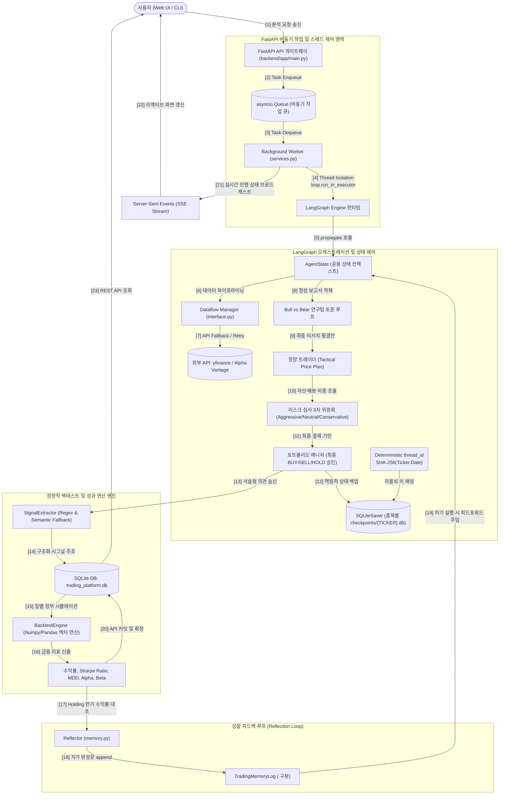

# 🧭 TradingAgents 기술 명세서 통합 마스터 인덱스 (Master Index)

본 마스터 인덱스는 TradingAgents 백테스트 및 분석 플랫폼의 전체 구조, 핵심 아키텍처 개념, 모듈별 상세 사양 및 트러블슈팅 가이드를 통합 제공하는 종합 명세서입니다. 신규 개발자 및 운영자가 시스템의 데이터 흐름과 컴포넌트 간 상호작용을 손쉽게 파악하고 즉각적인 디버깅 및 유지보수를 수행할 수 있도록 최고 수준의 실무 정보를 수록했습니다.

플랫폼은 다양한 인공지능 에이전트(Multi-Agents) 기반의 시장 분석, 토론 및 리스크 평가 파이프라인을 구축하고, 백그라운드 백테스트 엔진과 웹 대시보드 인터페이스를 통해 전략 성과를 정량적으로 평가할 수 있도록 설계되었습니다. 또한 핵심 아키텍처의 직관적 이해를 돕기 위해 고품격 기술 일러스트 자산이 `/docs/attachments/` 하위에 탑재되어 있으며, 본 명세서는 옵시디언(Obsidian) 노트 링크에 최적화되어 있습니다.

![[tradingagents_overview.png]]

---

## 🎨 플랫폼 전반 데이터 & 제어 루프 아키텍처

플랫폼의 전체 컴포넌트가 어떻게 유기적으로 맞물려 실행되는지 도해한 종합 제어 아키텍처입니다:

---

## 📖 플랫폼 핵심 기술 및 금융 용어 사전 (Glossary)

시스템 설계와 구현을 이해하는 데 필요한 핵심 금융 공학 및 컴퓨터 과학 개념들의 명확한 정의입니다.

### 📈 금융 공학 및 데이터 관련 기초 개념

> [!NOTE]
> **티커 (Ticker)**
> * 주식 및 자산 시장에서 개별 상장 기업 또는 거래 대상 자산에 부여한 고유 식별 코드입니다. 
> * 본 플랫폼은 미국 주식 시장 종목을 주로 대상으로 삼으며, Apple Inc. $\rightarrow$ `AAPL`, SPDR S&P 500 ETF $\rightarrow$ `SPY`, Tesla Inc. $\rightarrow$ `TSLA` 등 표준 규격을 사용합니다.

> [!NOTE]
> **OHLCV 데이터**
> * 특정 거래 기간(일, 시간, 분 등) 동안의 자산 가격 움직임과 거래량을 나타내는 시계열 데이터의 표준 스키마입니다.
> * 본 플랫폼의 백테스트 엔진은 일별(Daily) OHLCV 세그먼트를 기준으로 구동됩니다.

![[ohlcv_candle_chart.png]]

* **O (Open, 시가)**: 해당 기간의 첫 번째 체결 가격.
* **H (High, 고가)**: 해당 기간 중 거래된 최고 가격.
* **L (Low, 저가)**: 해당 기간 중 거래된 최저 가격.
* **C (Close, 종가)**: 해당 기간의 최종 체결 가격으로, 백테스트 엔진의 기본 정산가로 활용됩니다.
* **V (Volume, 거래량)**: 해당 기간 동안 거래된 총 주식 수량.

> [!TIP]
> **백테스팅 (Backtesting)**
> * 특정 거래 전략이나 에이전트의 결정 알고리즘을 과거 시계열 주가 데이터에 대입하여 가상 매매를 구동하고, 전략의 성과와 안정성을 정량적으로 사전 검증하는 시뮬레이션 기법입니다.
> * 본 플랫폼은 Numpy와 Pandas의 고속 행렬 외적 연산을 기반으로 설계된 **정량 벡터화 백테스팅 엔진(Vectorized Backtest Engine)**을 내장하고 있습니다.

> [!CAUTION]
> **슬리피지 (Slippage)**
> * 주문 제출 시점의 시장가와 실제 체결된 가격 사이의 미세한 가격 차이(오차)로 인해 발생하는 가상 거래 손실 및 비용입니다. 급격한 변동성이나 대량 주문 시 발생하며 백테스트의 현실성을 높이기 위한 필수 반영 요소입니다.
> * 본 플랫폼은 실전 거래의 현실성을 반영하기 위해 매 체결 시 마다 **0.05% (`slippage=0.0005`)**의 페널티 비용을 자산 곡선에서 강제 차감합니다.

> [!WARNING]
> **최대 낙폭 (MDD, Max Drawdown)**
> * 누적 수익률 곡선에서 역사적 최고점(Peak) 대비 최저 골짜기(Trough)까지 기록된 최대 손실 비율입니다. 전략이 겪을 수 있는 최대 리스크 임계치를 정량화하는 핵심 지표입니다.

![[sharpe_mdd_concept.png]]

> [!TIP]
> **샤프 지수 (Sharpe Ratio)**
> * 포트폴리오의 단위 위험(변동성) 대비 초과 수익률(Risk-adjusted Return)을 측정하는 가성비 지표입니다. 무위험 수익률을 `0`으로 가정하여 계산하며, 이 지수가 높을수록 동일 위험 대비 안정적이고 효율적인 수익 모델을 보유하고 있음을 뜻합니다.

> [!NOTE]
> **알파 (Alpha) & 베타 (Beta)**
> * **베타(Beta)**: 벤치마크 시장 지수(예: S&P 500 / `SPY`)의 변동에 대한 자산 포트폴리오의 민감도(체계적 위험)를 측정하는 상관계수입니다.
> * **알파(Alpha)**: 베타 계수로 조정된 시장 변동 위험을 제외하고, 에이전트의 독자적인 의사결정 및 종목 선정 능력으로 창출해 낸 순수 초과 수익률(비체계적 초과수익)입니다.

---

### 💻 컴퓨터 과학 및 시스템 관련 핵심 개념

> [!IMPORTANT]
> **에이전트 (Agent)**
> * 지정된 프롬프트 룰과 주어진 컨텍스트를 활용하여 스스로 문제 상황을 분석하고, 도구(Tool)를 적극 활용하여 최적의 결정을 도출하는 자율적 AI 개체입니다.
> * TradingAgents는 4대 기초 애널리스트(기술/재무/감성/뉴스), 찬반 토론팀(Bull/Bear), 의견 중재역(Research Manager), 수리 계획팀(Trader), 리스크 위원회 3인, 의사결정권자(PM)가 유기적으로 엮인 **멀티 에이전트 조율망**으로 설계되었습니다.

> [!NOTE]
> **FastAPI API 게이트웨이**
> * Python 기반의 고성능, 비동기 웹 프레임워크로, 백테스트 요청 접수 및 실시간 진행 상태 조회 등의 API 엔드포인트를 웹 대시보드와 중개하는 플랫폼의 게이트웨이 서비스입니다.

> [!IMPORTANT]
> **asyncio.Queue (비동기 작업 큐)**
> * 플랫폼 내부의 다중 백테스트 요청을 선입선출(FIFO) 방식으로 관리하여 병목 현상과 메모리 과부하를 방지하는 비동기 대기열 시스템입니다. 
> * 무거운 랭그래프 시뮬레이션 연산이 비동기 메인 이벤트 루프를 고사시키는 현상을 막기 위해, 백그라운드 워커가 `loop.run_in_executor`를 활용해 연산 스레드를 격리 구동합니다.

> [!NOTE]
> **SSE (Server-Sent Events)**
> * 단일 HTTP 지속 연결을 통해 서버에서 브라우저 방향으로 이벤트를 스트리밍하는 실시간 단방향 데이터 전송 기술입니다. 
> * 에이전트의 노드 실행 진행 상황(Progress)과 실시간 에이전트 로그를 웹 대시보드에 무중단 전송하는 데 사용됩니다.

> [!IMPORTANT]
> **스레드 세이프 락 (Thread-safe Lock / Mutex)**
> * 멀티스레딩 환경에서 공유 자원(예: 누적 API 토큰 카운터 등)에 동시에 쓰기 작업을 수행할 때 발생하는 데이터 오염(Race Condition)을 방지하는 상호 배제(Mutex) 동기화 메커니즘입니다. 
> * Python의 `threading.Lock()`을 활용하여 임계 영역(Critical Section)의 동시 진입을 통제합니다.

> [!NOTE]
> **SQLiteSaver 체크포인터 (Checkpointer)**
> * LangGraph 상태 머신의 각 단계(Node) 실행 직후 현재 상태(State)와 변수들을 데이터베이스에 실시간 백업해 두는 지속성 장치입니다. 
> * 실행 중 예외 상황으로 장애가 발생하더라도 마지막 세이브 시점부터 유실 없이 안전하게 복구 및 이어하기를 수행할 수 있게 돕습니다.

---

## 📂 통합 기술 명세서 목록 (TOC)

시스템의 각 레이어와 엔진 사양은 아래의 전문 마크다운 문서들로 분할되어 정밀 상세 명세되어 있으며, 옵시디언 괄호 링크로 즉시 이동할 수 있습니다.

1. **[[00_master_index.md]] (본 문서)**
   * 마스터 기술 용어 사전(Glossary) 및 아키텍처 기반 시스템 장애 해결 가이드(Troubleshooting) 제공.
2. **[[01_system_architecture.md]] (통합 아키텍처 명세)**
   * 13단계 엔드투엔드 파이프라인의 시퀀스 및 전체 통합 컴포넌트 아키텍처 제공.
3. **[[02_agent_system.md]] (멀티 에이전트 상세 명세)**
   * 공용 상태 컨텍스트(`AgentState`) 상세 스키마 사양, 5대 노드의 I/O 흐름 및 피드백 자가 성찰 루프(`Reflection`) 구조 제공.
4. **[[03_dataflows.md]] (데이터 파이프라인 및 정제 상세 명세)**
   * 동적 API Fallback 라우팅 및 Exponential Backoff 재시도 로직, 선행 데이터 참조를 통한 부정행위를 원천 봉쇄하는 룩어헤드 편향(Look-Ahead Bias) 방지 기술 제공.
5. **[[04_graph_engine.md]] (LangGraph 오케스트레이션 및 체크포인터 명세)**
   * StateGraph와 Conditional Edges 분기 논리 분석, SQLite 체크포인터를 개별 Ticker별 파일로 파티셔닝하여 DB 락을 방지하는 다중 동시성 설계 명세 제공.
6. **[[05_llm_clients.md]] (LLM 서비스 레이어 및 에뮬레이터 상세 명세)**
   * LLM 클라이언트용 Factory 패턴 구현체와, 도구 호출(Tool Calling) 미지원 모델을 위한 Regex 기반 Custom Emulator 파싱 알고리즘 명세 제공.
7. **[[06_backend_api.md]] (FastAPI 비동기 서버 및 정량 백테스트 엔진 명세)**
   * `asyncio.Queue` 기반 비동기 백그라운드 워커 구동 방식, 정성 보고서에서 의사결정 신호를 파싱하는 `SignalExtractor`, Sharpe와 MDD, Alpha, Beta 등의 포트폴리오 백테스트 정량 공식 수학적 사양 제공.
8. **[[07_frontend_dashboard.md]] (React UI 컴포넌트 및 스트리밍 시각화 명세)**
   * 조립식 UI 아키텍처 명세, EventSource를 활용한 실시간 SSE 수신 모듈, Canvas 및 GPU 가속 기반 TradingView Lightweight Charts 시각화 구현체 연동 기법 제공.
9. **[[08_cli_interface.md]] (대화형 CLI 및 동기화 보안 설계 명세)**
   * Typer와 Rich 기반 대화형 터미널 메뉴 루프, LLM 호출 및 토큰 사용을 트래킹하는 `StatsCallbackHandler`와 레이스 컨디션을 방지하기 위한 Thread Mutex Lock 설계 제공.

---

## 🛠️ 아키텍처 기반 장애 진단 및 문제 해결 가이드 (Troubleshooting)

시스템 런타임에 발생할 수 있는 주요 장애 및 오류 시나리오와 아키텍처 관점의 구체적인 해결 가이드라인입니다.

| 발생 장애 증상 | 진단 포인트 | 해결 및 조치 방법 |
| :--- | :--- | :--- |
| **LLM 작동 중단 혹은 도구 미호출** (분석 에이전트가 텍스트만 출력하고 도구를 쓰지 못하고 멈춤) | `tradingagents/llm_clients/local_client.py` 내부 `LocalChatModel` 파서 런타임 | 로컬 LLM이 JSON 형식을 정상적으로 출력했는지 API 로그를 검수하고, [[05_llm_clients.md]]를 참조하여 정규식(`re.search`) 및 `json.loads` 파트의 오류 및 예외 로그를 디버깅합니다. |
| **데이터 수집 API 제한 (HTTP 429 에러)** (Alpha Vantage 등 주요 벤더 호출 시 한도 에러 발생) | `tradingagents/dataflows/interface.py` 내의 Fallback 라우팅 분기 | [[03_dataflows.md]]를 참조하여 `route_to_vendor` 함수가 정상적으로 백업 벤더(yfinance)로 동적 라우팅을 수행하는지 점검하고, `yf_retry` 데코레이터의 Exponential Backoff 대기 시간 설정을 상향 조정합니다. |
| **백테스트 수익률의 비정상적 고평가** (비정상적으로 1000% 이상의 무결점 수익률 도출) | `tradingagents/dataflows/stockstats_utils.py` 내 시계열 가림막 컷오프 | [[03_dataflows.md]]를 참조하여 오늘 분석 날짜(`curr_date`)보다 큰 시계열 행들을 가려내주는 룩어헤드 편향 방지 필터링(`filter_financials_by_date` 및 `load_ohlcv` 분기)이 우회되었거나 해제되었는지 코드 로직을 점검합니다. |
| **백테스트 동시 실행 시 프로그램 교착/튕김** (다중 Ticker 병렬 분석 도중 SQLite 락업 및 예외 종료) | `tradingagents/graph/checkpointer.py` 내부 SQLite 커넥션 | [[04_graph_engine.md]]를 참조하여 전역 데이터베이스 파일 대신 종목별 개별 저장 파일(`checkpoints/{TICKER}.db`)로 완벽 분리가 이루어졌는지 및 데이터 디렉토리 쓰기 권한이 보장되었는지 점검합니다. |
| **병렬 API 호출 통계 누락 / 오차** (스레드 병렬 구동 시 LLM 사용량 통계가 실제보다 누락 기록됨) | `tradingagents/agents/utils/stats_handler.py` 의 `threading.Lock` | [[08_cli_interface.md]]를 참조하여 `StatsCallbackHandler` 클래스 내의 `self._lock` 객체가 임계 자원 가산 영역(`tokens_in`, `tokens_out` 등)을 상호 배제(`with self._lock:`) 방어 중인지 점검합니다. |
| **브라우저 대시보드의 진행 타임라인 굳음** (실행 후 타임라인 프로그레스바가 갱신되지 않음) | `frontend/src/components/Timeline.tsx` 의 `EventSource` 리스너 | [[07_frontend_dashboard.md]]를 참조하여 브라우저의 콘솔 에러 로그를 확인하고, 백엔드 게이트웨이의 SSE API 주소 매핑 및 CORS Origin 허용 정책이 정상적으로 열려있는지 대조합니다. |
| **세션 이어하기 복구 실패** (크래시 후 재구동 시 처음 단계부터 다시 실행됨) | `tradingagents/graph/checkpointer.py` 내 `thread_id` 해시 키 | [[04_graph_engine.md]]를 참조하여 복구 진입 시 입력받은 Ticker 및 Date 문자열의 대소문자와 포맷이 최초 실행 시 매핑된 해시 키 생성 알고리즘 인풋 스펙과 완벽히 일치하는지 `hashlib` 호출 스택을 분석합니다. |
| **우측 실시간 뉴스 카드 글자 넘침 및 레이아웃 깨짐** (헤드라인 및 텍스트 짤림 또는 가로 스크롤바 발생) | `frontend/src/index.css` (.dashboard-grid) 및 `App.tsx` (Sidebar panel) | [[07_frontend_dashboard.md]]를 참조하여 CSS 그리드 칼럼(`240px 1fr 260px;`) 설정과 사이드바의 최대 너비 제한(`maxWidth: "260px"`), 그리고 텍스트 컴포넌트의 단어 분절(`wordBreak: "break-all"`, `whiteSpace: "normal"`) 규칙이 정상 적용되었는지 검수합니다. |
| **뉴스 실시간 AI 해석(Micro-Interpretation) 실행 오류 / 응답 지연** (AI 분석 지연 경고 카드가 상시 표시됨) | `backend/app/routers/market.py` 내의 `/interpret` 라우터와 설정 바인딩 | [[06_backend_api.md]]를 참조하여 프론트엔드의 전역 설정 모달에서 저장된 로컬 LLM `API Base URL` 및 `API Key` 값이 백엔드로 정확히 전달(`NewsInterpretRequest`)되고 작동 중인지 로컬 서버 상태를 점검합니다. |
