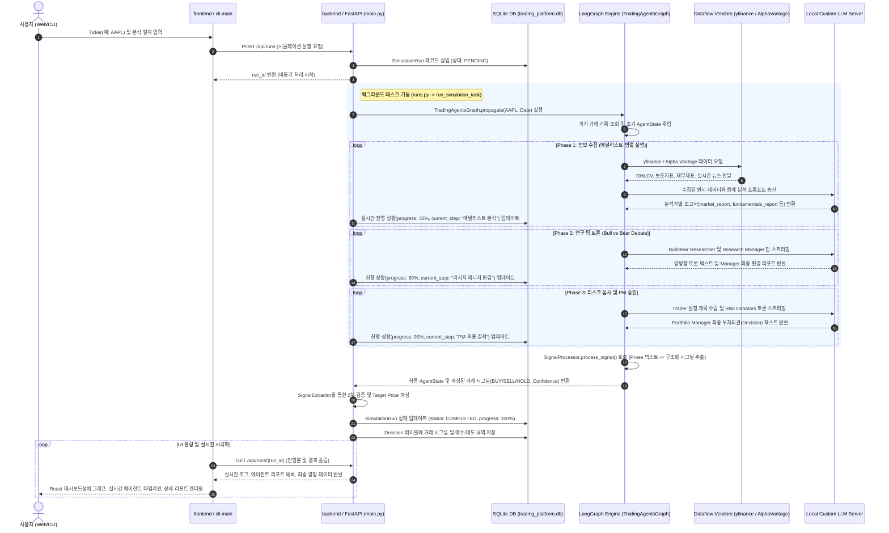

# 🏗️ TradingAgents 통합 시스템 아키텍처 명세서 (System Architecture)

본 명세서는 TradingAgents 플랫폼의 오케스트레이션 설계 구조, 핵심 컴포넌트 구성 요소, 그리고 프론트엔드/CLI 인터페이스부터 백엔드 분산 데이터 파이프라인 및 LLM 추론 엔진에 이르는 전체 데이터 파이프라인(End-to-End Data Pipeline)의 물리적/논리적 아키텍처를 상세 기술합니다. 본 문서는 옵시디언(Obsidian) 전용 링크 및 이미지 임베딩 포맷에 최적화되어 있습니다.

![[system_input_output.png]]

---

## 🏢 에이전트 역할군별 컴포넌트 설계 사양 (Multi-Agent Component Design)

TradingAgents 플랫폼은 결정을 내리기 위해 단일 LLM 인스턴스에 의존하지 않고, 각기 다른 전문 도구(Tools)와 프롬프트 룰을 탑재한 독립적인 **AI 에이전트 컴포넌트(Agent Node)**들의 다각적 협업 루프로 구동되도록 설계되었습니다.

![[trading_prop_firm.png]]

위 아키텍처 오피스 뷰와 같이, 수집된 데이터를 바탕으로 각각의 애널리스트 및 토론 노드들이 공용 상태 컨텍스트 상에서 병렬 혹은 시퀀셜하게 통신하며 의사결정의 신뢰도를 점진적으로 고도화합니다.

### 👥 핵심 에이전트 컴포넌트 명세

> [!NOTE]
> **1. 시장 애널리스트 (Market Analyst Node)**
> * **역할**: 시계열 주가(OHLCV) 및 기술적 보조 지표(RSI, MACD, Bollinger Bands 등)를 활용하여 정량적인 기술적 분석을 전담하는 분석 컴포넌트입니다.
> * **물리 코드**: `tradingagents/agents/analysts/market_analyst.py`
> * **사용 도구**: `get_stock_data`, `get_indicators`

> [!NOTE]
> **2. 시장 감성 애널리스트 (Sentiment Analyst Node)**
> * **역할**: 소셜 미디어 피드, 뉴스 헤드라인, 온라인 커뮤니티 등의 텍스트 데이터 스트림을 분석하여 대중 투심의 과열(Euphoria) 및 공포(Fear) 정도를 수량화하는 감성 스캔 컴포넌트입니다.
> * **물리 코드**: `tradingagents/agents/analysts/sentiment_analyst.py`
> * **사용 도구**: 소셜 및 감성 분석 임베딩 유틸

> [!NOTE]
> **3. 뉴스 애널리스트 (News Analyst Node)**
> * **역할**: 매크로 경제 지표 속보, 기업 대형 공시 및 실시간 시황 기사를 분석하여 특정 종목에 영향을 줄 수 있는 주요 거시경제적 이벤트를 식별 및 정제하는 정보 컴포넌트입니다.
> * **물리 코드**: `tradingagents/agents/analysts/news_analyst.py`
> * **사용 도구**: `get_news`

> [!NOTE]
> **4. 기본적 재무 분석가 (Fundamentals Analyst Node)**
> * **역할**: 분기 재무제표(대차대조표, 손익계산서, 현금흐름표)의 계정 과목들을 정밀 추적하여 부채비율, 영업이익률, PER/PBR 가치 평가 등의 정성적 기초 재무 건전성을 분석하는 컴포넌트입니다.
> * **물리 코드**: `tradingagents/agents/analysts/fundamentals_analyst.py`
> * **사용 도구**: `get_financials`, `get_key_ratios`

> [!TIP]
> **5. 강세 리서처 & 약세 리서처 (Bull vs Bear Debate Nodes)**
> * **역할**: 의사결정의 편향(Confirmation Bias)을 방지하기 위해, 상승 요인(긍정적 논거)과 하락 요인(경제 리스크, 손실 변수)을 극단적으로 탐색하고 공방을 벌이는 토론 세션 노드입니다.
> * **물리 코드**: `tradingagents/agents/researchers/bull_researcher.py`, `tradingagents/agents/researchers/bear_researcher.py`

> [!TIP]
> **6. 연구소장 (Research Manager Node)**
> * **역할**: 강세 리서처와 약세 리서처 간의 토론 이력(`investment_debate_state`)을 종합 평가하고 객관적인 투자 등급 및 중립적 **"리서치 보고서"**(`ResearchPlan` 구조화 문서)를 취합 생성하는 평결 컴포넌트입니다.
> * **물리 코드**: `tradingagents/agents/managers/research_manager.py`

> [!NOTE]
> **7. 정량 트레이더 (Trader Node)**
> * **역할**: 리서치 보고서를 인풋으로 수신하여 구체적인 가상 거래 전술을 구상합니다. 진입 목표가(Entry Price), 1차/2차 목표가(Target Price) 및 엄격한 손절가(Stop Loss) 수치를 설계하여 제안서(`TraderProposal`)를 발급합니다.
> * **물리 코드**: `tradingagents/agents/trader/trader.py`

> [!WARNING]
> **8. 리스크 심의 삼총사 (Aggressive, Conservative, Neutral Risk Analysts)**
> * **역할**: 공격적, 보수적, 중립적 자산 운용 기준을 가진 에이전트들로 구성됩니다. 트레이더의 투자 계획안을 리스크 관리 관점에서 피드백하며, 자산 배분 비중을 최적화하기 위해 다자간 검토를 순환 수행합니다.
> * **물리 코드**: `tradingagents/agents/risk_mgmt/` 하위 모듈

> [!IMPORTANT]
> **9. 포트폴리오 매니저 (Portfolio Manager Node)**
> * **역할**: 이전 시뮬레이션 결과의 피드백 정보가 누적된 오답 노트(Reflection Memory)와 리스크 조정 계획안을 취합 검토하여, 최종 자산 매매 거래 사인을 승인하고 결정 정보(`BUY/SELL/HOLD`)를 확정하는 최고 의사결정 컴포넌트입니다.
> * **물리 코드**: `tradingagents/agents/managers/portfolio_manager.py`

---

## 🔄 엔드투엔드 데이터 파이프라인 (Data Pipeline Sequence)

아래의 시퀀스 다이어그램은 프론트엔드/CLI의 사용자 요청 시점부터 데이터 수집, 랭그래프 기반의 분산 토론 추론, 백엔드 정량 신호 파싱 및 데이터베이스 영구 갱신까지 이어지는 엔드투엔드(End-to-End) 데이터 처리 시퀀스입니다.

### 📋 엔드투엔드 파이프라인 단계별 메커니즘 상세 설명

![[sequence_detail_1.png]]

1. **[분석 요청 제안]**: 사용자가 GUI 또는 CLI 입력 인터페이스에서 종목 기호와 분석 기준일을 특정하여 분석 세션을 트리거합니다.
2. **[API 세션 접수]**: 프론트엔드가 FastAPI 엔드포인트(`POST /api/runs`)로 요청을 전달합니다. 백엔드는 스레드 블로킹 방지를 위해 요청을 비동기화 처리합니다. (자세한 대기열 설계: [[06_backend_api.md]])
3. **[시뮬레이션 인스턴스 영구화]**: 데이터베이스(`SimulationRun` 테이블)에 새로운 세션을 등록하고, 실행 상태를 `PENDING`으로 저장합니다.
4. **[비동기 작업 토큰 반환]**: 백엔드 서버는 클라이언트가 오랜 대기 시간 없이 즉시 다음 UI 상태를 제어할 수 있도록 고유 세션 식별자(`run_id`)를 즉시 반환합니다.
5. **[백그라운드 엔진 기동 및 컨텍스트 주입]**: 백그라운드 워커에 의해 `TradingAgentsGraph.propagate` 비동기 태스크가 점화됩니다. 영구 데이터베이스에 보관 중이던 해당 티커의 과거 거래 이력 및 오답 노트를 수거하여 `AgentState` 내의 메모리 버퍼에 채우고 시뮬레이션을 초기화합니다.
6. **[원시 데이터 실시간 파이프라이닝]**: 애널리스트 컴포넌트 노드가 기동되어 Alpha Vantage 및 yfinance 라이브러리를 동시 구동합니다. 현재 기준일(`curr_date`) 이전의 깨끗한 시계열 가격 데이터, 분기 재무 정보, 특종 뉴스 스트림을 메모리로 적재합니다. (상세 파이프라인 필터: [[03_dataflows.md]])
7. **[정성 분석 보고서 생성]**: 원시 데이터와 전용 지침 프롬프트를 취합해 로컬 Custom LLM 추론 서버로 전달합니다. AI는 이를 가공하여 한국어 기반의 종합 기술/감성/기본 분석 보고서를 렌더링해 상태 컨텍스트에 덮어씁니다. 이때 DB 내의 진행 상태가 `30%`로 업데이트됩니다.
8. **[상반 논리 토론(Debate Loop)]**: Bull(강세론) 및 Bear(약세론) 연구 노드가 지정된 라운드 횟수 한도 내에서 상호 대화 컨텍스트를 스와핑하며 맹렬한 찬반 피드백 룹을 돕습니다.
9. **[총괄 의견서 종합]** 두 노드의 모든 토론 이력이 리서치 매니저(`Research Manager`) 노드로 전달되어, 타당성 가중치를 거쳐 왜곡 없는 최종 종합 요약 보고서(`ResearchPlan`)가 작성되고 상태 진행률이 `60%`로 상향됩니다.
10. **[매매 수치 설계]**: 정량 트레이더(`Trader`) 노드가 전 단계의 종합 계획을 파싱하여, 진입, 청산, 손절을 정의하는 수리 계획을 수립하고 리스크 애널리스트 3인의 심의 과정으로 스트리밍합니다.
11. **[PM 최종 의결 및 사인]**: 포트폴리오 매니저가 리스크 조정 전략 및 과거 성찰 가이드를 복합 검토하여 최종 투자의견 결재를 승인하고, 상태 진행도를 `90%`에 육박하게 합니다. (상태 세이브 로직: [[04_graph_engine.md]])
12. **[정량 거래 시그널 정제]**: `SignalProcessor` 및 `SignalExtractor` 서브 시스템이 자연어로 기록된 PM 보고서 텍스트 속에서 최종 매매 방향(`BUY/SELL/HOLD`), 목표가, 신뢰도 계수를 파싱(Regex 기반)하여 정량 데이터 구조로 패킹합니다.
13. **[대시보드 실시간 중계]**: 완료된 최종 분석 상태 데이터셋이 데이터베이스에 완전히 커밋되고 `status: COMPLETED`로 확정됩니다. 프론트엔드 UI의 실시간 폴링 스레드 혹은 SSE 리시버가 이를 감지하여 대시보드상에 렉이 없는 60FPS 네온 주가 캔들과 시계열 수익률 그래프, 마크다운 에이전트 토론 로그를 최종 렌더링합니다. (실시간 UI 바인딩: [[07_frontend_dashboard.md]])

---

## 🔒 시스템 데이터 보안 및 네트워크 구조 (Network & Security Layer)

![[network_security_layer.png]]

플랫폼은 다양한 서비스 레이어와 클라이언트 간의 무중단 실시간 이벤트 중계를 수행하며, 아래와 같은 다중 보안 및 전송 격리 설계를 견지하고 있습니다:

### 🌐 1. 교차 출처 자원 공유 (CORS) 통제 정책
* **설계 목적**: 인가되지 않은 타 도메인이나 악성 웹 클라이언트가 FastAPI 백엔드 엔드포인트를 직접 타격하여 자산을 훔치거나 부하를 유발하는 행위를 차단합니다.
* **구현 세부 사양**:
  * 백엔드 API 기동 시 `CORSMiddleware`를 주입하여 `allow_origins` 리스트를 엄격하게 제한합니다.
  * 개발 환경 포트(`http://localhost:5173`)와 CLI 연결 포트만을 정밀 허용 목록(White-list)으로 구성하여 브라우저 수준의 XSS 및 CSRF 공격을 방어합니다.

### 🛡️ 2. 전송 채널 암호화 및 비동기 SSE 채널 보호
* **REST API & SSE 암호화**:
  * 실시간 진행 로그 및 토폴로지 정보를 스트리밍하는 `EventSource` (Server-Sent Events) 연결망은 기본 HTTP 프로토콜의 단방향 취약점을 보완하기 위해 **TLS/SSL 암호화 터널링(HTTPS / WSS)** 표준을 견지하도록 설계되었습니다.
* **비동기 세션 식별 기술**:
  * 각 시뮬레이션 인스턴스는 추측이 불가능한 UUIDv4 형식의 `run_id`를 획득합니다. 클라이언트는 오직 자신에게 귀속된 `run_id`를 기반으로만 실시간 이벤트 스트림 리스너(`GET /api/runs/{run_id}/stream`)를 바인딩할 수 있도록 격리됩니다.

### 🔒 3. 데이터베이스 트랜잭션 격리 및 프로세스 차폐
* **메모리 오염 방지**:
  * SQLite DB (`trading_platform.db`) 세션은 스레드 풀 격리 공간(`loop.run_in_executor`)에서 별도로 생성되어 트랜잭션이 독립 수행됩니다.
  * 종목별 checkpoints DB 저장 공간은 `/docs/attachments/` 및 `/checkpoints/` 격리 폴더 하위로 완전히 분할되어, 프로세스 단위로 쓰기 자물쇠가 잠기며 OS 수준에서 직접 자원 접근이 차폐 통제됩니다.

---

## ⚙️ 아키텍처 핵심 설계 의사결정 (Key Engineering Decisions)

1. **교차 검증을 통한 환상(Hallucination) 방지**: 
   * 단일 프롬프트-싱글 LLM 아키텍처의 경우, 잘못된 정보를 마치 신뢰성 있는 통계처럼 거짓 생성하는 한계가 상존합니다. 이를 격리하기 위해 분석 데이터 유형에 특화된 4개의 독립 애널리스트 노드 구조를 세우고 상호 결과물을 교차 감시하도록 함으로써 추론의 안정성을 확보했습니다.
2. **제한된 프롬프트 토론(Debate Mechanism)을 통한 의사결정 편향 필터링**:
   * AI 에이전트는 프롬프트 설계의 강도에 따라 특정 거래 방향에만 치우친 결정을 내리기 쉽습니다. 시스템적으로 Bull(강세)과 Bear(약세) 노드의 논리적 대결 구조와 상위 중재 노드를 엄격하게 제어하여 합리적이고 객관적인 투자의견이 조율되도록 안전장치를 설계했습니다.
3. **비동기 멀티스레드 기반 런타임 최적화**:
   * 대량의 시계열 처리 및 수많은 LLM 토큰 추론 호출은 수 분이 소요되는 고부하 태스크입니다. 주방의 웹 세션이 굳지 않고 실시간으로 다른 스크린을 조작할 수 있도록 FastAPI의 `asyncio.Queue` 작업 대기열과 `run_in_executor` 비동기 조리 프로세스를 구축하여 고동시성 동적 플랫폼 런타임을 안정화했습니다.
