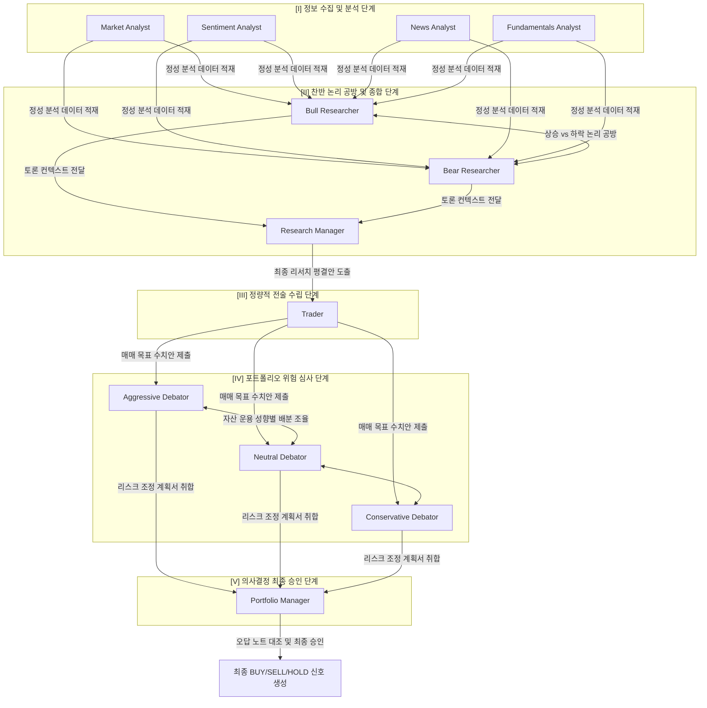
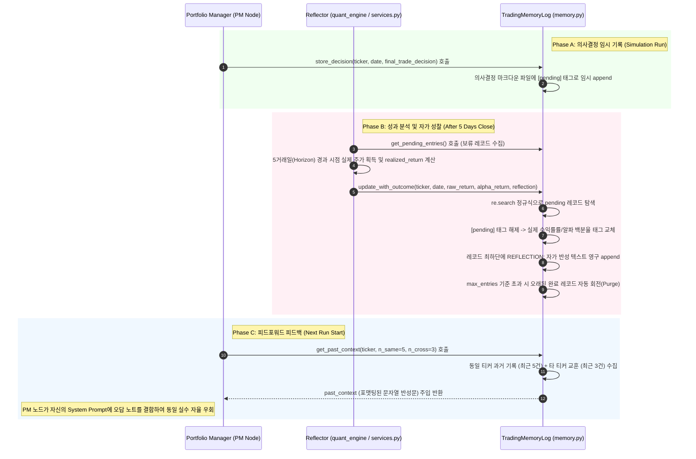

# 👥 TradingAgents 멀티 에이전트 설계 및 스키마 명세서 (Agent System Specification)

본 명세서는 TradingAgents 프레임워크를 구성하는 다중 에이전트의 상태 관리 구조, 노드 간 데이터 공유를 위한 공용 메모리 컨텍스트 스키마, 그리고 에이전트 협업 파이프라인의 물리적 함수 매핑 및 자가 성찰 피드백 제어 루프(Reflection Loop)의 상세 사양을 규정합니다. 본 명세서는 옵시디언(Obsidian) 전용 링크 및 이미지 임베딩 포맷에 최적화되어 있습니다.

---

## 🎨 1. 공용 상태 컨텍스트 명세 (`AgentState` 전역 공유 메모리)

다양한 인공지능 에이전트 컴포넌트들은 분산 환경 내에서 동적으로 결정을 주고받기 위해, 전역 공유 메모리 컨텍스트인 **`AgentState`** ([[agent_states.py]]) 스키마에 동시 의존합니다. 각 에이전트 노드는 이전 노드가 갱신한 상태를 읽어 자신의 태스크를 수행한 후, 결과물을 지정된 필드에 기록합니다.

![[agent_state_schema.png]]

### 📋 AgentState 데이터 필드 명세 사양

`AgentState` 클래스는 LangGraph의 `MessagesState`를 상속하여 기본적인 대화 버퍼를 내장하고 있으며, 다음과 같은 정밀 TypedDict 스펙을 견지합니다:

```python
class AgentState(MessagesState):
    company_of_interest: str   # 분석 대상 종목 자산 티커 코드 (예: "AAPL")
    asset_type: str            # 자산의 종류 (예: "stock", "crypto")
    trade_date: str            # 과거 시뮬레이션 대상 타겟 날짜 (YYYY-MM-DD)
    sender: str                # 직전에 메시지를 송신한 에이전트 노드의 이름 식별자
    
    # I. 기초 정보 수집 분석가 단계 적재 보고서
    market_report: str         # 시장 분석 노드가 기술 차트 도구를 돌려 작성한 보고서
    sentiment_report: str      # 감성 분석 노드가 소셜 투심 분석을 통해 작성한 보고서
    news_report: str           # 뉴스 분석 노드가 매크로 속보를 요약해 작성한 보고서
    fundamentals_report: str   # 재무 분석 노드가 분기 재정 건전성을 요약해 작성한 보고서
    
    # II. 연구 찬반 공방 및 의견 중재 단계
    investment_debate_state: InvestDebateState  # Bull vs Bear 토론 진행 상황
    investment_plan: str       # Research Manager가 평결하여 작성한 종합 등급 평결서
    
    # III. 정량 매매 계획 단계
    trader_investment_plan: str # Trader가 가격 전술 수치를 설정해 기안한 거래 작전서
    
    # IV. 리스크 심의 및 의결
    risk_debate_state: RiskDebateState          # 리스크 삼자 위원회 토론록 상태
    final_trade_decision: str  # Portfolio Manager가 성찰 메모리를 대조 승인한 결재 보고서
    past_context: str          # memory.py에서 로드하여 주입한 Ticker별 과거 오답 노트
```

---

### 📋 하위 융합 토론록 데이터 스키마 (`TypedDict`)

연구팀 찬반 토론과 리스크 위원회는 복잡한 대화 흐름을 관리하기 위해 `AgentState` 내부에 다음과 같은 독립 서브 상태 TypedDict를 중첩 보관합니다.

#### ⚖️ 1. `InvestDebateState` (연구 토론용 공유 메모리)
```python
class InvestDebateState(TypedDict):
    bull_history: str         # 상승 옹호론(Bull) 에이전트의 대화 히스토리 누적 버퍼
    bear_history: str         # 하락 경고론(Bear) 에이전트의 대화 히스토리 누적 버퍼
    history: str              # 토론 전체의 대화 히스토리 통합 버퍼
    current_response: str     # 직전 턴에 에이전트가 뱉은 가장 최신의 자연어 답변
    judge_decision: str       # 토론 완수 후 Research Manager가 요약 종합한 의사결정문
    count: int                # 현재 진행된 상호 반박 토론 라운드 횟수 (Max: 3회 제한)
```

#### 🛡️ 2. `RiskDebateState` (리스크 위원회용 공유 메모리)
```python
class RiskDebateState(TypedDict):
    aggressive_history: str   # 공격적 리스크 애널리스트의 대화 히스토리 버퍼
    conservative_history: str # 보수적 리스크 애널리스트의 대화 히스토리 버퍼
    neutral_history: str      # 중립적 리스크 애널리스트의 대화 히스토리 버퍼
    history: str              # 리스크 위원회 전체의 다자간 토론 히스토리 통합 버퍼
    latest_speaker: str       # 직전에 발언한 리스크 애널리스트 노드 식별자
    current_aggressive_response: str # 공격적 애널리스트의 가장 최신 의견서
    current_conservative_response: str # 보수적 애널리스트의 가장 최신 의견서
    current_neutral_response: str  # 중립적 애널리스트의 가장 최신 의견서
    judge_decision: str       # Portfolio Manager 심의를 위해 취합 완료된 리스크 조정 기안서
    count: int                # 리스크 비중 배분 토론 라운드 횟수
```

---

## 🧩 2. 에이전트 협업 워크플로우 (Collaboration Logic Loop)

TradingAgents 그래프 엔진은 아래와 같이 5대 프로세스 단계를 시퀀셜하게 거치며 최종 거래 의사결정을 수립 및 검증합니다. (세부 그래프 설계: [[04_graph_engine.md]])



### 📖 협업 흐름별 데이터 제어 메커니즘

1. **[정보 수집 및 분석]**: 4대 분석가 노드가 병렬 혹은 순차 구동되어 시계열 데이터 가림막 필터를 거친 정보들을 획득합니다. 결과 보고서를 공용 상태 컨텍스트에 덮어씁니다. (세부 파이프라인 필터: [[03_dataflows.md]])
2. **[상반 논리 공방]**: 상승 옹호론(Bull)과 약세 경고론(Bear) 노드가 상대방의 주장을 교차 참조하고 반박 논리를 쌓아, 편향된 결정을 원천 배제하는 토론 히스토리(`investment_debate_state`)를 축적합니다.
3. **[의견 중재 및 평결]**: 리서치 매니저가 토론 데이터를 취합하여 양측의 타당성을 평가한 후, 정제된 중립 종합 리포트(`ResearchPlan`)를 작성합니다.
4. **[정량적 매매 계획 수립]**: 트레이더 노드가 리포트를 근거로 구체적인 진입가, 청산가, 손절 한계 수치(`TraderProposal`)를 픽스하여 기안합니다.
5. **[리스크 심사]**: 3인의 상이한 성향(공격, 보수, 중립)의 리스크 전문가들이 트레이더의 투자금 배분 비율을 포트폴리오 리스크 허용 한도에 맞추어 보정하고 조정 회의록을 생성합니다.
6. **[최종 PM 결제 승인]**: 포트폴리오 매니저가 리스크 조정 보고서와 함께, 메모리 보관소에서 로드한 동일 종목의 과거 거래 피드백 내역(`past_context`)을 결합하여 최종 매매 사인을 결정합니다.

---

## 📂 노드별 물리적 소스 코드 매핑 사양 (Code Mapping)

각 컴포넌트 노드가 실행될 때 작동하는 실제 물리적 모듈 소스 코드 및 함수 매핑 정보입니다.

### 1️⃣ I. 정보 수집 및 분석 단계 (Analysts)
* **시장 분석가 노드 (Market Analyst Node)**
  * **소스 코드 위치**: `tradingagents/agents/analysts/market_analyst.py`
  * **진입점 함수**: `create_market_analyst(llm)`
  * **입력 컨텍스트**: `trade_date`, `company_of_interest`
  * **출력 데이터**: `state["market_report"]` (정성 차트 분석 보고서 적재)
* **재무 분석가 노드 (Fundamentals Analyst Node)**
  * **소스 코드 위치**: `tradingagents/agents/analysts/fundamentals_analyst.py`
  * **진입점 함수**: `create_fundamentals_analyst(llm)`
  * **입력 컨텍스트**: `company_of_interest`
  * **출력 데이터**: `state["fundamentals_report"]` (EPS, FCF 및 기업 재무 건전성 분석 보고서 적재)

### 2️⃣ II. 찬반 논리 공방 및 종합 단계 (Research)
* **상승/하락 토론 노드 (Bull/Bear Debate Node)**
  * **소스 코드 위치**: `tradingagents/agents/researchers/bull_researcher.py` 및 `bear_researcher.py`
  * **진입점 함수**: `create_bull_researcher(llm)`, `create_bear_researcher(llm)`
  * **입력 컨텍스트**: 4대 분석가 보고서, 기존 대화 히스토리
  * **출력 데이터**: `state["investment_debate_state"]` (토론 라운드 카운터 및 텍스트 데이터 갱신)
* **리서치 매니저 노드 (Research Manager Node)**
  * **소스 코드 위치**: `tradingagents/agents/managers/research_manager.py`
  * **진입점 함수**: `create_research_manager(llm)`
  * **입력 컨텍스트**: `investment_debate_state` 대화 로그
  * **출력 데이터**: `state["investment_plan"]` (Pydantic 구조화 평결 보고서 `ResearchPlan` 적재)

### 3️⃣ III. 정량적 전술 수립 단계 (Trading)
* **실무 트레이더 노드 (Trader Node)**
  * **소스 코드 위치**: `tradingagents/agents/trader/trader.py`
  * **진입점 함수**: `create_trader(llm)`
  * **입력 컨텍스트**: `state["investment_plan"]`
  * **출력 데이터**: `state["trader_investment_plan"]` (진입/목표/손절가 정의 `TraderProposal` 적재)

### 4️⃣ IV. 포트폴리오 위험 심사 단계 (Risk Management)
* **리스크 삼자 위원회 노드 (Risk Commission Node)**
  * **소스 코드 위치**: `tradingagents/agents/risk_mgmt/aggressive_debator.py` 및 중립형, 보수형 모듈
  * **진입점 함수**: `create_aggressive_debator(llm)` 등 삼총사 팩토리 함수
  * **입력 컨텍스트**: 트레이더 매매안, 리스크 토론록, 분석가 보고서
  * **출력 데이터**: `state["risk_debate_state"]` (리스크 평가 및 비중 최적화 회의록 적재)

### 5️⃣ V. 의사결정 최종 승인 단계 (Portfolio Management)
* **최종 포트폴리오 매니저 노드 (Portfolio Manager Node)**
  * **소스 코드 위치**: `tradingagents/agents/managers/portfolio_manager.py`
  * **진입점 함수**: `create_portfolio_manager(llm)`
  * **입력 컨텍스트**: 리스크 심사 위원회 보고서, 트레이더 거래안, 과거 거래 평가 피드백(`past_context`)
  * **출력 데이터**: `state["final_trade_decision"]` (구조화 의사결정 보고서 `PortfolioDecision` 적재)

### 6️⃣ VI. 실시간 뉴스 AI 해석 단계 (News AI Interpretation)
* **실시간 뉴스 AI 해석기 (Symmetrical News AI Interpreter)**
  * **소스 코드 위치**: `backend/app/routers/market.py`
  * **진입점 함수**: `interpret_news(payload: NewsInterpretRequest)`
  * **입력 컨텍스트**: `ticker`, `news_title`, `news_summary`, `provider`, `base_url`, `api_key`, `model_name`
  * **출력 데이터**: `NewsInterpretResponse(interpretation=...)` (실시간 뉴스 마크다운 해설 반환)

---

## 💾 지속성 오답 메모리를 활용한 자가 성찰 루프 (Reflection Loop)

TradingAgents 플랫폼의 가장 독창적인 정교함은 **과거 실거래 성과와 결정을 대조 분석하여 의사결정 모형을 지속적으로 자동 튜닝하는 피드백 루프(Reflection Loop)**에 있습니다.



### 🧠 1. append-only 마크다운 메모리 로그의 물리적 구조
`TradingMemoryLog`는 마크다운 기반의 영속 텍스트 데이터베이스입니다. 각 레코드는 LLM이 실수로 출력할 수 없는 완벽히 유니크한 구분자 키인 `\n\n<!-- ENTRY_END -->\n\n` 주석을 활용하여 상호 차폐됩니다.
* **임시 적재 레코드 태그 포맷**:
  `[{trade_date} | {ticker} | {rating} | pending]`
* **성찰 완수 레코드 태그 포맷**:
  `[{trade_date} | {ticker} | {rating} | {raw_return:+.1%} | {alpha_return:+.1%} | {holding_days}d]`

### 🔍 2. 정규식(Regex) 기반 오답 원인 분석 파싱 스펙
`TradingMemoryLog` 내부에서 데이터 복원 시, 다음과 같은 비블로킹(Non-blocking) 고속 정규식 스캔 장치가 구동되어 마크다운 내의 정성적 서술 영역을 칼같이 도려냅니다.
* **의사결정 본문 추출 정규식**:
  `re.compile(r"DECISION:\n(.*?)(?=\nREFLECTION:|\Z)", re.DOTALL)`
  * 목적: 의사결정 기안서의 시작점부터 성찰 피드백(`REFLECTION`) 이전 혹은 문자열 끝까지를 줄바꿈(`re.DOTALL`)을 포함해 탐색합니다.
* **성찰 반성문 추출 정규식**:
  `re.compile(r"REFLECTION:\n(.*?)$", re.DOTALL)`
  * 목적: 런타임 환류 시점에 에이전트의 반성 문장만을 텍스트 뭉치 끝까지 정확히 수거해 냅니다.

### 🔄 3. n_same / n_cross 기반 슬라이딩 윈도우 인젝션
차기 시뮬레이션 구동 시, 그래프 진입부에서 `get_past_context(ticker, n_same=5, n_cross=3)` 함수가 작동합니다.
* **동일 종목 복기 (`n_same=5`)**:
  * 대상 티커(예: `AAPL`)에 대한 과거 5건의 매매 계획 및 성찰 일지를 역순(최신순)으로 수집하여 `past_context` 상단에 주입합니다. 이를 통해 개별 주식의 특이적 변동성 실수를 반복하지 않도록 통제합니다.
* **타 종목 교차 학습 (`n_cross=3`)**:
  * 타 티커(예: `TSLA`, `MSFT`)에서 도출된 최근 3건의 뼈아픈 리스크 성찰 일지만을 솎아내어 하단에 결합합니다. 이를 통해 시장 거시적 리스크에 대한 면역력을 에이전트 전역에 전파합니다.

![[reflection_loop_detail.png]]
