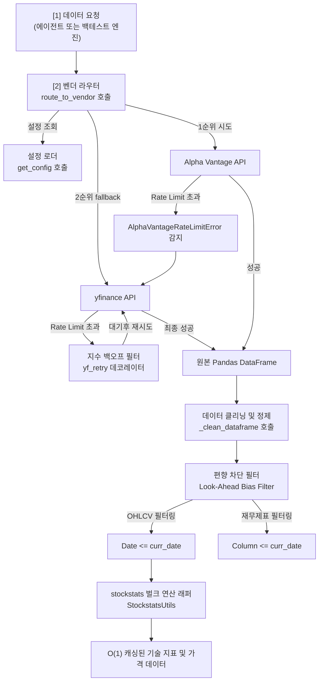

# 📊 TradingAgents 데이터 수집, 가공 및 편향 제거 명세서 (Data Pipeline Specification)

본 명세서는 외부 금융 API로부터 데이터를 안정적이고 영속적으로 공급받기 위한 다중 벤더 페일오버(Failover) 라우팅 설계, 외부 API의 엄격한 호출 속도 제한(Rate Limit) 회피 메커니즘, 그리고 백테스트 시뮬레이션의 수학적 왜곡을 방지하기 위한 선행 데이터 참조 방지(Look-Ahead Bias Prevention) 데이터 마스킹 기술에 대해 상세히 규정합니다. 본 문서는 옵시디언(Obsidian) 전용 링크 및 이미지 임베딩 포맷에 최적화되어 있습니다.

---

## 🎨 1. 데이터 수집 및 가공 파이프라인 개요

플랫폼은 외부 금융 데이터 제공사(Alpha Vantage, yfinance) 및 뉴스 피드 등 다양한 소스로부터 실시간 및 과거 시계열 데이터를 수집하여 가공합니다. 전체 데이터 흐름 및 벤더 추상화 레이어의 상호작용은 다음과 같습니다:



---

## 🔌 2. 다중 벤더 페일오버 (Multi-Vendor Failover Routing)

주가 수집 시 특정 금융 데이터 제공사(Vendor)의 일일 할당량 소진, Rate Limit 차단, 혹은 일시적 서버 장애(Downtime)가 발생할 경우 데이터 파이프라인 전체가 마비될 위험이 존재합니다. 

이러한 단일 장애점(SPOF)을 격리하기 위해, TradingAgents는 **동적 API Fallback 라우팅 모듈**을 내장하여 주 서비스망 장애 시 예비망으로 무중단 즉시 자동 우회하도록 설계되었습니다.

![[dual_sim_smartphone.png]]

위 일러스트처럼, 시스템 내부의 Fallback 라우터는 주 데이터 경로(Alpha Vantage)와 보조 데이터 경로(yfinance)의 통신 신뢰도를 실시간 모니터링하며 예외 에러 감지 즉시 우회로를 개척하여 상위 에이전트 측에 투명한(Transparent) 영속적 데이터 수송망을 보장합니다.

### ⚙️ 2.1 API 벤더 설정 및 라우팅 코드 맵핑

외부 데이터 연동을 담당하는 핵심 게이트웨이는 `tradingagents/dataflows/interface.py`에 정의되어 있으며, 다음과 같은 카테고리 구조와 라우팅 테이블을 기반으로 동작합니다.

#### 📁 도구 카테고리 정의 (`TOOLS_CATEGORIES`)
```python
TOOLS_CATEGORIES = {
    "core_stock_apis": {
        "description": "OHLCV stock price data",
        "tools": ["get_stock_data"]
    },
    "technical_indicators": {
        "description": "Technical analysis indicators",
        "tools": ["get_indicators"]
    },
    "fundamental_data": {
        "description": "Company fundamentals",
        "tools": ["get_fundamentals", "get_balance_sheet", "get_cashflow", "get_income_statement"]
    },
    "news_data": {
        "description": "News and insider data",
        "tools": ["get_news", "get_global_news", "get_insider_transactions"]
    }
}
```

#### 🔄 벤더 메소드 매핑 테이블 (`VENDOR_METHODS`)
각 추상 메소드 이름에 매핑된 실질적인 벤더별 모듈 구현체 매핑 구조입니다.
* `get_stock_data`: `alpha_vantage` $\rightarrow$ `get_alpha_vantage_stock`, `yfinance` $\rightarrow$ `get_YFin_data_online`
* `get_indicators`: `alpha_vantage` $\rightarrow$ `get_alpha_vantage_indicator`, `yfinance` $\rightarrow$ `get_stock_stats_indicators_window`
* `get_fundamentals`: `alpha_vantage` $\rightarrow$ `get_alpha_vantage_fundamentals`, `yfinance` $\rightarrow$ `get_yfinance_fundamentals`
* `get_balance_sheet`: `alpha_vantage` $\rightarrow$ `get_alpha_vantage_balance_sheet`, `yfinance` $\rightarrow$ `get_yfinance_balance_sheet`
* `get_cashflow`: `alpha_vantage` $\rightarrow$ `get_alpha_vantage_cashflow`, `yfinance` $\rightarrow$ `get_yfinance_cashflow`
* `get_income_statement`: `alpha_vantage` $\rightarrow$ `get_alpha_vantage_income_statement`, `yfinance` $\rightarrow$ `get_yfinance_income_statement`
* `get_news`: `alpha_vantage` $\rightarrow$ `get_alpha_vantage_news`, `yfinance` $\rightarrow$ `get_news_yfinance`

### 🛠️ 2.2 라우터 제어 흐름 (`route_to_vendor`)

`route_to_vendor` 함수는 예외 발생 시 동적으로 Fallback 체인을 빌드하고 복구합니다:

1. **카테고리 식별**: `get_category_for_method(method)`를 통해 대상 메소드가 속한 도구 그룹을 식별합니다.
2. **벤더 설정 조회**: `get_vendor(category, method)`를 수행하여 설정 파일(`config`)의 `tool_vendors` 또는 `data_vendors` 속성을 확인합니다.
3. **폴백 체인 동적 구성**: 1순위로 설정된 primary 벤더 뒤에 사용 가능한 모든 백업 벤더(`all_available_vendors`)를 덧붙여 호출 체인 리스트(`fallback_vendors`)를 물리적으로 생성합니다.
4. **순차 실행 및 예외 포착**:
   * 각 벤더의 API 함수(`impl_func`)를 순차적으로 실행합니다.
   * `AlphaVantageRateLimitError` 예외 발생 시, 다음 벤더로 즉시 루프를 전개합니다.
   * 모든 벤더 호출이 실패하면 최종적으로 `RuntimeError` 예외를 던집니다.

> [!IMPORTANT]
> **동적 예외 차단 범위**
> * 본 플랫폼은 오직 **속도 제한 예외 (`AlphaVantageRateLimitError`)** 에 대해서만 폴백 라우팅을 트리거합니다. 네트워크 오류, 잘못된 티커 입력 등으로 인한 파라미터 예외는 폴백되지 않고 즉시 예외로 호출자에게 보고되도록 설계되어 디버깅 명확성을 보장합니다.

---

## ⏱️ 3. Exponential Backoff 재시도 필터 (`yf_retry` 데코레이터)

![[exponential_backoff.png]]

야후 파이낸스(`yfinance`) 등의 무료 데이터 벤더는 단시간 내 과도한 요청(Burst Traffic)이 집중될 시 HTTP 429(Too Many Requests) 에러를 반환하며 특정 IP를 차단합니다. 

이때 고정 주기로 계속 재시도를 시도하면 외부 차단 방화벽은 이를 디도스(DDoS) 공격으로 분류해 차단 세션 기간을 영구적으로 연장해 버립니다. 시스템은 이를 예방하기 위해, 실패할 때마다 대기 시간을 지수적으로 늘리는 **지수 백오프 (Exponential Backoff)** 알고리즘을 사용합니다.

### 📐 3.1 수학적 지수 대기 시간 수식
재시도 대기 시간 $Delay_i$는 다음과 같이 정의됩니다:

$$Delay_i = Base\_Delay \times 2^{i-1}$$

여기서 $i$는 현재 재시도 차수 (1-indexed), $Base\_Delay$는 기본 설정 시간 초(sec, 시스템 기본값 `2.0초`)입니다.

* 1차 재시도 대기 시간: $2.0 \times 2^0 = 2\text{초}$
* 2차 재시도 대기 시간: $2.0 \times 2^1 = 4\text{초}$
* 3차 재시도 대기 시간: $2.0 \times 2^2 = 8\text{초}$

### 💻 3.2 `yf_retry` 데코레이터 핵심 구현
* **소스 코드 위치**: `tradingagents/dataflows/stockstats_utils.py` $\rightarrow$ [[stockstats_utils.py#L16]]

```python
def yf_retry(func, max_retries=3, base_delay=2.0):
    for attempt in range(max_retries + 1):
        try:
            return func()
        except YFRateLimitError:
            if attempt < max_retries:
                delay = base_delay * (2 ** attempt)
                logger.warning(f"Yahoo Finance rate limited, retrying in {delay:.0f}s (attempt {attempt + 1}/{max_retries})")
                time.sleep(delay)
            else:
                raise
```

> [!TIP]
> **yfinance 라이브러리 예외의 특징**
> * yfinance 모듈은 내부적으로 HTTP 429 에러 감지 시 즉시 `yfinance.exceptions.YFRateLimitError`를 발생시키며 재시도 없이 프로세스를 중단시킵니다. 본 데코레이터는 이를 외부 레이어에서 감지하여 트래픽 버스트 상태를 스무딩(Smoothing) 처리하는 방어 메커니즘 역할을 수행합니다.

---

## ⏳ 4. 선행 데이터 참조 편향 차단 (Look-Ahead Bias Prevention)

과거 주가 시뮬레이션을 진행할 때 발생할 수 있는 가장 치명적인 논리적 결함은 **선행 데이터 참조 편향 (Look-Ahead Bias)**입니다. 

예를 들어, "2026년 1월 1일의 매매 결정을 내리는 가상 세션에서, 2026년 1월 3일에 공시된 실적이나 호재 뉴스를 알고리즘 판단식에 실수로 흘려 넣어 판단하게 만드는 행위"입니다. 미래 데이터를 미리 훔쳐보고 과거 시험을 치는 꼴이므로 백테스트 성적표는 환상적인 누적 수익률을 가리키겠지만, 정작 실전 거래에 투입하는 즉시 막대한 손실을 유발하게 됩니다.

![[time_machine_cheating.png]]

위 그림과 같이, 과거 특정 기준시점의 투자 결정을 내릴 때 미래 시계열 차원의 어떤 정보도 유출될 수 없도록 데이터 파이프라인 경계면에서 강력한 정보 컷오프(Information Cutoff) 필터 장벽을 물리적으로 구동하여 미래 데이터를 즉각 증발 및 배제합니다.

### 🛡️ 4.1 시계열 OHLCV 데이터 마스킹 (`load_ohlcv` 함수)
* 외부 및 로컬 캐시에서 로드한 주가 시계열 Pandas DataFrame에서, 현재 시뮬레이션 기준 날짜인 `curr_date`보다 큰 모든 미래 행들을 인덱스 슬라이싱을 통해 완전히 마스킹 및 제외합니다.
* **소스 코드 위치**: `tradingagents/dataflows/stockstats_utils.py` $\rightarrow$ [[stockstats_utils.py#L48]]

```python
def load_ohlcv(symbol: str, curr_date: str) -> pd.DataFrame:
    # 안전한 캐시 파일명 생성을 위한 티커 검증 (디렉토리 탈출 방어)
    safe_symbol = safe_ticker_component(symbol)
    config = get_config()
    curr_date_dt = pd.to_datetime(curr_date)
    
    # 5년간의 데이터를 캐시 주기로 설정
    today_date = pd.Timestamp.today()
    start_date = today_date - pd.DateOffset(years=5)
    start_str = start_date.strftime("%Y-%m-%d")
    end_str = today_date.strftime("%Y-%m-%d")
    
    os.makedirs(config["data_cache_dir"], exist_ok=True)
    data_file = os.path.join(
        config["data_cache_dir"],
        f"{safe_symbol}-YFin-data-{start_str}-{end_str}.csv",
    )
    
    # 캐시 존재 여부 검사 및 로드 / 또는 yf_retry 기반 외부 다운로드 수행
    if os.path.exists(data_file):
        data = pd.read_csv(data_file, on_bad_lines="skip", encoding="utf-8")
    else:
        data = yf_retry(lambda: yf.download(
            symbol,
            start=start_str,
            end=end_str,
            multi_level_index=False,
            progress=False,
            auto_adjust=True,
        ))
        data = data.reset_index()
        data.to_csv(data_file, index=False, encoding="utf-8")
        
    data = _clean_dataframe(data)
    
    # [핵심] 기준일자 시점까지만 인덱스 슬라이싱하여 미래 데이터 완전 차단
    data = data[data["Date"] <= curr_date_dt]
    return data
```

### 🛡️ 4.2 재무제표 공시 시점 컷오프 (`filter_financials_by_date` 함수)
* 외부 벤더에서 다운로드받은 분기 재무제표 원문에는 분석 기준일 시점에 실제로는 아직 시장에 발표(공시)되지 않은 미래 분기의 자산/부채/수익 정보 컬럼들이 섞여 들어올 위험이 큽니다.
* 이를 도려내기 위해 재무제표 DataFrame의 컬럼 날짜가 분석 기준일 `curr_date` 이후인 모든 재무 실적 정보 컬럼들을 물리적으로 드롭(Drop) 처리합니다.
* **소스 코드 위치**: `tradingagents/dataflows/stockstats_utils.py` $\rightarrow$ [[stockstats_utils.py#L96]]

```python
def filter_financials_by_date(data: pd.DataFrame, curr_date: str) -> pd.DataFrame:
    if not curr_date or data.empty:
        return data
    cutoff = pd.Timestamp(curr_date)
    # 컬럼 레이블(날짜 포맷)을 Datetime 객체로 변환하여 컷오프 비교용 마스크 생성
    mask = pd.to_datetime(data.columns, errors="coerce") <= cutoff
    # 컷오프를 통과한 열(Columns) 데이터 세트만 취사선택하여 반환
    return data.loc[:, mask]
```

> [!CAUTION]
> **Look-Ahead Bias가 시뮬레이션 수익률에 미치는 영향**
> * 편향 제거 처리를 단 한 줄이라도 생략하는 순간, 에이전트들은 미래에 상승할 주식의 재무 실적이나 기사를 T-Day 이전에 인지하여 비현실적인 100%에 근접하는 승률의 허상 시그널을 출력하게 됩니다. 따라서 `data["Date"] <= curr_date` 규칙은 에이전트 데이터 수집의 최우선 불변 규칙으로 통제됩니다.

---

## 📊 5. stockstats 벌크 연산 최적화 (Bulk Computation Optimization)

![[stockstats_bulk.png]]

시뮬레이션 전 기간 동안 이동평균선(SMA), MACD, RSI 등의 수많은 주가 지표들을 매 거래일마다 루프 내에서 하나씩 연산하면 극심한 CPU I/O 병목이 발생하여 시스템 속도가 현저히 느려집니다. (상세 백테스트 엔진 사양: [[06_backend_api.md]])

이를 최적화하기 위해, TradingAgents는 **시계열 벌크 벡터화 연산 최적화** 기법을 적용했습니다.

### ⚙️ 5.1 벌크 최적화 동작 메커니즘

1. **데이터 래핑 및 벡터 인스턴스화**: `wrap(data)` 연산을 통해 전체 시계열 DataFrame을 `stockstats.StockDataFrame` 객체로 일괄 캐스팅합니다.
2. **선제적 벌크 연산 트리거 (`df[indicator]`)**:
   * 특정 기술적 보조지표 컬럼(예: `close_20_sma`, `macd`, `rsi_14`)을 한 번 호출합니다.
   * `stockstats` 내부의 고속 C-extension 기반 벡터 연산 루프가 가동되어 **수만 행에 달하는 전체 시계열의 지표 값을 단 한 번에 선제 연산**합니다.
3. **메모리 캐싱**: 계산된 결과 컬럼은 Pandas DataFrame의 메모리 스페이스에 캐싱(Caching)됩니다.
4. **O(1) 해시 맵핑 검색**:
   * 일별 시뮬레이션 루프가 가동될 때마다 복잡한 수치 공식을 재귀 계산할 필요가 전혀 없습니다.
   * 이미 완성된 DataFrame의 시계열 행 인덱스 슬라이싱 및 일치 날짜를 `O(1)` 속도로 검색하여 타겟 지표 값을 반환합니다.

### 💻 5.2 `StockstatsUtils` 핵심 구현
* **소스 코드 위치**: `tradingagents/dataflows/stockstats_utils.py` $\rightarrow$ [[stockstats_utils.py#L110]]

```python
class StockstatsUtils:
    @staticmethod
    def get_stock_stats(
        symbol: str,
        indicator: str,
        curr_date: str,
    ):
        # 1. 룩어헤드 편향이 원천 제거된 과거~기준시점 가격 데이터 로드
        data = load_ohlcv(symbol, curr_date)
        
        # 2. stockstats 래핑
        df = wrap(data)
        df["Date"] = df["Date"].dt.strftime("%Y-%m-%d")
        curr_date_str = pd.to_datetime(curr_date).strftime("%Y-%m-%d")
        
        # 3. 특정 지표 컬럼 계산 유도 (내부 캐싱)
        df[indicator]
        
        # 4. 기준일 당일 날짜에 정확히 매치되는 유일 행 매핑
        matching_rows = df[df["Date"].str.startswith(curr_date_str)]
        
        if not matching_rows.empty:
            # 5. O(1) 해시 탐색으로 계산 결과를 즉각 추출
            indicator_value = matching_rows[indicator].values[0]
            return indicator_value
        else:
            return "N/A: Not a trading day (weekend or holiday)"
```

> [!NOTE]
> **비거래일(주말, 공휴일) 처리 정책**
> * 분석 기준일(`curr_date`)이 미국 시장 휴장일(토요일, 일요일 등)일 경우 `matching_rows` 데이터가 발견되지 않습니다. 이 경우 시스템 크래시를 방지하기 위해 프로그램은 예외를 발생시키지 않고 `"N/A: Not a trading day..."` 문자열을 반환하여 에이전트들이 분석 단계에서 자연스럽게 비거래 상태임을 이해하도록 유도합니다.
