# 🎮 TradingAgents 그래프 엔진 및 체크포인트 상세 명세서 (Graph Engine & Checkpointer)

본 명세서는 LangGraph 프레임워크 기반의 유향 비순환 그래프(DAG) 상태 머신 아키텍처 사양, 에이전트 실행 중 불의의 크래시 발생 시 중단된 지점부터 즉각 재개할 수 있도록 복구 메커니즘을 지원하는 **`SQLiteSaver` 체크포인터** 설계 사양, 그리고 다중 스레드 동시성 환경에서의 자원 경합을 방지하기 위한 데이터 파티셔닝 전략을 정밀 기술합니다. 본 문서는 옵시디언(Obsidian) 전용 링크 및 이미지 임베딩 포맷에 최적화되어 있습니다.

---

## 🕹️ 1. LangGraph 상태 머신 및 의사결정 워크플로우

플랫폼은 에이전트들의 실행 순서 조율과 데이터 교환 상태를 안정적으로 제어하기 위해, **LangGraph** 라이브러리를 차용하여 엄격하게 통제되는 유향 그래프 상태 머신 구조를 설계했습니다. 각 에이전트의 작동 경로는 노드(Node)와 조건부 분기(Conditional Edge)로 수식화되어 그래프 내부 스레드를 따라 시퀀셜하게 이동합니다. (상세 에이전트 노드 분석: [[02_agent_system.md]])

![[langgraph_dag_structure.png]]

위 그림과 같이, 플랫폼 그래프 엔진은 단순한 스크립트 실행이 아니라 각 컴포넌트 노드가 완수될 때마다 상태 정보를 지속성 SQLite 데이터베이스 장치에 백업 기록하고 제어를 다음 노드로 디스패치합니다.

### 🗺️ 1.1 LangGraph 오케스트레이션 상태 관계도

시스템 내부에서 구동되는 LangGraph의 물리적 연결 노드와 분기 엣지들의 흐름도입니다.

```mermaid
flowchart TD
    START([시작: START]) --> MarketNode["[1] Market Analyst<br/>market_analyst"]
    
    %% Market Analyst Loop
    MarketNode --> should_mkt{"조건부 분기<br/>should_continue_market"}
    should_mkt -->|도구 호출 필요| MarketTool["Market Tools Node<br/>market_tools"]
    MarketTool --> MarketNode
    should_mkt -->|수집 완료| MarketClear["Message Delete Node<br/>market_clear"]
    
    %% Next to Sentiment
    MarketClear --> SocialNode["[2] Social Analyst<br/>social_analyst"]
    
    %% Social Analyst Loop
    SocialNode --> should_social{"조건부 분기<br/>should_continue_social"}
    should_social -->|도구 호출 필요| SocialTool["Social Tools Node<br/>social_tools"]
    SocialTool --> SocialNode
    should_social -->|수집 완료| SocialClear["Message Delete Node<br/>social_clear"]
    
    %% Next to News
    SocialClear --> NewsNode["[3] News Analyst<br/>news_analyst"]
    
    %% News Analyst Loop
    NewsNode --> should_news{"조건부 분기<br/>should_continue_news"}
    should_news -->|도구 호출 필요| NewsTool["News Tools Node<br/>news_tools"]
    NewsTool --> NewsNode
    should_news -->|수집 완료| NewsClear["Message Delete Node<br/>news_clear"]
    
    %% Next to Fundamentals
    NewsClear --> FundNode["[4] Fundamentals Analyst<br/>fundamentals_analyst"]
    
    %% Fundamentals Analyst Loop
    FundNode --> should_fund{"조건부 분기<br/>should_continue_fundamentals"}
    should_fund -->|도구 호출 필요| FundTool["Fundamental Tools Node<br/>fundamentals_tools"]
    FundTool --> FundNode
    should_fund -->|수집 완료| FundClear["Message Delete Node<br/>fundamentals_clear"]
    
    %% Debate Phase
    FundClear --> BullResearcher["[5] Bull Researcher"]
    
    BullResearcher --> DebateCond{"조건부 분기<br/>should_continue_debate"}
    DebateCond -->|합의 미도달| BearResearcher["[6] Bear Researcher"]
    BearResearcher --> BullResearcher
    DebateCond -->|합의 완료 또는 최대 3회| ResearchManager["[7] Research Manager"]
    
    %% Trader
    ResearchManager --> Trader["[8] Trader"]
    
    %% Risk Phase
    Trader --> AggressiveAnalyst["[9] Aggressive Analyst"]
    
    AggressiveAnalyst --> RiskCond1{"조건부 분기<br/>should_continue_risk"}
    RiskCond1 -->|반대/조정 필요| ConservativeAnalyst["[10] Conservative Analyst"]
    RiskCond1 -->|합의 완료| PM["[12] Portfolio Manager"]
    
    ConservativeAnalyst --> RiskCond2{"조건부 분기<br/>should_continue_risk"}
    RiskCond2 -->|반대/조정 필요| NeutralAnalyst["[11] Neutral Analyst"]
    RiskCond2 -->|합의 완료| PM
    
    NeutralAnalyst --> RiskCond3{"조건부 분기<br/>should_continue_risk"}
    RiskCond3 -->|반대/조정 필요| AggressiveAnalyst
    RiskCond3 -->|합의 완료| PM
    
    PM --> END([종료: END])
```



### 📋 1.2 그래프 오케스트레이션 실행 메커니즘 상세 명세

#### 📂 1. 클래스 컴포지션 구성 (`setup.py`)
* **클래스명**: `GraphSetup`
* **주요 구성원 필드**:
  * `quick_thinking_llm`: 애널리스트 및 리서치 그룹용 고속 모델 인스턴스 (Ollama / Claude-3.5-Haiku 등)
  * `deep_thinking_llm`: 최종 평가 및 오케스트레이션 심층 모델 인스턴스 (GPT-4o / Claude-3.5-Sonnet 등)
  * `tool_nodes`: 각 애널리스트의 벤더 API 도구 래퍼 노드 딕셔너리 (`Dict[str, ToolNode]`)
  * `conditional_logic`: `ConditionalLogic` 분기 로직 유틸リティ

#### 🚀 2. 동적 실행 계획 수립 및 노드 바인딩 (`setup_graph`)
1. **분석가 동적 배치**: `build_analyst_execution_plan(selected_analysts)`을 호출하여 분석 대상 리스트에 따라 실행 순서(`plan.specs`)를 동적으로 규정합니다.
2. **에이전트 인스턴스 팩토리 가동**:
   * 강세 리서처 (`create_bull_researcher`)
   * 약세 리서처 (`create_bear_researcher`)
   * 리서치 총괄 매니저 (`create_research_manager`)
   * 정량 트레이더 (`create_trader`)
   * 공격적/보수적/중립적 리스크 평가 3인방 (`create_aggressive_debator` 등)
3. **그래프 구조 생성**: `workflow = StateGraph(AgentState)` 상태 전이 머신을 생성하고 노드를 추가합니다.

#### 🔄 3. 루프 내 비대화형 메시지 소멸 처리 (`Message Decimation`)
각 애널리스트는 LLM 도구 호출 시 중간에 대량의 LLM 대화 메시지가 누적되어 컨텍스트 윈도우 폭발을 유발할 수 있습니다. 이를 격리하기 위해 다음과 같이 클리어 노드를 거칩니다:
```python
for spec in plan.specs:
    workflow.add_node(spec.agent_node, analyst_factories[spec.key]())
    workflow.add_node(spec.clear_node, create_msg_delete()) # 중간 메시지 완전 파기용 노드
    workflow.add_node(spec.tool_node, self.tool_nodes[spec.key])
```
* **동작 규칙**: 애널리스트가 데이터 수집을 완수하여 필요한 정보 필드를 `AgentState`에 덮어쓰고 나면, 즉시 `clear_node` (`create_msg_delete()`)가 동작하여 intermediate LLM 메시지들을 피지컬 메모리에서 삭제함으로써 차후 실행 단계의 LLM 가용 토큰 한도를 깨끗하게 청소해 줍니다.

* **관련 소스 코드 위치**: `setup.py` $\rightarrow$ [[setup.py#L32]] 메소드

---

## 💾 2. SQLiteSaver 기반 멱등적 장애 복구 (Idempotent Fault Recovery)

![[game_save_file.png]]

LLM 토큰 추론 및 대용량 외부 API 수집 과정은 네트워크 단절, 지연(Latency), 외부 인프라 에러 등으로 프로세스가 불시에 예외 종료(Crash)될 리스크를 항상 안고 있습니다. 

이를 물리적으로 방어하기 위해 플랫폼은 **`SQLiteSaver` 체크포인터 백업** 설계를 구현했습니다.

```
                     [ SQLiteSaver 멱등적 복구 흐름 ]

  [1. Market 노드 실행 완수] ──► 💾 SQLite DB 실시간 상태 스냅샷 저장
               │
  [2. Social 노드 실행 완수] ──► 💾 SQLite DB 실시간 상태 스냅샷 저장
               │
  [3. News 노드 실행 완수]   ──► 💾 SQLite DB 실시간 상태 스냅샷 저장
               │
               ❌ (이 시점에 네트워크 장애로 프로세스 크래시 발생!) 
               
                       [ 재구동 및 복구 프로세스 시 ]
                       
  [3. News 노드 완수 스냅샷] ◄── 💾 DB 상태 복원 및 4단계 Fundamentals부터 즉시 이어하기
```

### 🔒 2.1 다중 동시성 I/O 락업 방지를 위한 데이터 파티셔닝 전략
전략 백테스트는 수십 개의 티커를 병렬 멀티스레드 환경에서 한 번에 고속 연산하는 것이 핵심 요구사항입니다. (상세 백엔드 동시성 설계: [[06_backend_api.md]])

만약 전역 데이터베이스 단 한 군데에 모든 체크포인트 바이너리를 몰아 기록하면, 다중 스레드들이 쓰기 자원을 선점하려 겹치면서 뼈아픈 **데이터베이스 락(Database Lock / SQLite Disk Contention)** 현상이 터져 프로그램 전체가 대기 상태에 빠지게 됩니다.

이를 해결하기 위해, TradingAgents는 **Ticker별 개별 SQLite 파일 파티셔닝** 설계를 채택했습니다:

![[database_lock_concurrency.png]]

* 각 분석 프로세스 점화 시, 캐시 디렉토리 아래에 `checkpoints/{TICKER}.db` 형식의 종목 코드 전용 SQLite 데이터베이스를 즉석에서 독점 매핑합니다.
* 다중 스레드가 각자의 독방 파일에 독립적으로 I/O를 수행하므로, 스레드 간 교착 경합 현상이 완벽히 방어되어 극대화된 병렬 런타임 성능을 안정적으로 보장합니다.

### 💻 2.2 `checkpointer.py` 구현 명세
* **소스 코드 위치**: `tradingagents/graph/checkpointer.py` $\rightarrow$ [[checkpointer.py#L34]]

```python
@contextmanager
def get_checkpointer(data_dir: str | Path, ticker: str) -> Generator[SqliteSaver, None, None]:
    """컨텍스트 매니저를 활용하여 종목별 SQLite 데이터베이스 접속을 독점 격리 제공합니다."""
    db = _db_path(data_dir, ticker) # checkpoints/{TICKER}.db 경로 생성
    
    # check_same_thread=False 로 다중 동시성 비동기 루프 호출 지원
    conn = sqlite3.connect(str(db), check_same_thread=False)
    try:
        saver = SqliteSaver(conn)
        saver.setup() # 체크포인트용 테이블 구조(writes, checkpoints) 자동 빌드
        yield saver
    finally:
        conn.close()
```

---

## 🔑 3. 결정론적 세이브 슬롯 자물쇠 (`thread_id` 해시 키 주조)

![[thread_id_sha256.png]]

임의로 중단된 프로세스가 재기동되었을 때, 자신이 처리하고 있던 정확한 종목과 일자 분석 세션을 찾아 매핑하는 것은 멱등성(Idempotency)의 필수 요건입니다. 시스템은 이를 식별할 고유 키값인 **`thread_id`**를 생성할 때 결정론적(Deterministic) SHA-256 해시 인코딩 칩셋 알고리즘을 사용합니다.

### 📐 3.1 결정론적 thread_id의 동작 메커니즘
* **소스 코드 위치**: `tradingagents/graph/checkpointer.py` $\rightarrow$ [[checkpointer.py#L28]]

```python
def thread_id(ticker: str, date: str) -> str:
    """종목코드와 날짜 정보를 엮어 고유한 결정론적 16자리 해시 식별자를 생성합니다."""
    import hashlib
    hash_input = f"{ticker.upper()}:{date}".encode()
    return hashlib.sha256(hash_input).hexdigest()[:16]
```

1. **문자열 인풋 패키징**: 분석 타겟 종목(예: `TSLA`)과 분석 기준 날짜(예: `2026-05-31`) 정보를 대문자 정규화하여 `TSLA:2026-05-31` 문자열을 주조합니다.
2. **SHA-256 해시 연산**: 해시 함수를 통해 64바이트 16진수 암호 식별자를 계산합니다.
3. **슬라이싱 해시 키 확정**: 결과 문자열의 앞 16글자를 잘라내어 유일무이한 복구 키(예: `a3b2c1598fec2d14`)로 삼아 SQLite 데이터베이스 테이블의 인덱스 키로 매핑합니다.
4. **결정론적 이어하기**: 런타임 종료 후 동일 티커와 동일 날짜로 재진입하면 물리적으로 백퍼센트 동일한 해시 키가 복원되므로, SQLite의 `checkpoints` 테이블 내 `thread_id` 컬럼을 쿼리하여 최종 중단되었던 상태를 즉각 스캔하고 복구할 수 있습니다.

### 🧹 2.3 체크포인트 삭제 및 데이터 무결성 보호 (`clear_checkpoint`)
분석이 정상 완료되었거나 사용자가 백테스트를 새로 시작하고자 할 경우, 다음 쿼리를 통해 특정 세션의 체크포인트 기록을 원자적으로 삭제합니다.
* **소스 코드 위치**: `tradingagents/graph/checkpointer.py` $\rightarrow$ [[checkpointer.py#L76]]

```python
def clear_checkpoint(data_dir: str | Path, ticker: str, date: str) -> None:
    db = _db_path(data_dir, ticker)
    if not db.exists():
        return
    tid = thread_id(ticker, date)
    conn = sqlite3.connect(str(db))
    try:
        # SQLite 트랜잭션 범위 내에서 writes(중간 데이터)와 checkpoints(스냅샷) 행 동시 삭제
        for table in ("writes", "checkpoints"):
            conn.execute(f"DELETE FROM {table} WHERE thread_id = ?", (tid,))
        conn.commit()
    except sqlite3.OperationalError:
        pass
    finally:
        conn.close()
```

> [!CAUTION]
> **체크포인터 쓰기 락 트러블슈팅**
> * 만약 Windows OS 파일 시스템 권한 제한이나 Docker 컨테이너 실행 환경에서 데이터 디렉토리에 대한 쓰기 권한이 결여될 경우, `SqliteSaver` 인스턴스화 도중 `OperationalError: attempt to write a readonly database` 크래시가 발생할 수 있습니다. 장애 진단 시에는 항상 `checkpoints/` 폴더의 읽기/쓰기 권한을 확인하십시오.
