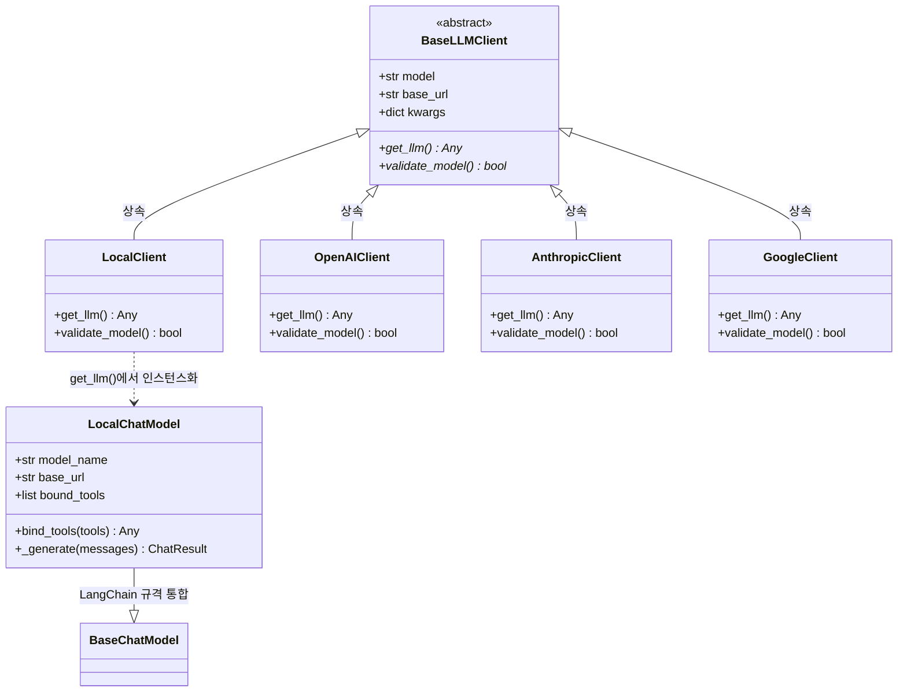

# 🔌 TradingAgents LLM 서비스 레이어 & 에뮬레이터 상세 명세서 (LLM Client & Emulator)

본 명세서는 외부 및 로컬의 다양한 대형 언어 모델(LLM) API 엔드포인트를 일원화된 인터페이스로 추상화하여 제공하는 **LLM 클라이언트 팩토리 패턴(Factory Pattern)** 구현 사양, 런타임 종속성 최소화를 위한 **지연 로딩(Lazy Import)** 설계, 그리고 네이티브 도구 호출(Tool Calling) 스펙을 지원하지 않는 경량 로컬 모델(Ollama Llama3 등)을 플랫폼 그래프에 원활히 통합하기 위해 설계된 **Custom Tool-Calling Emulator** 구현체를 상세히 명세합니다. 본 문서는 옵시디언(Obsidian) 전용 링크 및 이미지 임베딩 포맷에 최적화되어 있습니다.

---

## 🎨 1. 클래스 다이어그램 및 설계 관계도

플랫폼의 LLM 서비스 레이어는 다음과 같은 인터페이스 지향적 설계와 LangChain 모델 통합 계층 구조를 보유하고 있습니다:



---

## 🥤 2. LLM 클라이언트 팩토리 패턴 및 지연 로딩 (Factory & Lazy Import)

다양한 인공지능 공급자(OpenAI, Anthropic, Google Gemini, Azure, Local 등)는 각자 고유한 클라이언트 SDK 객체 규격과 서로 다른 매개변수 스키마를 요구합니다. 

이러한 개별 공급자 클래스의 복잡한 세부 구현을 상위 에이전트 노드로부터 완전히 은닉하고 단일 게이트웨이 함수로 제어하기 위해, 시스템은 **추상 팩토리 패턴 (Factory Pattern)**을 도입하여 아키텍처 결합도를 대폭 낮췄습니다.

![[llm_client_factory.png]]

위 일러스트처럼, 플랫폼 시스템 내부의 LLM 관문은 단일 팩토리 진입점(`create_llm_client`) 뒤로 추상화되어 있어, 상위 노드 컴포넌트는 단지 공급자 이름과 대상 모델 문자열을 넘겨주는 것만으로 완벽히 추상화 및 캡슐화된 `BaseLLMClient` 구현 인스턴스를 보장받게 됩니다.

### ⚙️ 2.1 팩토리 함수 핵심 구현 (`create_llm_client`)
* **소스 코드 위치**: `tradingagents/llm_clients/factory.py` $\rightarrow$ [[factory.py#L15]]

```python
def create_llm_client(
    provider: str,
    model: str,
    base_url: Optional[str] = None,
    **kwargs,
) -> BaseLLMClient:
    provider_lower = provider.lower()

    if provider_lower == "local":
        from .local_client import LocalClient
        return LocalClient(model, base_url, **kwargs)

    if provider_lower in _OPENAI_COMPATIBLE:
        from .openai_client import OpenAIClient
        return OpenAIClient(model, base_url, provider=provider_lower, **kwargs)

    if provider_lower == "anthropic":
        from .anthropic_client import AnthropicClient
        return AnthropicClient(model, base_url, **kwargs)

    if provider_lower == "google":
        from .google_client import GoogleClient
        return GoogleClient(model, base_url, **kwargs)

    if provider_lower == "azure":
        from .azure_client import AzureOpenAIClient
        return AzureOpenAIClient(model, base_url, **kwargs)

    raise ValueError(f"Unsupported LLM provider: {provider}")
```

### 🧠 2.2 런타임 격리를 위한 지연 로딩(Lazy Import)의 필연성

![[lazy_import_isolation.png]]

일반적인 Python 설계에 따라 모든 외부 라이브러리 임포트(`import openai`, `import google.generativeai` 등)를 파일 최상단(Top-level)에 선언하면 다음과 같은 치명적인 문제가 발생합니다:

1. **종속성 크래시**: 사용자가 특정 공급자(예: Anthropic)만을 선택해 구동하고자 할지라도, 사용자의 로컬 환경에 OpenAI나 Google SDK 패키지가 누락되어 있다면 모듈 로드 시점에 즉시 `ImportError`가 발생해 실행 자체가 불가능해집니다.
2. **부팅 오버헤드**: 불필요한 무거운 인공지능 SDK 패키지들이 물리 메모리에 한꺼번에 적재되어 서버 초기 기동 지연(Latency)이 심화됩니다.

> [!TIP]
> **지연 로딩 (Lazy Import) 적용 효과**
> * 본 플랫폼은 공급자 분기 내부 함수가 호출되는 정확한 시점에만 해당 외부 SDK 종속성 모듈을 임포트합니다. 이를 통해 서버 가동 및 테스트 탐색 단계를 밀리초(ms) 단위로 초고속화하며, 불필요한 API 키 누락 예외를 사전에 원천 차단합니다.

### ⚙️ 2.3 대칭적 클라이언트 실행 환경 (Symmetrical Client Execution)

본 플랫폼의 LLM 클라이언트 팩토리(`create_llm_client`)는 메인 멀티 에이전트 백테스트 시뮬레이션뿐만 아니라, **실시간 뉴스 AI 해석 마이크로 서비스(News AI Interpretation Service)**에서도 완전히 대칭적인 방식으로 호출되어 작동합니다.

* **뉴스 AI 해석 프로세스**: 우측 사이드바의 실시간 뉴스 피드 영역에서 특정 뉴스를 선택하면, 사용자가 프론트엔드 설정창(Settings Modal)에 입력하고 로컬 스토리지(`localStorage`)에 저장해 둔 맞춤형 LLM 설정값(`provider`, `base_url`, `api_key`, `model_name`)이 [[06_backend_api.md]]의 `NewsInterpretRequest` 스키마를 통해 백엔드 라우터(`/api/v1/news/interpret`)로 송신됩니다.
* **대칭형 초기화**: 백엔드 라우터는 전달받은 개별 매개변수를 활용하여 메인 에이전트 노드와 완전히 동일한 `create_llm_client` 팩토리를 통해 임시 `BaseLLMClient` 구현 인스턴스를 동적으로 인스턴스화하고, LangChain 메시지 프로토콜(`SystemMessage`, `HumanMessage`)을 거쳐 `llm.invoke()`를 대칭형으로 수행합니다.
* **통일성 보장**: 이로써 주 트레이딩 파이프라인의 에이전트와 독립된 실시간 해석 기능이 완전히 통일된 LLM 커넥션 생태계를 공유하게 됩니다.

---

## 🤖 3. 도구 호출 에뮬레이터 (Custom Tool-Calling Emulator)

![[magic_translator.png]]

오픈AI GPT-4, 구글 제미나이 등 상용 대형 모델은 "지금 주가 보조 지표 도구가 필요하니까 `get_indicators` 함수를 인자값 `{"symbol": "AAPL"}`로 호출해야겠다"고 판단하여 JSON 신호로 리턴해주는 네이티브 도구 호출(Tool Calling) 스펙을 자체 탑재하고 있습니다. 

반면 사용자가 자체 인프라에서 구동하는 로컬 경량 모델(예: Llama-3-8B) 등은 이러한 구조화 도구 호출 능력이 결여되어 있어, 도구 호출 요청을 단순한 문장(자연어 텍스트)으로 답변하여 랭그래프의 ToolNode 구동 흐름을 깨뜨리는 한계가 있습니다.

이를 완벽히 극복하기 위해, 시스템은 로컬용 API 인터셉터 구조인 **`LocalChatModel` 에뮬레이터**를 물리적으로 탑재했습니다.

```
       [ Custom Tool-Calling Emulator 데이터 흐름 ]

  [에이전트 노드] ──► "애플(AAPL) 주가 조회 도구 호출 필요"
                           │
                           ▼
                  [ LocalChatModel 가동 ]
                  (시스템 프롬프트 영역에 사용 가능한 도구 명세 주입 및 
                   ```json ... ``` 마크다운 출력 강제 룰 규칙 삽입)
                           │
                           ▼
  [로컬 LLM 서버] ──► ```json {"tool": "get_stock_data", "args": {"symbol": "AAPL"}} ```
                           │
                           ▼  (정규식 및 JSON 파싱 인터셉터 발동)
                  [ Regex JSON block extraction ]
                  (raw text 내에서 json 블록을 획득하여 랭체인 공식 규격 카드로 포장)
                           │
                           ▼
  [랭그래프 흐름] ──► AIMessage(content="", tool_calls=[...]) 로 전달 (정상 구동!)
```

### ⚙️ 3.1 동적 도구 스키마 프롬프트 인젝션
`LocalChatModel` 객체는 에이전트로부터 바인딩된 도구 리스트(`self.bound_tools`)가 감지되면, 시스템 프롬프트의 끝단에 모델이 해석 가능한 툴 스펙 지침서(`tool_instructions`)를 동적으로 합성합니다:

```python
if self.bound_tools:
    tool_instructions = "\n\n### Available Tools\nYou have access to the following tools for retrieving financial data:\n"
    for tool in self.bound_tools:
        name = getattr(tool, "name", getattr(tool, "__name__", str(tool)))
        description = getattr(tool, "description", "")
        args = getattr(tool, "args", "")
        tool_instructions += f"- `{name}`: {description}. Arguments schema: {args}\n"
        
    tool_instructions += (
        "\nTo execute a tool call, you MUST respond ONLY with a JSON block in this exact format:\n"
        "```json\n"
        "{\n"
        '  "tool": "tool_name",\n'
        '  "args": {"arg_name": "value"}\n'
        "}\n"
        "```\n"
        "Do not write any other text, pleasantries, or reasoning when you decide to call a tool. Just output the JSON block."
    )
    system_prompt += tool_instructions
```

### 🛡️ 3.2 정규식 기반 도구 신호 파싱 알고리즘
* **소스 코드 위치**: `tradingagents/llm_clients/local_client.py` $\rightarrow$ [[local_client.py#L153]]

번역 어댑터 역할을 하는 `LocalChatModel` 클래스는 내부적으로 고속 정규식(Regular Expression) 매칭 기계인 `re.search`를 가동하여, 로컬 모델이 뱉어낸 문자열 뭉치에서 도구 호출 JSON 블록을 칼같이 추출해 재포장하는 물리 코드를 탑재했습니다.

```python
# 1단계: re.DOTALL 모드로 마크다운 내 json 코드 블록을 다자간 탐색합니다.
json_match = re.search(r"```json\s*(.*?)\s*```", raw_text, re.DOTALL)

if not json_match:
    # 2단계: 예외 복구(JSON 래퍼가 누락되었으나 텍스트 자체가 단일 객체 형식일 때)
    stripped = raw_text.strip()
    if stripped.startswith("{") and stripped.endswith("}"):
        raw_text_clean = stripped
    else:
        raw_text_clean = None
else:
    raw_text_clean = json_match.group(1).strip()
    
if raw_text_clean:
    try:
        # 3단계: JSON 구문 해석 및 유효성 검사
        parsed_json = json.loads(raw_text_clean)
        if "tool" in parsed_json and "args" in parsed_json:
            # 4단계: LangChain 호환용 난수 ID 기반 구조화 tool_call 카드 구성
            tool_call = {
                "name": parsed_json["tool"],
                "args": parsed_json["args"],
                "id": "call_" + str(uuid.uuid4()).replace("-", ""),
                "type": "tool_call"
            }
            tool_calls.append(tool_call)
    except Exception:
        pass # 파싱 장애 시 텍스트 본문 모드로 백업 통제
```

이 고속 어댑터 레이어 덕분에, **구조화된 도구 호출 능력이 결여된 경량 로컬 모델조차 완벽하게 플랫폼 그래프 내의 데이터 수집 루프를 에러 없이 수행**해낼 수 있게 됩니다.

> [!IMPORTANT]
> **출력 상태 전이의 투명성**
> * 만약 에뮬레이터가 유효한 도구 호출 JSON을 탐색해 냈을 경우, 생성된 `AIMessage` 객체의 `content`는 `""`(빈 문자열)로 설정되며 오직 `tool_calls` 필드에만 해당 매개변수 블록이 탑재됩니다. 툴 호출 조건이 성립하지 않은 일반 답변의 경우에는 원본 `raw_text`가 `content` 필드로 온전히 보존되어 상위 오케스트레이터로 흐릅니다.

---

## 🛡️ 4. 공급자별 특이 모형 제어 테이블 및 기능 바인딩 (Provider-Specific Model Catalog & Quirks)

대형 언어 모델 공급사(OpenAI, Anthropic, Google Gemini, DeepSeek, MiniMax, Qwen 등)는 규격화된 OpenAI 호환성 모드를 제공할지라도, API 수준에서 허용하는 매개변수의 사소한 차이나 응답 데이터 구조의 파편화로 인해 시스템 에러를 빈번하게 유발합니다. 

이를 단일하고 우아하게 통합 제어하기 위해 플랫폼의 LLM 클라이언트 레이어는 선언적 모형 제어 아키텍처를 도입했습니다.

### 📋 4.1 선언적 모델 케이퍼빌리티 매핑 (`capabilities.py`)
* **물리적 위치**: `tradingagents/llm_clients/capabilities.py` $\rightarrow$ [[capabilities.py#L31]]
* **설계 철학**: 상위 에이전트 생성 팩토리 코드 내부에 특정 모델명을 하드코딩한 `if-else` 분기 사다리를 생성하는 대신, 모델의 고유 API 호환 스펙을 `ModelCapabilities` 데이터 클래스 형태로 중앙 선언 관리합니다.
* **통제 매개변수 종류**:
  * `supports_tool_choice` (bool): 모델이 툴 호출 선택 강제 파라미터(`tool_choice`)를 지원하는지 여부.
  * `supports_json_mode` (bool): `response_format={"type":"json_object"}` 옵션을 지원하는지 여부.
  * `preferred_structured_method` (StructuredMethod): 구조화된 출력 획득을 위해 권장되는 파이프라인 방식.
  * `requires_reasoning_content_roundtrip` (bool): DeepSeek 계열 모델을 위한 사고 과정 히스토리 반환 필요 여부.
  * `requires_reasoning_split` (bool): MiniMax 계열의 사고 블록 분할 지원 필요 여부.

---

### 🧠 4.2 DeepSeek 추론용 사고 블록 라운드트립 (`DeepSeekChatOpenAI`)
* **물리적 위치**: `tradingagents/llm_clients/openai_client.py` $\rightarrow$ [[openai_client.py#L68]]
* **장애 요인**: DeepSeek의 추론 특화형 모델(예: `deepseek-reasoner`, `deepseek-v4-pro` 등)은 API 호출 시 사고 과정(`reasoning_content`)이 담긴 메시지를 응답합니다. 그러나 랭체인 프롬프트 체인 상에서 다음 대화 턴(Next Turn)을 이어갈 때, 어시스턴트 메시지에 이전 턴의 `reasoning_content`를 그대로 메아리처럼 실어 전송(Roundtrip)해 주지 않으면 API 서버가 **HTTP 400 (Invalid Parameter)** 예외를 내며 즉시 런타임 크래시를 일으킵니다.
* **해결 방안**: 
  1. `DeepSeekChatOpenAI` 클래스는 `_create_chat_result` 메소드에서 반환된 원본 JSON 패킷 내부의 `choices[].message.reasoning_content`를 낚아채 `generation.message.additional_kwargs["reasoning_content"]`로 안전하게 바인딩하여 메모리에 이식합니다.
  2. 차기 API 요청 발생 시, `_get_request_payload` 메소드가 동작하여 발송할 대화 배열 중 `AIMessage` 타입을 스캔한 후, `additional_kwargs`에 캐싱되어 있던 `reasoning_content` 값을 요청 바디(Body)의 `messages[].reasoning_content` 필드로 동적으로 재결합 및 동기화 합성하여 송신함으로써 API 충돌을 원천 차단합니다.
  3. 또한, 이 모델들은 `tools` 필드는 수신하지만 `tool_choice` 파라미터가 명시되면 예외를 뱉으므로 `supports_tool_choice`를 `False`로 설정하여 해당 인자만을 동적으로 숨겨 전송합니다.

---

### 🛡️ 4.3 MiniMax 사고 오염 방지 및 스플릿 바인딩 (`MinimaxChatOpenAI`)
* **물리적 위치**: `tradingagents/llm_clients/openai_client.py` $\rightarrow$ [[openai_client.py#L112]]
* **장애 요인**: MiniMax M2.x 추론 모델들은 기본적으로 `<think>...</think>` 사고 블록을 일반 답변 문자열(`message.content`) 내부에 뒤섞어 리턴합니다. 이 원시 텍스트를 여과 없이 수집 보고서 필드에 기록하면, 보고서 마크다운 출력과 대시보드 화면이 기계어 사고 로그로 어지럽혀지는 텍스트 오염 현상이 터지게 됩니다.
* **해결 방안**: 
  1. `MinimaxChatOpenAI` 클래스는 요청 Payload 생성 시점(`_get_request_payload`)에 `ModelCapabilities`를 확인한 뒤, MiniMax 추론 플래그인 `reasoning_split=True` 속성을 요청 메시지 헤더 바디에 동적으로 주입합니다.
  2. 이 플래그가 전송되면 MiniMax API는 사고 블록을 `content`에서 물리 분리하여 전용 `reasoning_details` 객체로만 출력하므로 사용자는 깨끗하게 가공된 최종 보고서 정보만을 취득할 수 있게 됩니다. (추론 기능이 없는 일반 MiniMax-Text-01 등의 모델은 해당 플래그를 수신할 시 에러를 유발하므로 케이퍼빌리티 기반으로 엄격하게 선별 주입됩니다.)

---

### 🪐 4.4 Google Gemini 지능형 씽킹 및 버젯 변환 (`GoogleClient`)
* **물리적 위치**: `tradingagents/llm_clients/google_client.py` $\rightarrow$ [[google_client.py#L20]]
* **장애 요인**: 구글의 Gemini 모델군은 생각 모드(Thinking Mode)를 적용하는 변수가 세대별로 다릅니다. Gemini 3 계열은 `thinking_level` 문자열 변수를 바로 수신하는 반면, Gemini 2.5 계열은 `thinking_budget` (정수 바이트 제한) 수치 매개변수를 전송해야 하여 두 API 설정이 상호 충돌하는 파편화를 낳습니다.
* **해결 방안**: 
  1. `GoogleClient` 클래스는 전역 환경에서 `thinking_level` 값을 수집한 후 현재 설정된 모델 문자열을 지능적으로 스캔합니다.
  2. `gemini-3` 패턴이 감지되면 문자열 파라미터를 그대로 통과시키되, Gemini 3 Pro에서 지원하지 않는 유일한 옵션인 `"minimal"` 레벨은 `"low"` 단계로 실시간 자동 다운그레이드 매핑(Auto-downgrade mapping)하여 API 크래시를 예방합니다.
  3. 만약 `gemini-2.5` 등 하위 레벨이 식별되면 `thinking_budget` 정수 체계로 매핑을 변환하며, 사용자가 `"high"` 레벨을 선택했을 때 동적 예산 활성화를 뜻하는 `-1`을, 그 외에는 씽킹 비활성화를 위해 `0` 값을 매핑 바인딩하여 안정적인 통신을 중재합니다.

---

### 🔌 4.5 Anthropic extended-thinking 씽킹 매개변수 통제 (`AnthropicClient`)
* **물리적 위치**: `tradingagents/llm_clients/anthropic_client.py` $\rightarrow$ [[anthropic_client.py#L43]]
* **장애 요인**: 앤트로픽의 확장형 생각 모드(Extended Thinking Mode) 변수인 `effort`는 오직 동적 자원이 확보된 Claude Opus 4.5+ 및 Sonnet 4.5+ 계열의 거대 flagship 모델만 지원합니다. 경량 모형인 Claude Haiku 시리즈에 이 파라미터가 섞여 유입되면, 서버는 즉시 **"This model does not support the effort parameter"** 예외를 던지며 연산을 거부합니다.
* **해결 방안**:
  1. `AnthropicClient` 클래스는 프롬프트 체인 점화 전에 `_supports_effort` 내부 헬퍼 함수를 기동하여 정규식 패턴(`re.compile(r"^claude-(opus|sonnet)-\d+-\d+$")`) 및 예외 등록 목록(`claude-mythos-preview`)과의 정확한 크기 비교 연산을 수행합니다.
  2. 케이퍼빌리티 조건에 만족하지 않는 모형(Haiku 전체 계열 등)일 경우, 사용자가 전달한 설정 인자 목록에서 `effort` 속성을 물리적으로 자동 소멸 소거(Auto-suppression)한 후 안전한 잔여 옵션만 바인딩하여 백엔드로 디스패치합니다.

---

### 🥤 4.6 응답 데이터 블록 텍스트 표준화 및 정화 (`normalize_content`)
* **물리적 위치**: `tradingagents/llm_clients/base_client.py` $\rightarrow$ [[base_client.py#L6]]
* **장애 요인**: 최신 대형 언어 모델들(OpenAI Responses API, Google Gemini 3 등)은 추론 연산 강화의 영향으로 인해, 일반 자연어 텍스트 대신 `[{'type': 'reasoning', ...}, {'type': 'text', 'text': '...'}]` 와 같은 여러 형식 블록이 중첩 결합된 배열(List) 데이터를 기본 리턴값으로 돌려줍니다. 하위 에이전트 파이프라인 노드는 plain string 포맷의 보고서만을 가정하고 수많은 가공 함수를 엮어두었기 때문에, 가공되지 않은 복합 리스트가 통과하면 파이썬 문자열 연산(`split`, `replace` 등) 단계에서 타입 에러(`TypeError`)가 나며 시스템 전체가 뻗는 위기를 초래합니다.
* **해결 방안**:
  1. 모든 클라이언트의 `invoke` 진입로에 `normalize_content` 전처리 필터를 융합 이식했습니다.
  2. 필터는 리턴된 데이터 타입이 `list` 구조임이 식별되면 내부의 블록들 중 오직 `type == 'text'` 에 귀속된 자연어 본문만을 선별적으로 긁어모아 공백 줄바꿈 문자열(`\n`)로 즉석 강제 정규화 병합(Conversion)하여 출력합니다.
  3. 이 방어용 어댑터 레이어가 작동함으로써 복잡하게 반환된 추론 데이터 패킷조차 하부 에이전트들이 100% 안전하게 이해하고 요약할 수 있게 됩니다.

