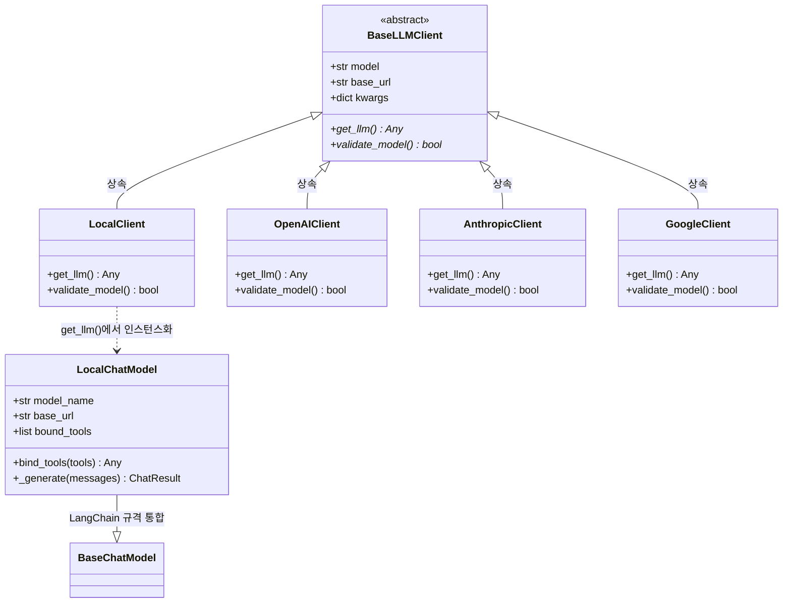

# 🔌 TradingAgents LLM 서비스 레이어 & 에뮬레이터 상세 명세서 (LLM Client & Emulator)

본 명세서는 외부 및 로컬의 다양한 대형 언어 모델(LLM) API 엔드포인트를 일원화된 인터페이스로 추상화하여 제공하는 **LLM 클라이언트 팩토리 패턴(Factory Pattern)** 구현 사양, 런타임 종속성 최소화를 위한 **지연 로딩(Lazy Import)** 설계, 그리고 네이티브 도구 호출(Tool Calling) 스펙을 지원하지 않는 경량 로컬 모델(Ollama Llama3 등)을 플랫폼 그래프에 원활히 통합하기 위해 설계된 **Custom Tool-Calling Emulator** 구현체를 상세히 명세합니다. 본 문서는 옵시디언(Obsidian) 전용 링크 및 이미지 임베딩 포맷에 최적화되어 있습니다.

---

## 🎨 1. 클래스 다이어그램 및 설계 관계도

플랫폼의 LLM 서비스 레이어는 다음과 같은 인터페이스 지향적 설계와 LangChain 모델 통합 계층 구조를 보유하고 있습니다:



---

## 🥤 2. LLM 클라이언트 팩토리 패턴 및 지연 로딩 (Factory & Lazy Import)

다양한 인공지능 공급자(OpenAI, Anthropic, Google Gemini, Azure, Local 등)는 각자 고유한 클라이언트 SDK 객체 규격과 서로 다른 매개변수 스키마를 요구합니다. 

이러한 개별 공급자 클래스의 복잡한 세부 구현을 상위 에이전트 노드로부터 완전히 은닉하고 단일 게이트웨이 함수로 제어하기 위해, 시스템은 **추상 팩토리 패턴 (Factory Pattern)**을 도입하여 아키텍처 결합도를 대폭 낮췄습니다.

![[llm_client_factory.png]]

위 일러스트처럼, 플랫폼 시스템 내부의 LLM 관문은 단일 팩토리 진입점(`create_llm_client`) 뒤로 추상화되어 있어, 상위 노드 컴포넌트는 단지 공급자 이름과 대상 모델 문자열을 넘겨주는 것만으로 완벽히 추상화 및 캡슐화된 `BaseLLMClient` 구현 인스턴스를 보장받게 됩니다.

### ⚙️ 2.1 팩토리 함수 핵심 구현 (`create_llm_client`)
* **소스 코드 위치**: `tradingagents/llm_clients/factory.py` $\rightarrow$ [[factory.py#L15]]

```python
def create_llm_client(
    provider: str,
    model: str,
    base_url: Optional[str] = None,
    **kwargs,
) -> BaseLLMClient:
    provider_lower = provider.lower()

    if provider_lower == "local":
        from .local_client import LocalClient
        return LocalClient(model, base_url, **kwargs)

    if provider_lower in _OPENAI_COMPATIBLE:
        from .openai_client import OpenAIClient
        return OpenAIClient(model, base_url, provider=provider_lower, **kwargs)

    if provider_lower == "anthropic":
        from .anthropic_client import AnthropicClient
        return AnthropicClient(model, base_url, **kwargs)

    if provider_lower == "google":
        from .google_client import GoogleClient
        return GoogleClient(model, base_url, **kwargs)

    if provider_lower == "azure":
        from .azure_client import AzureOpenAIClient
        return AzureOpenAIClient(model, base_url, **kwargs)

    raise ValueError(f"Unsupported LLM provider: {provider}")
```

### 🧠 2.2 런타임 격리를 위한 지연 로딩(Lazy Import)의 필연성

![[lazy_import_isolation.png]]

일반적인 Python 설계에 따라 모든 외부 라이브러리 임포트(`import openai`, `import google.generativeai` 등)를 파일 최상단(Top-level)에 선언하면 다음과 같은 치명적인 문제가 발생합니다:

1. **종속성 크래시**: 사용자가 특정 공급자(예: Anthropic)만을 선택해 구동하고자 할지라도, 사용자의 로컬 환경에 OpenAI나 Google SDK 패키지가 누락되어 있다면 모듈 로드 시점에 즉시 `ImportError`가 발생해 실행 자체가 불가능해집니다.
2. **부팅 오버헤드**: 불필요한 무거운 인공지능 SDK 패키지들이 물리 메모리에 한꺼번에 적재되어 서버 초기 기동 지연(Latency)이 심화됩니다.

> [!TIP]
> **지연 로딩 (Lazy Import) 적용 효과**
> * 본 플랫폼은 공급자 분기 내부 함수가 호출되는 정확한 시점에만 해당 외부 SDK 종속성 모듈을 임포트합니다. 이를 통해 서버 가동 및 테스트 탐색 단계를 밀리초(ms) 단위로 초고속화하며, 불필요한 API 키 누락 예외를 사전에 원천 차단합니다.

---

## 🤖 3. 도구 호출 에뮬레이터 (Custom Tool-Calling Emulator)

![[magic_translator.png]]

오픈AI GPT-4, 구글 제미나이 등 상용 대형 모델은 "지금 주가 보조 지표 도구가 필요하니까 `get_indicators` 함수를 인자값 `{"symbol": "AAPL"}`로 호출해야겠다"고 판단하여 JSON 신호로 리턴해주는 네이티브 도구 호출(Tool Calling) 스펙을 자체 탑재하고 있습니다. 

반면 사용자가 자체 인프라에서 구동하는 로컬 경량 모델(예: Llama-3-8B) 등은 이러한 구조화 도구 호출 능력이 결여되어 있어, 도구 호출 요청을 단순한 문장(자연어 텍스트)으로 답변하여 랭그래프의 ToolNode 구동 흐름을 깨뜨리는 한계가 있습니다.

이를 완벽히 극복하기 위해, 시스템은 로컬용 API 인터셉터 구조인 **`LocalChatModel` 에뮬레이터**를 물리적으로 탑재했습니다.

```
       [ Custom Tool-Calling Emulator 데이터 흐름 ]

  [에이전트 노드] ──► "애플(AAPL) 주가 조회 도구 호출 필요"
                           │
                           ▼
                  [ LocalChatModel 가동 ]
                  (시스템 프롬프트 영역에 사용 가능한 도구 명세 주입 및 
                   ```json ... ``` 마크다운 출력 강제 룰 규칙 삽입)
                           │
                           ▼
  [로컬 LLM 서버] ──► ```json {"tool": "get_stock_data", "args": {"symbol": "AAPL"}} ```
                           │
                           ▼  (정규식 및 JSON 파싱 인터셉터 발동)
                  [ Regex JSON block extraction ]
                  (raw text 내에서 json 블록을 획득하여 랭체인 공식 규격 카드로 포장)
                           │
                           ▼
  [랭그래프 흐름] ──► AIMessage(content="", tool_calls=[...]) 로 전달 (정상 구동!)
```

### ⚙️ 3.1 동적 도구 스키마 프롬프트 인젝션
`LocalChatModel` 객체는 에이전트로부터 바인딩된 도구 리스트(`self.bound_tools`)가 감지되면, 시스템 프롬프트의 끝단에 모델이 해석 가능한 툴 스펙 지침서(`tool_instructions`)를 동적으로 합성합니다:

```python
if self.bound_tools:
    tool_instructions = "\n\n### Available Tools\nYou have access to the following tools for retrieving financial data:\n"
    for tool in self.bound_tools:
        name = getattr(tool, "name", getattr(tool, "__name__", str(tool)))
        description = getattr(tool, "description", "")
        args = getattr(tool, "args", "")
        tool_instructions += f"- `{name}`: {description}. Arguments schema: {args}\n"
        
    tool_instructions += (
        "\nTo execute a tool call, you MUST respond ONLY with a JSON block in this exact format:\n"
        "```json\n"
        "{\n"
        '  "tool": "tool_name",\n'
        '  "args": {"arg_name": "value"}\n'
        "}\n"
        "```\n"
        "Do not write any other text, pleasantries, or reasoning when you decide to call a tool. Just output the JSON block."
    )
    system_prompt += tool_instructions
```

### 🛡️ 3.2 정규식 기반 도구 신호 파싱 알고리즘
* **소스 코드 위치**: `tradingagents/llm_clients/local_client.py` $\rightarrow$ [[local_client.py#L153]]

번역 어댑터 역할을 하는 `LocalChatModel` 클래스는 내부적으로 고속 정규식(Regular Expression) 매칭 기계인 `re.search`를 가동하여, 로컬 모델이 뱉어낸 문자열 뭉치에서 도구 호출 JSON 블록을 칼같이 추출해 재포장하는 물리 코드를 탑재했습니다.

```python
# 1단계: re.DOTALL 모드로 마크다운 내 json 코드 블록을 다자간 탐색합니다.
json_match = re.search(r"```json\s*(.*?)\s*```", raw_text, re.DOTALL)

if not json_match:
    # 2단계: 예외 복구(JSON 래퍼가 누락되었으나 텍스트 자체가 단일 객체 형식일 때)
    stripped = raw_text.strip()
    if stripped.startswith("{") and stripped.endswith("}"):
        raw_text_clean = stripped
    else:
        raw_text_clean = None
else:
    raw_text_clean = json_match.group(1).strip()
    
if raw_text_clean:
    try:
        # 3단계: JSON 구문 해석 및 유효성 검사
        parsed_json = json.loads(raw_text_clean)
        if "tool" in parsed_json and "args" in parsed_json:
            # 4단계: LangChain 호환용 난수 ID 기반 구조화 tool_call 카드 구성
            tool_call = {
                "name": parsed_json["tool"],
                "args": parsed_json["args"],
                "id": "call_" + str(uuid.uuid4()).replace("-", ""),
                "type": "tool_call"
            }
            tool_calls.append(tool_call)
    except Exception:
        pass # 파싱 장애 시 텍스트 본문 모드로 백업 통제
```

이 고속 어댑터 레이어 덕분에, **구조화된 도구 호출 능력이 결여된 경량 로컬 모델조차 완벽하게 플랫폼 그래프 내의 데이터 수집 루프를 에러 없이 수행**해낼 수 있게 됩니다.

> [!IMPORTANT]
> **출력 상태 전이의 투명성**
> * 만약 에뮬레이터가 유효한 도구 호출 JSON을 탐색해 냈을 경우, 생성된 `AIMessage` 객체의 `content`는 `""`(빈 문자열)로 설정되며 오직 `tool_calls` 필드에만 해당 매개변수 블록이 탑재됩니다. 툴 호출 조건이 성립하지 않은 일반 답변의 경우에는 원본 `raw_text`가 `content` 필드로 온전히 보존되어 상위 오케스트레이터로 흐릅니다.
