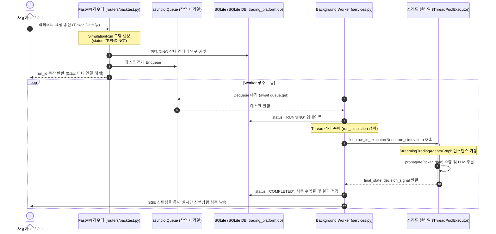
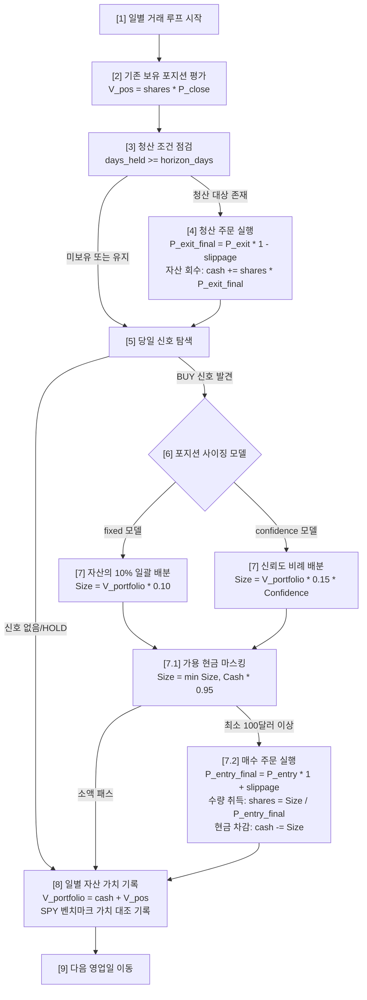

# ⚙️ FastAPI 백엔드 서비스 & 백테스트 시뮬레이션 엔진 상세 명세서 (Backend & Quant Engine)

본 명세서는 실시간 대시보드와 백그라운드 다중 에이전트 연산을 격리하여 동시성을 확보하는 **FastAPI 비동기 작업 대기열(Async Task Queue)** 구조, 자연어로 기록된 에이전트의 종합 보고서로부터 거래 지표들을 정확히 파싱하는 **`SignalExtractor`** 모듈, 그리고 Pandas/Numpy를 활용하여 고속 벡터화 가상 거래 시뮬레이션을 수행하고 정량적 성과 지표(Sharpe Ratio, MDD, Alpha, Beta)를 산출해 내는 **백테스트 엔진(BacktestEngine)**의 정밀 사양을 수리적으로 명세합니다. 본 문서는 옵시디언(Obsidian) 전용 링크 및 이미지 임베딩 포맷에 최적화되어 있습니다.

---

## ☕ 1. FastAPI 비동기 작업 대기열 및 백그라운드 워커 (Async Task Queue)

다중 에이전트 시뮬레이션 및 데이터 수집 런타임은 외부 LLM 추론 지연과 네트워크 I/O 병목으로 인해 1회 실행 당 최소 1분에서 5분 이상의 실행 주기를 가집니다. 

만약 백엔드가 해당 세션을 동기식(Synchronous) 단일 스레드로 처리한다면, 한 손님의 요청이 끝날 때까지 서버 전체가 블로킹(Blocking) 상태에 빠져 다른 사용자의 어떠한 API 요청도 수신할 수 없는 장애가 발생합니다.

이를 해결하기 위해, 플랫폼은 **비동기 작업 대기열(Async Queue)과 독립 백그라운드 워커(Background Task Worker)** 아키텍처를 구축했습니다.

![[fastapi_queue_worker.png]]

### ⚙️ 1.1 비동기 작업 처리 격리 시퀀스

사용자 요청 시점부터 스레드 풀 격리 실행 및 결과 데이터 동기화까지의 생명주기를 나타낸 흐름도입니다:



### 📋 1.2 비동기 제어 구조 및 데이터 모델

#### 📁 비동기 워커 루프 구현 (`services.py`)
* **상주 리스너**: `start_worker` 함수는 서버 부팅 시점에 `asyncio.create_task`에 의해 비동기 백그라운드 작업으로 등록되어 무한 루프 형태로 가동됩니다.
* **대기열 수신 블로킹**: `task = await queue.get()` 코드 라인에서 작업이 들어올 때까지 비동기식으로 대기하여 CPU 리소스 낭비를 방지합니다.
* **스레드 풀 격리**: LangGraph의 유향 동기 그래프 런타임(`ta.propagate()`)은 CPU 바운드 연산 및 파일 I/O를 다량 포함합니다. 파이썬의 단일 비동기 이벤트 루프가 이를 실행하면 이벤트 루프 자체가 먹통이 되므로(Event Loop Starvation), `loop.run_in_executor(None, run_simulation)`를 호출하여 파이썬 전역 스레드 풀(`ThreadPoolExecutor`)로 작업을 물리적으로 이관합니다.

#### 🗄️ 백테스트 제어 상태 전이 모델 (`SimulationRun`)
* `PENDING`: 요청이 접수되어 `asyncio.Queue`에 대기 중인 상태.
* `RUNNING`: 백그라운드 워커가 작업을 수주하여 실제 에이전트 그래프 추론을 스레드 풀에서 구동 중인 상태.
* `COMPLETED`: 그래프 연산 및 Pandas 백테스팅 시뮬레이션 계산이 정상 완수되어 성과가 저장된 상태.
* `FAILED`: 통신 장애, 파싱 에러 등으로 내부 예외가 전파되어 비정상 중단된 상태.

* **관련 소스 코드 위치**: `backend/app/services.py` $\rightarrow$ [[services.py#L343]] `run_simulation` 및 스레드 격리 구동부

---

## 📝 2. 자연어 의사결정 파싱 엔진 (`SignalExtractor`)

![[signal_extractor_flow.png]]

포트폴리오 매니저 에이전트의 최종 출력은 자연어로 풍부하게 기재된 마크다운 형식의 종합 보고서 텍스트(`decision_text`)입니다. 

정량 시뮬레이터인 `BacktestEngine`은 자연어를 해독할 수 없으므로, 비정형 보고서 원문에서 **거래 액션(BUY/SELL/HOLD), 신뢰 계수(Confidence Score), 보유 타겟 일수(Horizon Days), 그리고 목표 가격(Price Target)**을 정확하게 골라내 정형 데이터프레임으로 주조해 주는 **`SignalExtractor`** 모듈이 전면 구동됩니다.

### ⚙️ 2.1 자연어 텍스트 정규식 파싱 알고리즘

`SignalExtractor` 클래스는 내부적으로 다음과 같은 컴포넌트 메서드를 보유하고 있습니다.

#### 🔄 1. 매매 의사결정 분류 (`parse_recommendation`)
텍스트 원문을 대문자로 정규화한 뒤, 금융 용어 패턴 사전을 기반으로 의사결정을 필터링합니다.
* `STRONG BUY`: `"STRONG BUY"`, `"강력 매수"`, `"강력매수"` 매칭
* `OVERWEIGHT`: `"OVERWEIGHT"`, `"비중확대"`, `"비중 확대"`, `"매수 대기"`, `"매수대기"` 매칭
* `UNDERWEIGHT`: `"UNDERWEIGHT"`, `"비중축소"`, `"비중 축소"` 매칭
* `SELL`: `"SELL"`, `"매도"`, `"추천: 매도"`, `"청산"` 매칭
* `BUY`: 상기 강세 매수/비중 확대를 제외한 단순 `"BUY"`, `"매수"`, `"추천: 매수"`, `"매입"`, `"구매"` 매칭
* `HOLD`: 어떠한 분류 필터에도 걸리지 않은 모든 텍스트에 대한 기본 디폴트 반환값

#### 🎯 2. 확신도 스캔 (`extract_confidence`)
정규식을 통해 명시적인 수치 기재 영역을 탐색하며, 탐색 실패 시 의미론적 폴백 값을 적용합니다.
* **추출 정규식**: `r"(?:confidence|신뢰도|확신도|확신)\s*:\s*(\d+(?:\.\d+)?)%?"` (대소문자 무시)
* **스무딩 바운더리 연산**: 퍼센트 단위로 입력받은 경우(`val > 1.0`), $val = \frac{val}{100.0}$을 수행하여 강제로 `[0.0, 1.0]` 범위의 가중치 실수로 마스킹합니다.
* **의미론적 폴백**: 수치 패턴 탐색 실패 시 텍스트 내용 중 `"STRONG"` 문맥 감지 시 `0.90`, 일반 매수/매도는 `0.80`, 비중 관련은 `0.65`, 일반 홀드는 `0.50`을 반환합니다.

#### 📅 3. 투자 지평 보유 영업일 파싱 (`extract_horizon_days`)
포지션 자동 청산의 기준이 되는 보유 기간(Horizon Days)을 정량 수치로 산출합니다.
* **1차 타겟 정규식**: `r"(?:time horizon|horizon|기간|투자 기간)\s*:\s*(.*?)(?:\n|\Z)"`
* **주기별 수치 정화**:
  * 일(Days) 단위: `r"(\d+)\s*(?:day|일)"` $\rightarrow$ 정수값 그대로 반환
  * 주(Weeks) 단위: `r"(\d+)\s*(?:week|주)"` $\rightarrow$ 정수값 $\times 5$ (영업일 환산)
  * 월(Months) 단위: `r"(\d+)\s*(?:month|달|개월)"` $\rightarrow$ 정수값 $\times 21$ (월평균 영업일 환산)
  * 감지 실패 시 디폴트 보유 기간: **5영업일** 자동 지정

#### 💵 4. 목표 타겟가 추출 (`extract_price_target`)
포지션 가치 평가 및 수익 실현 앵커로 쓰일 목표 주가를 추출합니다.
* **목표가 정규식**: `r"(?:price target|target|목표가|목표 가격)[*\s]*:\s*(?:\$)?\s*([0-9,]+(?:\.[0-9]+)?)"`
* **정제**: 화폐 기호나 쉼표(`,`)를 공백으로 대치한 후 `float` 형식으로 원자적 변환을 수행합니다.

* **관련 소스 코드 위치**: `backend/app/quant_engine.py` $\rightarrow$ [[quant_engine.py#L11]] 클래스

---

## 🏎️ 3. 벡터화 백테스트 엔진 및 금융 공학 사양 (`BacktestEngine`)

![[vectorized_backtest_math.png]]

**`BacktestEngine`**은 `SignalExtractor`가 수립한 정량 신호 배열을 수신하여 과거 실제 종목 가격 장부에 맞춰 일별 시뮬레이션을 실행하는 백그라운드 엔진입니다. 

### ⚙️ 3.1 포트폴리오 백테스트 가상 매매 시뮬레이션 알고리즘

시뮬레이터는 매 거래일(Trading Calendar Loop)마다 자산 가치 평가와 진입/청산 주문을 수행합니다:



> [!IMPORTANT]
> **체결 오차 슬리피지(Slippage) 보정식**
> * 가상 매매 체결의 엄격한 현실성을 부여하기 위해 플랫폼은 **0.05% (`slippage=0.0005`)**의 페널티 비용을 매매 체결 시 마다 정산가에 강제 반영합니다.
> * 매수 진입 시 체결가 가중: $P_{entry\_final} = P_{entry} \times (1 + 0.0005)$ (더 비싸게 매수)
> * 매도 청산 시 체결가 삭감: $P_{exit\_final} = P_{exit} \times (1 - 0.0005)$ (더 저렴하게 매도)

---

## 📈 4. 금융 공학적 정량 평가 공식 및 수리적 정의

시뮬레이션이 종료되면 Pandas 및 NumPy 행렬 연산을 활용하여 포트폴리오의 실력을 검증하는 5대 표준 금융 공학 지표를 다음과 같은 수학적 수식 사양에 의거해 최종 계산합니다.

### 📊 4.1 Sharpe Ratio (샤프 지수)
전략의 단순 수익률이 아무리 높을지라도 매일의 변동성(위험)이 극심하다면 안정성이 떨어집니다. 샤프 지수는 무위험 수익률 가정을 `0`으로 상정하고, 포트폴리오 일별 수익률의 기대값과 일별 수익률의 변동성(표준편차)을 연율화(Annualization)하여 나누어 계산한 위험 조정 가성비 계수입니다.

$$\text{Sharpe Ratio} = \frac{E[R_p]}{\sigma_p} \times \sqrt{252}$$

* **수식 변수 정의**:
  * $R_{p, t} = \frac{V_p(t) - V_p(t-1)}{V_p(t-1)}$: 포트폴리오 일일 수익률(Daily Return)
  * $E[R_p]$: $R_{p, t}$ 시계열 배열의 산술 평균값
  * $\sigma_p = \sqrt{\frac{1}{N-1} \sum_{t=1}^N (R_{p, t} - E[R_p])^2}$: 일일 수익률의 표본 표준편차
  * $\sqrt{252}$: 1년 거래 영업일수 $252$를 반영하여 일일 지수를 연도 단위 지수로 환산하는 승수
* **아키텍처 평점**: 통상적으로 샤프 지수가 **1.0 이상이면 위험 대비 안정성이 검증된 준수한 전략**으로 판단하며, **2.0 이상은 매우 안정된 초우량 알고리즘**으로 판별합니다.

### 📉 4.2 Max Drawdown (MDD, 최대 낙폭)
최대 낙폭은 시뮬레이션 전 기간 중 가상 계좌 자산이 최고 기록(Peak Value)을 갱신한 후 기록한 직후 가장 깊은 바닥(Trough Value)까지 꼬꾸라진 최대 자산 감소 폭의 최솟값(가장 뼈아픈 마이너스 비율)입니다.

$$\text{MDD} = \min_{t} \left( \frac{V_p(t) - \text{Peak}_p(t)}{\text{Peak}_p(t)} \right)$$

$$\text{단, } \text{Peak}_p(t) = \max_{\tau \le t} V_p(\tau)$$

![[sharpe_mdd_concept.png]]

* **수식 변수 정의**:
  * $V_p(t)$: $t$ 시점의 포트폴리오 자산 가치 (Portfolio Value)
  * $\text{Peak}_p(t)$: $t$ 시점 이전까지 달성한 가상 계좌 최고 자산 가치 (Peak Value)
* **아키텍처 평점**: 최종 누적 수익률이 아무리 뛰어난 들 MDD가 **-30%를 초과**하면 실전 운용 시 계좌 고사가 벌어집니다. 본 플랫폼의 포트폴리오 매니저는 리스크 에이전트의 비중 조절 필터를 통해 MDD 폭탄을 제한하도록 통제받습니다. (상세 리스크 에이전트 노드: [[02_agent_system.md]])

### 🏆 4.3 Beta ($\beta$, 체계적 위험 민감도)
벤치마크 시장 지수(SPY ETF)의 변동성 대비 포트폴리오 자산이 얼마나 연동하여 민감하게 춤추는지를 측정하는 공분산 감도 비율입니다.

$$\beta = \frac{\text{Cov}(R_p, R_m)}{\text{Var}(R_m)}$$

* **수식 변수 정의**:
  * $R_p$: 포트폴리오 일일 수익률 시계열 벡터
  * $R_m$: 벤치마크 시장(SPY) 일일 수익률 시계열 벡터
  * $\text{Cov}(R_p, R_m) = E[(R_p - E[R_p])(R_m - E[R_m])]$: 공분산(Covariance)
  * $\text{Var}(R_m) = E[(R_m - E[R_m])^2]$: 벤치마크 변동성의 분산(Variance)

### 📈 4.4 Annualized Alpha ($\alpha$, 순수 초과 수익률)
시장 변동 민감도(Beta)에 따른 자연 변동분(체계적 수익)을 제하고, 오직 우리 에이전트들의 지능적 포트폴리오 조율 실력으로만 일궈낸 **연간 환산 고유 초과 수익률**입니다.

$$\alpha = \left( E[R_p] \times 252 \right) - \left( \beta \times E[R_m] \times 252 \right)$$

* **수식 변수 정의**:
  * $E[R_p] \times 252$: 포트폴리오의 연율화 평균 수익률
  * $E[R_m] \times 252$: 벤치마크 시장(SPY)의 연율화 평균 수익률

### 🎯 4.5 Win Rate (승률) & Profit Factor (손익비)
매매 체결 기록 배열(`completed_trades`)을 스캔하여 거래의 정량적 거래 분포를 도출합니다.

$$\text{Win Rate} = \frac{N_{win}}{N_{total}}$$

$$\text{Profit Factor} = \frac{\sum_{j \in Winning} Profit_j}{\sum_{k \in Losing} |Profit_k|}$$

* **수식 변수 정의**:
  * $N_{win}$: 개별 청산 거래 중 실질 수익이 0보다 큰 거래 횟수 ($Profit > 0$)
  * $N_{total}$: 전체 완료된 총 거래 청산 횟수
  * $\text{Profit Factor}$: 총 이익금 합산 대비 총 손실금 합산의 비율로, **1.5 이상이면 이익 수용력이 검증된 우수한 트레이딩 모델**로 해석합니다.

* **관련 소스 코드 위치**: `backend/app/quant_engine.py` $\rightarrow$ [[quant_engine.py#L364]] `_calculate_backtest_summary` 메소드

---

## 📰 5. 실시간 뉴스 AI 해석 서비스 및 반-환각 예외 방어 (News AI Interpretation & Fallback)

웹 대시보드의 우측 패널에 표시되는 실시간 경제 뉴스 피드는 단순 텍스트 표시를 넘어, 대화형 AI가 특정 종목에 미칠 거시/미시 경제적 파급력을 즉석에서 풀이해 주는 실시간 해석 API 서비스를 탑재하고 있습니다.

### ⚙️ 5.1 동적 설정 연동 스키마 (`NewsInterpretRequest`)
사용자가 설정창에서 수정한 커스텀 LLM 설정은 Pydantic 데이터 모델인 `NewsInterpretRequest`를 거쳐 타입 세이프하게 백엔드로 전송됩니다.
* **소프트웨어 물리 구조**: `backend/app/schemas.py` $\rightarrow$ [[schemas.py#L133]]

```python
class NewsInterpretRequest(BaseModel):
    ticker: str = Field(..., description="Stock ticker symbol")
    news_title: str = Field(..., description="News title")
    news_summary: str = Field(..., description="News body or summary")
    provider: Optional[str] = Field("local", description="LLM provider")
    base_url: Optional[str] = Field(None, description="LLM endpoint URL")
    api_key: Optional[str] = Field(None, description="LLM Authentication API key")
    model_name: Optional[str] = Field(None, description="LLM model identifier")
```

### 🛡️ 5.2 반-환각 방어 및 예외 차단 가이드라인 (Anti-Hallucination Fallback)
* **소스 코드 위치**: `backend/app/routers/market.py` $\rightarrow$ [[market.py#L253]]
* **동작 원리**: 
  1. `/api/v1/news/interpret` 엔드포인트는 프론트엔드가 송신한 `NewsInterpretRequest`를 파싱하여 `create_llm_client`를 통해 LLM 클라이언트를 동적 할당합니다.
  2. 만약 로컬 LLM 서버(예: LM Studio, Ollama)가 오프라인 상태이거나 네트워크 장애 등으로 인해 API 접속 실패 예외(`Exception`)가 검출될 경우, 이를 무조건 크래시로 처리해 버리거나 임의의 환각(Hallucination) 예측값을 생성해 사용자에게 잘못된 투자 힌트를 주지 않도록 **반-환각 프로토콜(Anti-Hallucination Protocol)**을 강력 구동합니다.
  3. 예외 트랩(`except Exception`)에 포착되면, 에러를 숨기거나 임의의 시장 판별을 내리는 대신 사용자에게 **로컬 서버 작동 불능 상태 및 LMStudio 구성 요소 연결 상태를 직접 알리고 자가 해결법을 제안하는 표준 마크다운 경고 카드**를 온전히 조립하여 프론트엔드로 리턴합니다:

```python
fallback_interpretation = (
    f"### ⚠️ [AI 분석 지연 안내] {ticker} 분석 보고서\n\n"
    f"- **오류 내용**: 현재 AI 분석 모델 엔진(LLM)과의 연결이 끊겼거나 응답이 지연되고 있습니다.\n"
    f"- **안내 가이드**: 백엔드 로컬 LLM 서버(LMStudio) 작동 상태를 점검해 주십시오. 연결이 복구되면 즉시 정상적인 AI 해설을 받아보실 수 있습니다."
)
```

이 고도화된 방어 장치는 잘못된 기계적 분석 데이터로 초보 투자자가 잘못된 판단을 내릴 가능성을 사전에 차단하며, 시스템의 실시간 유지보수성과 진단성을 획기적으로 향상시킵니다.

