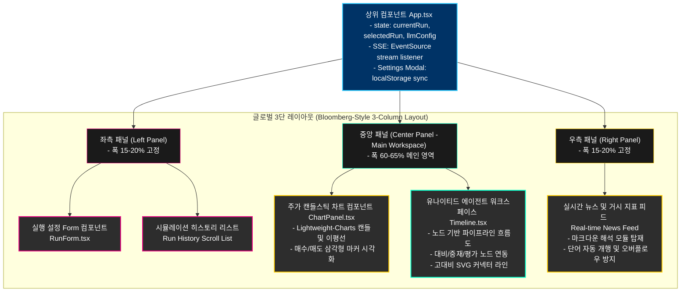

# 🖥️ React 대시보드 컴포넌트 및 스트리밍 시각화 명세서 (Frontend Specification)

본 명세서는 TradingAgents 플랫폼의 웹 사용자 인터페이스를 담당하는 **React/Vite 프론트엔드(`frontend/src/`)**의 모듈형 컴포넌트 계층 설계 사양, **`EventSource` API**를 통하여 백엔드의 비동기 이벤트를 실시간 단방향 스트리밍 수신하는 **Server-Sent Events(SSE) 리시버** 구현부, 그리고 대량의 시계열 주가 캔들 및 가상 포트폴리오 수익률 곡선을 렉 없이 초당 60FPS 속도로 부드럽게 렌더링하는 **TradingView Lightweight Charts** 시각화 연동 사양을 상세히 기술합니다. 본 문서는 옵시디언(Obsidian) 전용 링크 및 이미지 임베딩 포맷에 최적화되어 있습니다.

---

## 🧱 1. React 컴포넌트 계층 아키텍처 (Component Hierarchy)

![[dashboard_grid_layout.png]]

프론트엔드 아키텍처는 코드의 모듈성 확보와 단일 책임 원칙(SRP)을 충족하기 위해, 단일 페이지로 구성하되 기능별로 물리 격리되어 계층적으로 조립되는 **조립형 컴포넌트 구조**를 취하고 있습니다. 

상위 컴포넌트인 `App.tsx`가 전체 애플리케이션의 공용 컨텍스트 상태 관리와 REST API 통신, 그리고 SSE 영속 연결 관리를 수행하며, 하부 컴포넌트로 데이터를 단방향(One-way Props-down) 바인딩하는 단방향 제어 흐름 구조를 가집니다.

### 🗺️ 1.1 컴포넌트 계층 구조 및 데이터 흐름도



### 📋 1.2 하부 컴포넌트별 렌더링 명세 및 역할

* **`RunForm.tsx` (분석 파라미터 조종간)**
  * **목적**: 대상 티커 코드, 분석 기준 날짜, 토론 라운드 횟수, 리스크 모델 가중치를 검증 및 수집하여 백엔드 포스트 호출(`POST /api/v1/runs`)을 수행하는 트리거 폼 컴포넌트입니다.
  * **소스 코드 위치**: `frontend/src/components/RunForm.tsx` $\rightarrow$ [[RunForm.tsx#L1]]
* **`Timeline.tsx` (유나이티드 에이전트 워크스페이스 - 노드 기반 흐름도)**
  * **목적**: 백엔드가 전송하는 SSE 실시간 이벤트를 수집하여, 시장 분석/토론/리스크 평가/최종 의사결정 등 에이전트 구동 파이프라인의 각 처리 노드와 고대비 연결선을 실시간 시각화하고, 개별 노드 클릭 시 디버그 로그와 마크다운 최종 보고서를 팝업으로 표출하는 통합 워크스페이스입니다.
  * **소스 코드 위치**: `frontend/src/components/Timeline.tsx` $\rightarrow$ [[Timeline.tsx#L1]]
* **`ChartPanel.tsx` (캔들스틱 및 테크니컬 차트)**
  * **목적**: `lightweight-charts` 엔진을 기반으로, OHLCV 주가 캔들스틱, 이동평균선(EMA 10, SMA 50, SMA 200), 포트폴리오 매니저의 매매 체결 마커(BUY: 녹색 상향 삼각형, SELL: 적색 하향 삼각형), 그리고 의사결정 3대 가격선(진입가, 익절가, 손절가)을 실시간 GPU 가속 캔버스 위에 고속으로 렌더링합니다.
  * **소스 코드 위치**: `frontend/src/components/ChartPanel.tsx` $\rightarrow$ [[ChartPanel.tsx#L1]]
* **`News Feed` (실시간 뉴스 및 AI 마이크로 해석 레이어)**
  * **목적**: 대상 기업에 특화된 최신 마켓 헤드라인 뉴스를 수집 표출하며, 특정 뉴스 카드 클릭 시 사용자의 맞춤형 API 환경 설정을 활용하여 해당 뉴스가 주가에 미칠 임팩트를 AI로 동적 요약 해석하는 뷰 포트폴리오입니다.
  * **CSS 및 스타일**: 단어 잘림 및 가로 넘침으로 인한 레이아웃 깨짐 현상을 사전에 방어하기 위해 strict boundary containment 기법이 적용되어 있습니다.
  * **소스 코드 위치**: `frontend/src/App.tsx` $\rightarrow$ [[App.tsx#L400]] (뉴스 피드 렌더러 파트)

---

## 📻 2. EventSource API 기반 실시간 SSE 스트리밍 수신부 (Server-Sent Events)

에이전트가 백엔드에서 2분 동안 분석을 수행하는 과정을 브라우저가 화면 새로고침 없이 실시간 트래킹하기 위해, 호출 오버헤드가 극심한 전통적 단기 폴링(Short Polling) 대신 HTTP 단일 영속 연결 기반의 **Server-Sent Events (SSE)** 수신 모듈을 구축했습니다. (백엔드 큐 대기 구조: [[06_backend_api.md]])

```
                    [ SSE 실시간 통신 이벤트 파이프라인 ]

  [ Web Browser (Timeline.tsx) ] ────► 수신 리스너 등록 (`/api/runs/stream`)
                                           │
                                           ▼ (단일 TCP 소켓 오픈 후 대기)
                                    📡 [ EventSource API ]
                                           ▲
                                           │  (백엔드 노드 클리어 시점마다 패킷 브로드캐스트)
  [ backend (services.py) ] ────────┼── "event: progress (시장분석 진행률 20%)"
                                           ├── "event: progress (토론배틀 진행률 60%)"
                                           └── "event: completed (최종 완료 100%)"
```

### 📡 2.1 Timeline.tsx의 EventSource 리스너 구현 패턴
* **소스 코드 위치**: `frontend/src/components/Timeline.tsx`

클라이언트 브라우저는 수립된 엔드포인트 URL로 `EventSource` 인스턴스를 즉석 점화하고 리액티브한 이벤트 감시 상태로 진입합니다.

```typescript
// 1단계: 백엔드의 비동기 중계 스트리밍 엔드포인트로 커넥션을 연결합니다.
const eventSource = new EventSource(`${BACKEND_URL}/api/v1/runs/stream`);

// 2단계: 'progress'라는 명칭으로 브로드캐스트되는 실시간 이벤트를 트랩합니다.
eventSource.addEventListener("progress", (event) => {
  try {
    const payload = JSON.parse(event.data);
    
    // 3단계: 전달받은 정량 진행율 수치와 로그 메시지를 React의 상태 변수로 바인딩합니다.
    setProgress(payload.progress);
    setCurrentStepText(payload.current_step);
    
    // 실시간 로그 터미널 창에 실시간으로 로그 문자열을 스트리밍 누적
    setLiveLogs((prev) => [...prev, payload.log]);
  } catch (err) {
    console.error("SSE parse error:", err);
  }
});
```

> [!TIP]
> **네트워크 결합 복구 메커니즘**
> * 브라우저의 EventSource 객체는 와이파이 단절 등으로 인해 연결이 유실될 시, 백엔드 서버에 추가 조작 없이 즉석에서 3초 간격으로 자동 연결 복구 시도(Auto-Reconnection)를 수행하도록 네이티브 표준 규격으로 통제되어 강력한 통신 유지보수성을 보장합니다.

---

## 🎨 3. HTML5 Canvas 및 GPU 가속 기반 초고속 금융 차트 시각화

![[lightweight_charts_canvas.png]]

백테스트 시뮬레이션 결과로 쏟아지는 수만 줄의 일별 시계열 데이터(Open, High, Low, Close 가격 배열 및 일별 Portfolio Value 자산 값)를 브라우저 내에서 부드럽게 렌더링하기 위해, 시스템은 TradingView가 빚어낸 오픈소스 금융 드로잉 엔진 **`Lightweight Charts`**를 내장하고 있습니다.

### ⚙️ 3.1 Lightweight Charts의 시각적 및 성능적 핵심 이점

1. **HTML5 Canvas 렌더링**:
   * 매 화면 갱신 시마다 무거운 DOM 태그 수천 개를 다시 렌더링하는 SVG 차트 방식과 달리, 그래픽 메모리 비트맵 위에 직접 초고속 픽셀 도포를 실행하는 **HTML5 Canvas** 드로잉 모드를 사용합니다.
2. **GPU 하드웨어 가속**:
   * 브라우저의 WebGL/GPU 가속 파이프라인과 완벽 동기화되어 마우스로 스크롤하거나 줌인/줌아웃을 초고속으로 왕복 실행해도 **밀리초(ms) 단위의 화면 딜레이나 렉 현상 없이 60FPS의 우아하고 매끄러운 줌 스크롤 렌더링**을 구현해 냅니다.
3. **타임스케일 동기화 (Time Scale Synchronization)**:
   * 메인 캔들 차트와 하단의 보조 지표 차트(RSI/MACD) 간의 시계열 이동이 양방향으로 동기화되어, 사용자가 하나의 스케일을 잡아끌면 다른 하나도 동기화되어 고속 자동 이동합니다:
```typescript
mainChart.timeScale().subscribeVisibleTimeRangeChange((range) => {
  if (range && indChart) {
    indChart.timeScale().setVisibleRange(range);
  }
});
```

### 💵 3.2 3중 퀀트 가격선 오버레이 파싱 알고리즘 (`parseQuantPriceLevels`)

`ChartPanel` 컴포넌트는 포트폴리오 매니저 에이전트의 종합 보고서(`decisionText`) 내에 기록된 **매수진입가, 익절목표가, 손절기준선** 자연어를 실시간 정규식으로 역추출하여 차트에 점선 지지선으로 렌더링합니다:

* **소스 코드 위치**: `frontend/src/components/ChartPanel.tsx` $\rightarrow$ [[ChartPanel.tsx#L33]]

```typescript
const parseQuantPriceLevels = (decisionText: string | null | undefined, fallbackPrice: number): PriceLevels => {
  let entry = fallbackPrice;
  let target = fallbackPrice * 1.15;   // 기본 익절가: +15% 편차 적용
  let stopLoss = fallbackPrice * 0.95; // 기본 손절가: -5% 편차 적용
  
  if (!decisionText) return { entry, target, stopLoss };
  
  // 50%를 넘는 비정상 가격 노이즈 필터링 장치 (임계 범위)
  const maxDeviation = 0.5;
  const isReasonable = (val: number) => {
    return !isNaN(val) && val > 0 && Math.abs(val - fallbackPrice) / fallbackPrice <= maxDeviation;
  };

  const lines = decisionText.split("\n");
  for (const line of lines) {
    const lowerLine = line.toLowerCase();
    
    // 라인 내 유효 가격 숫자 추출 ($ 표기, 천단위 콤마 정화)
    const matches = line.matchAll(/(?:\$|₩)?\s*([0-9,]+(?:\.[0-9]+)?)/gi);
    const candidates: number[] = [];
    for (const m of matches) {
      const val = parseFloat(m[1].replace(/,/g, ""));
      if (isReasonable(val)) candidates.push(val);
    }

    if (candidates.length > 0) {
      const bestCandidate = candidates.reduce((prev, curr) => 
        Math.abs(curr - fallbackPrice) < Math.abs(prev - fallbackPrice) ? curr : prev
      );

      // 키워드 검사 및 타겟 바인딩
      if (lowerLine.includes("매수") || lowerLine.includes("진입") || lowerLine.includes("entry")) {
        entry = bestCandidate;
      }
      if (lowerLine.includes("목표") || lowerLine.includes("익절") || lowerLine.includes("target")) {
        target = bestCandidate;
      }
      if (lowerLine.includes("손절") || lowerLine.includes("stop loss") || lowerLine.includes("sl")) {
        stopLoss = bestCandidate;
      }
    }
  }
  return { entry, target, stopLoss };
};
```

* **동적 가격선 렌더링**: 이렇게 추출된 세 가격 수준(`entry`, `target`, `stopLoss`)은 `createPriceLine` 라이브러리 함수를 통해 차트 위에 실시간으로 오버레이 점선으로 동적 렌더링되어 사용자가 시각적으로 거래 전략 범위를 인지하도록 돕습니다.

---

## 🏛️ 4. Bloomberg-Style 글로벌 3단 레이아웃 및 CSS 설계

대시보드 화면을 금융 엔터프라이즈 터미널 수준으로 끌어올리기 위해 전역 레이아웃을 3개 컬럼의 독립 스크롤 구조로 고도화했습니다.

### 📊 4.1 3-Column 레이아웃 명세
* **좌측 패널 (Left Panel: 15~20% 폭)**
  * **주요 구성**: `RunForm` 조작 컨트롤 및 백테스트 실행 히스토리 리스크 패널.
  * **기능**: 사용자는 종목 티커, 타겟 날짜 등을 설정하고 하단에서 이전에 수행된 시뮬레이션 결과 리스트를 선택/복구할 수 있습니다.
* **중앙 패널 (Center Panel: 60~65% 폭 - 메인 워크스페이스)**
  * **주요 구성**: 상단은 Lightweight-Charts 주가 차트, 하단은 랭그래프 에이전트 파이프라인 노드 뷰어(`Timeline.tsx`).
  * **기능**: 차트 분석과 에이전트의 사고 흐름을 한 화면에 결합한 핵심 작업 공간입니다.
* **우측 패널 (Right Panel: 15~20% 폭)**
  * **주요 구성**: 실시간 경제 뉴스 피드 카드 리스트 및 뉴스별 AI 해석 패널.

### 🛡️ 4.2 레이아웃 넘침 방지(Clipping Fix) 및 반응형 CSS
우측 뉴스 카드의 텍스트가 경계면 밖으로 삐져나오거나 잘리는 치명적인 CSS 버그를 방지하기 위해 다음과 같은 엄격한 레이아웃 정책이 반영되어 있습니다:
* **그리드 규격 표준화**: `frontend/src/index.css` [[index.css#L85]]
  ```css
  .dashboard-grid {
      display: grid;
      grid-template-columns: 240px 1fr 260px;
      gap: 1.5rem;
      width: 100%;
      height: calc(100vh - 80px);
      box-sizing: border-box;
  }
  ```
* **사이드바 고정 폭 마스킹**: 우측 `.panel` 및 카드의 `width`를 `100%`, `maxWidth`를 `260px`로 한계 짓고 `box-sizing: border-box`, `overflow-x: hidden`을 강제하여 레이아웃 이탈을 방어합니다.
* **텍스트 자동 줄바꿈 강제**: 뉴스 요약본이나 마크다운 컴파일러 본문 텍스트 내에서 가로 스크롤이 유발되는 것을 방지하기 위해 `word-break: break-all`, `white-space: normal`, `flex: 1` 스타일링 속성을 모든 본문 컴포넌트에 부여했습니다.

---

## ⚙️ 5. 사용자 환경 설정 모달 및 localStorage 영속성 (Settings Modal)

사용자가 API 환경을 자유롭게 수정하여 자신만의 로컬 또는 클라우드 LLM을 대시보드에 다이렉트 연동할 수 있도록 환경 설정 모달을 구현했습니다.

### ❓ 5.1 CSS 기반 지능형 툴팁 시스템
* 각 설정 항목 옆에는 `❓` 모양의 도움말 버튼이 배치되어 있으며, 마우스를 올릴 시(Hover) React의 무거운 리렌더링 쓰레싱을 타지 않고 CSS 선택자(`::after`, `content`)만을 활용해 고속으로 툴팁 정보 팝업을 띄우도록 가벼운 순수 스타일 레이어로 빌드되었습니다.

### 💾 5.2 localStorage 상태 동기화 및 런타임 영속화
* 사용자가 입력한 `API Base URL`과 `API Key`는 입력 즉시 브라우저의 로컬 스토리지(`localStorage.setItem`)에 직렬화 저장됩니다.
* 페이지를 새로고침(`F5`)하거나 브라우저를 완전히 껐다 켜더라도 초기 React 상태 선언 시 `localStorage.getItem`으로부터 값을 즉석 복구(Hydration)해 오므로, 매번 API Key를 다시 입력해야 하는 번거로움이 완벽히 해결되었습니다.
* 이 데이터는 [[05_llm_clients.md]]에서 다룬 바 있는 Symmetrical API 스펙을 통해 실시간 뉴스 AI 해석 백엔드로 자동 동기화 송신됩니다.

---

## 🤖 6. 유나이티드 에이전트 워크스페이스 & 인터랙티브 차트 고도화

### 🔗 6.1 노드 파이프라인 흐름도 (`Timeline.tsx`)
텍스트 로그 출력 방식을 완벽하게 대체하여, 멀티 에이전트의 분석 전 단계를 시각적 노드로 연결한 파이프라인 흐름도 컴포넌트를 탑재했습니다:
* **연결 흐름**: `Market Analyst` $\rightarrow$ `Bull/Bear Debate` $\rightarrow$ `Risk Manager` $\rightarrow$ `Portfolio Manager (PM)`로 이어지는 흐름을 네온 고대비 컬러의 SVG 경로 선(Path)으로 정교하게 드로잉합니다.
* **듀얼 모달 (Dual Log/Report Modal)**: 각 노드는 에이전트의 작동 상태에 따라 실시간 색상 상태 전이를 보이며, 노드를 클릭할 시 우측에서 해당 노드의 실시간 **로직 추적 로그(Raw Debug Logs)**와 정제되어 렌더링된 **최종 의사결정 보고서(Rendered Report)**를 탭 형태로 함께 확인 가능한 복합 디스플레이 모달을 전격 제공합니다.

### 📈 6.2 캔들스틱 및 매매 체결 마커 시각화 (`ChartPanel.tsx`)
주가 차트 패널은 단순 캔들 드로잉을 넘어 백테스팅 엔진의 정량 매매 체결 이벤트를 함께 오버레이합니다:
* **이동평균선 중첩(Overlay)**: EMA 10(단기), SMA 50(중기), SMA 200(장기) 라인을 색상 구분을 통해 주가 캔들 위에 겹쳐서 오버레이 드로잉합니다.
* **매매 체결 마커 (Execution Markers)**: 백테스트 데이터 중 에이전트의 거래가 실제 성사된 체결 일자에 마커를 꼽습니다. 
  * `BUY` 일자: 캔들 하단에 녹색 상향 삼각형(`aboveBar = false`, `shape = 'arrowUp'`, `color = '#26a69a'`) 마커 생성.
  * `SELL` 일자: 캔들 상단에 적색 하향 삼각형(`aboveBar = true`, `shape = 'arrowDown'`, `color = '#ef5350'`) 마커 생성.
* **반응형 리사이저 (Responsive Resize Handler)**: 웹 브라우저 창 크기가 조절되거나 Bloomberg 3단 레이아웃 폭이 변경될 시, `ResizeObserver` 및 윈도우 리사이즈 이벤트 리스너를 감지해 차트 컨테이너의 가로/세로 캔버스 픽셀 크기를 자동으로 픽셀 단위 맞춤 갱신함으로써 깨짐 현상을 원천 방지합니다.

