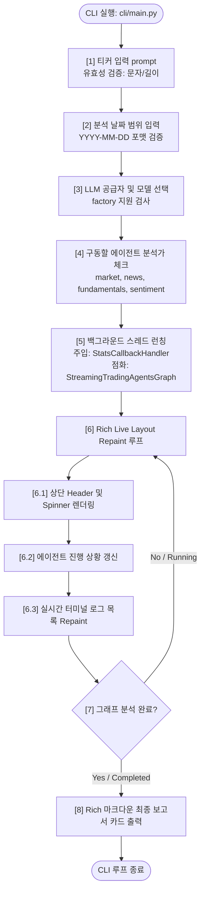
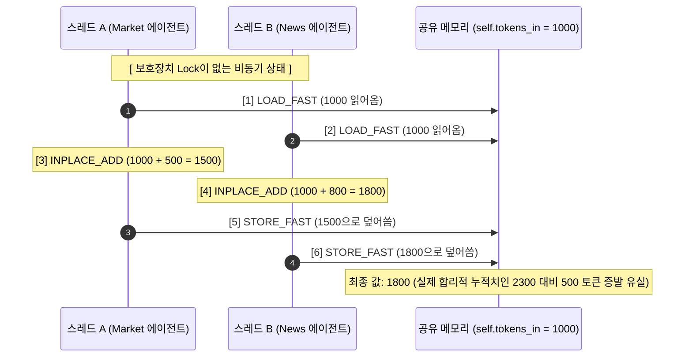
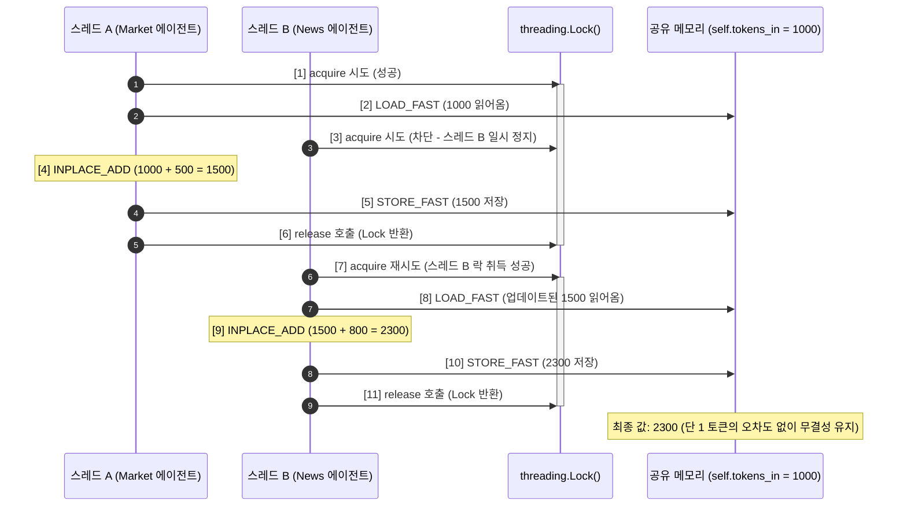

# 💻 대화형 CLI 인터페이스 & 멀티스레드 자원 동기화 명세서 (CLI & Thread Synchronization)

본 명세서는 대시보드 서버 가동 없이 터미널 환경에서 종목 분석 및 의사결정을 실시간 라이브 트리거하는 **Typer 및 Rich 기반 대화형 CLI 제어 루프**, LLM API 호출 횟수 및 실시간 트래픽 토큰 소모량을 정밀 산정 및 로깅하는 **`StatsCallbackHandler`** 구현체, 그리고 병렬 에이전트 노드들이 공용 수집 모듈에 동시 접근 시 데이터 무결성을 보장하기 위한 **스레드 상호 배제(Mutex Lock)** 설계 사양을 정밀 기술합니다. 본 문서는 옵시디언(Obsidian) 전용 링크 및 이미지 임베딩 포맷에 최적화되어 있습니다.

---

## 🧭 1. CLI 제어 루프 아키텍처

플랫폼의 CLI 엔진은 터미널 환경에서 직관적인 파라미터 구성과 고품격 대화 인터페이스를 제공하기 위해 다음과 같은 제어 루프 구조로 설계되었습니다:



---

## ⚔️ 2. Typer & Rich 기반 터미널 제어 루프 (CLI Command Loop)

터미널 환경에서도 웹 GUI 못지않은 시각적으로 수려한 라이브 상태 피드백을 구현하기 위해 Python **Typer** 프레임워크와 **Rich** 터미널 드로잉 툴킷을 융합 활용합니다. 

런타임 기동 시 단계별 입력 패널을 제공하며, 스레드가 런칭되면 독립 레이아웃 분할 창을 통해 진행 사항을 밀리초(ms) 단위로 자동 다시 그리기(Repaint)합니다.

![[cli_console_loop.png]]

### 📋 2.1 CLI 화면 구성 컴포넌트 구조

* **비블로킹 입력 제어 (Typer & Typer Prompt)**:
  * 런타임 진입 시 티커 명세, 분석 타겟 날짜, LLM 공급자 명세를 `typer.prompt` 및 `questionary` 컴포넌트를 통해 안전하게 스캔 및 유효성 검증(Regex Validation)합니다.
  * **진입 명령**: `python cli/main.py run --ticker AAPL --date 2026-05-31` 형태로 직접 실행도 가능합니다.
* **화면 분할 구조 (`Layout` & `Panel`)**:
  * Rich의 `Layout` 서브 모듈을 구동하여 터미널 스크린 좌표계를 격리 분할(Header, Upper[Progress, Messages], Analysis, Footer)합니다.
* **실시간 라이브 페인팅 (`Live` & `Live Repaint`)**:
  * 비동기 스레드가 백그라운드에서 진행될 때마다 `Live` 인스턴스가 뷰포트를 리프레시하여, 각 에이전트의 작동 상태(하늘색 스피너 감지)와 최근 12개의 도구 호출/메시지 행을 실시간으로 터미널 그리드 상에 안전하게 다시 렌더링합니다.

* **관련 소스 코드 위치**: `cli/main.py` $\rightarrow$ [[main.py#L465]] 및 `update_display` 함수

---

## 🧮 3. 실시간 토큰/API 감시 로깅 핸들러 (`StatsCallbackHandler`)

![[stats_callback_handler.png]]

다중 에이전트 연산 구동 시에는 누적 API 요금 방지 및 속도 제한(Rate Limit) 관리를 위해, 현재 시스템이 총 몇 번의 LLM/Tool 호출을 일으켰고 입력/출력 토큰을 얼마나 소비했는지 정밀 누계 산정할 메커니즘이 필수적입니다. 

이를 위해 시스템은 랭체인의 다양한 이벤트를 실시간으로 가로채는 **`StatsCallbackHandler`** 로깅 인터셉터를 구현했습니다. (로컬 LLM 클라이언트 팩토리: [[05_llm_clients.md]])

### 💻 3.1 `StatsCallbackHandler` 콜백 트리거 구현 명세
* **소스 코드 위치**: `cli/stats_handler.py` $\rightarrow$ [[stats_handler.py#L9]]

```python
class StatsCallbackHandler(BaseCallbackHandler):
    """LangChain의 수명주기 이벤트를 후킹하여 토큰 및 호출 횟수를 계측하는 스레드 세이프 핸들러입니다."""

    def __init__(self) -> None:
        super().__init__()
        self._lock = threading.Lock()
        self.llm_calls = 0
        self.tool_calls = 0
        self.tokens_in = 0
        self.tokens_out = 0

    def on_llm_start(
        self,
        serialized: Dict[str, Any],
        prompts: List[str],
        **kwargs: Any,
    ) -> None:
        """언어 모델의 프롬프트 전송 시점에 호출 회수를 안전하게 가산합니다."""
        with self._lock:
            self.llm_calls += 1

    def on_chat_model_start(
        self,
        serialized: Dict[str, Any],
        messages: List[List[Any]],
        **kwargs: Any,
    ) -> None:
        """대화형 챗 모델 시작 시점에 호출 회수를 안전하게 가산합니다."""
        with self._lock:
            self.llm_calls += 1

    def on_llm_end(self, response: LLMResult, **kwargs: Any) -> None:
        """LLM 응답 패킷이 반환되면 헤더의 usage_metadata를 가로채 토큰을 계측합니다."""
        try:
            generation = response.generations[0][0]
        except (IndexError, TypeError):
            return

        usage_metadata = None
        if hasattr(generation, "message"):
            message = generation.message
            if isinstance(message, AIMessage) and hasattr(message, "usage_metadata"):
                # LangChain 표준 usage_metadata 필드 조회
                usage_metadata = message.usage_metadata

        if usage_metadata:
            with self._lock:
                self.tokens_in += usage_metadata.get("input_tokens", 0)
                self.tokens_out += usage_metadata.get("output_tokens", 0)

    def on_tool_start(
        self,
        serialized: Dict[str, Any],
        input_str: str,
        **kwargs: Any,
    ) -> None:
        """에이전트가 외부 데이터 도구(Tools)를 구동할 때 카운트합니다."""
        with self._lock:
            self.tool_calls += 1

    def get_stats(self) -> Dict[str, Any]:
        """현재까지 계측된 정량 리소스 사용 지표를 원자적으로 조회 반환합니다."""
        with self._lock:
            return {
                "llm_calls": self.llm_calls,
                "tool_calls": self.tool_calls,
                "tokens_in": self.tokens_in,
                "tokens_out": self.tokens_out,
            }
```

---

## 🔒 4. 스레드 상호 배제 동기화 (Thread Mutual Exclusion / Mutex Lock)

![[mutex_thread_lock.png]]

### ⚔️ 4.1 Python 비원자적 증분 연산과 Race Condition

Python 인터프리터의 GIL(Global Interpreter Lock)이 활성화되어 있을지라도, 정수 증분 연산(`self.tokens_in += value`)은 컴퓨터 바이트코드 수준에서 **결코 원자적(Atomic)으로 실행되지 않습니다.** 

하나의 `+=` 연산은 실제로 다음과 같은 4가지 가상 머신 명령어 단계를 밟습니다:

1. `LOAD_FAST` (현재 `self.tokens_in` 주소의 값 로드)
2. `LOAD_CONST` (더할 `value` 상수 로드)
3. `INPLACE_ADD` (두 값을 산술 가산 수행)
4. `STORE_FAST` (연산된 결과를 다시 `self.tokens_in` 주소에 덮어쓰기)

만약 복수의 병렬 에이전트 스레드(Market Analyst, News Analyst 등)가 나노초 수준으로 동시에 실행을 완료하여 `on_llm_end` 콜백에 동시 진입하면 다음과 같은 **데이터 뭉개짐(Race Condition)** 버그가 유발됩니다:



이와 같이 스레드 A의 연산 완료 직후 스레드 B의 덮어쓰기로 인해 스레드 A가 기여한 토큰량(500)이 메모리 상에서 물리적으로 증발하게 됩니다.

### 🛡️ 4.2 Mutex Lock을 통한 스레드 세이프 안정성 확보

이러한 레이스 컨디션을 예방하기 위해, `StatsCallbackHandler`는 Python의 표준 동기화 기계인 `threading.Lock()`을 활용하여 임계 영역(Critical Section)의 동시 진입을 차단합니다.



* **상호 배제 원리**: 임계 코드 블록(`with self._lock:`)에 진입한 스레드가 자물쇠를 소유한 동안, 다른 모든 스레드는 CPU 런타임 대기열에서 안전하게 대기 상태(Block)를 유지합니다. 앞서 들어간 스레드가 갱신을 끝내고 자물쇠를 해제(release)하는 순간 대기 중이던 스레드가 교대로 안전 진입하므로 **병렬 초고속 에이전트 런타임 속에서도 API 사용량 데이터와 토큰 명세 누계가 100% 무결한 정량 상태를 상시 유지**하게 됩니다.
