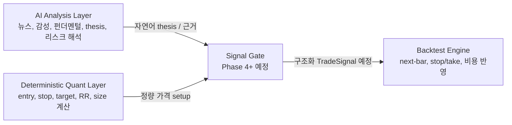
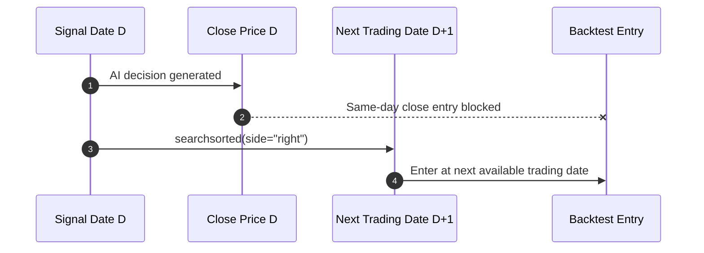
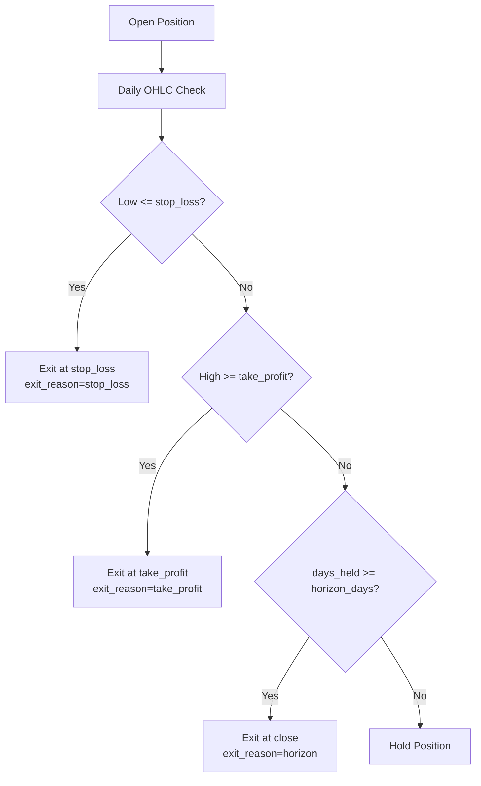
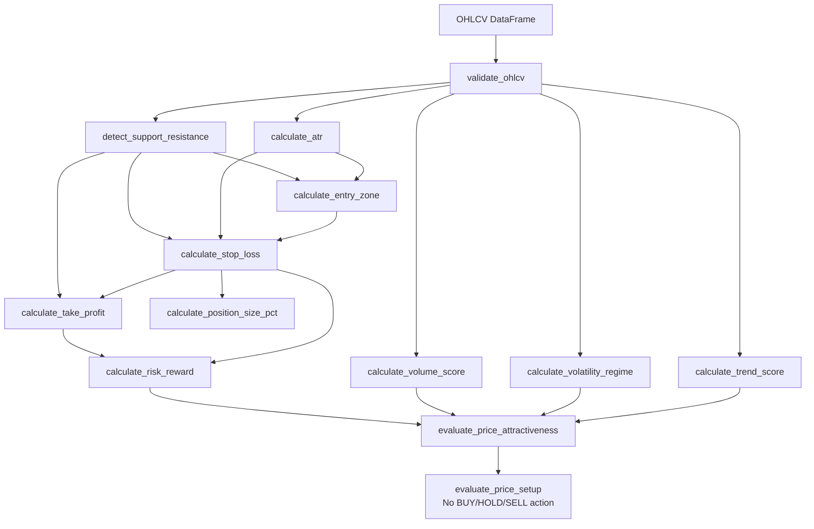
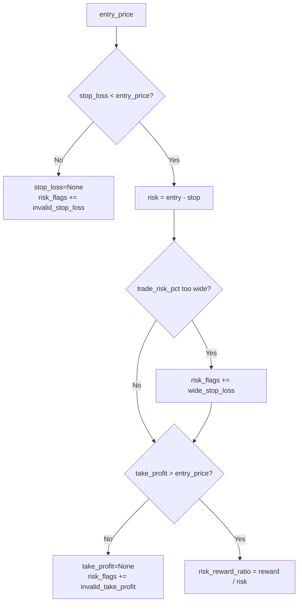
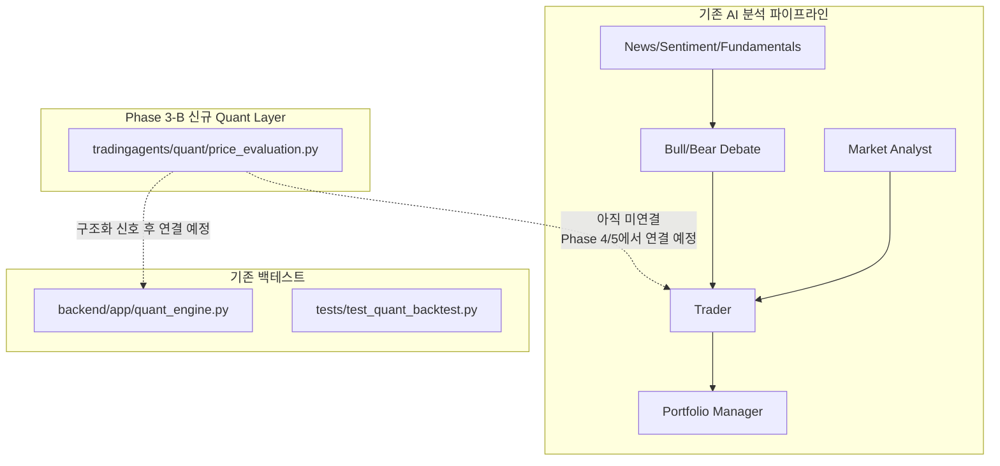
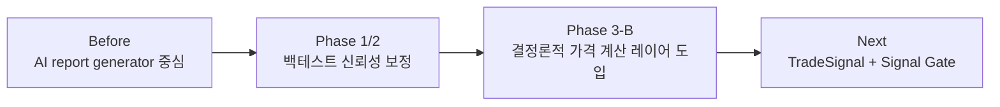

# Codex AI-Quant 개선 작업 결과 명세 (Phase 1 ~ Phase 3-B)

본 문서는 Codex를 통해 진행한 TradingAgents의 AI-Quant 개선 작업 결과를 Obsidian 문서 형식으로 정리한 기술 가이드입니다. 핵심 목적은 LLM이 생성하는 자연어 투자 의견과 실제 백테스트 가능한 정량 신호를 분리하고, 가격·손절·목표가·포지션 비중을 실제 OHLCV 기반 계산 레이어로 옮기는 것입니다.

관련 문서:

- [[00_master_index.md]]
- [[03_dataflows.md]]
- [[06_backend_api.md]]
- [[CODEX_MASTER_PLAN.md]]

![[tradingagents_overview.png]]

---

## 1. 전체 개선 방향

> [!IMPORTANT]
> 좋은 뉴스가 곧 좋은 매수가를 의미하지 않습니다. 좋은 기업이 곧 좋은 매매 기회를 의미하지도 않습니다. 이번 개선의 핵심은 **AI는 해석을 담당하고, 가격 수치는 결정론적 Quant Layer가 계산한다**는 역할 분리입니다.



### 핵심 원칙

- AI는 투자 논리, 이벤트 해석, 리스크 시나리오를 설명한다.
- Quant Layer는 매수가, 손절가, 목표가, risk/reward, 포지션 비중을 계산한다.
- AI의 `BUY` 의견은 최종 `BUY`의 충분조건이 아니다.
- 최종 거래 후보는 가격 위치, 손절폭, 목표가, risk/reward, 변동성, 거래량 조건을 통과해야 한다.
- 실제 주문 실행, 계좌 연동, 실시간 체결 처리는 이번 개선 범위가 아니다.

---

## 2. Phase 1 - 백테스트 누수 방지

![[time_machine_cheating.png]]

### 적용 결과

| 항목 | 기존 위험 | 개선 결과 |
|---|---|---|
| 신호일 체결 | 신호 생성일 종가로 당일 진입 가능 | 신호일 다음 거래일에만 진입 |
| 가격 결측 처리 | `ffill().bfill()`로 미래 가격이 과거로 채워질 수 있음 | `ffill()`만 사용 |
| 신호 스케줄링 | `signals_by_date` 같은 same-day scheduling 혼재 | `signals_by_entry_date` 기준으로 단일화 |



> [!NOTE]
> Phase 1 이후 백테스트 결과는 이전보다 보수적으로 해석해야 합니다. 당일 정보를 보고 당일 종가에 진입하던 낙관적 가정이 제거되었기 때문입니다.

### 관련 구현 영역

- `backend/app/quant_engine.py`
  - `fetch_price_history()`
  - `run_portfolio_backtest()`
- `tests/test_quant_backtest.py`
  - next-bar execution 검증
  - 마지막 거래일 신호 skip 검증
  - leading NaN이 미래 가격으로 채워지지 않는지 검증

---

## 3. Phase 2 - stop_loss / take_profit 백테스트 반영

![[ohlcv_candle_chart.png]]

### 적용 결과

Phase 2에서는 신호 dict에 optional `stop_loss`, `take_profit`, `trailing_stop_pct`를 받을 수 있게 하고, long-only 백테스트에서 손절/목표가 조기 청산을 반영했습니다.



> [!CAUTION]
> 일봉 OHLC 데이터에서는 같은 날짜 안에서 stop과 target 중 어느 쪽이 먼저 도달했는지 알 수 없습니다. 따라서 같은 일봉에서 둘 다 도달하면 보수적으로 `stop_loss`를 우선 처리합니다.

### 백테스트 해석 변화

- 기존: 보유기간 종료 시점의 close만으로 청산 성과가 계산됨.
- 개선 후: 보유 중 일봉 high/low가 stop 또는 target에 닿으면 조기 청산됨.
- 슬리피지는 기존 방식과 일관되게 진입/청산 가격에 반영됨.
- stop/take-profit이 없는 신호는 기존 horizon 기반 청산을 유지함.

### 남은 한계

- `trailing_stop_pct`는 입력/응답 필드로 보존하지만 실제 trailing stop 로직은 아직 구현하지 않았습니다.
- DB `Decision` 모델에는 stop/take-profit 필드가 없어 DB 기반 과거 신호에는 아직 자동 반영되지 않습니다.
- 장중 가격 경로는 알 수 없으므로 intraday 체결 순서는 확인할 수 없습니다.

---

## 4. Phase 3-B - 결정론적 가격 계산 레이어

![[vectorized_backtest_math.png]]

### 신규 모듈

| 파일 | 역할 |
|---|---|
| `tradingagents/quant/__init__.py` | Quant 계산 유틸 export |
| `tradingagents/quant/price_evaluation.py` | OHLCV 기반 순수 계산 함수 |
| `tests/test_price_evaluation.py` | 고정 fixture 기반 단위 테스트 |

> [!TIP]
> Phase 3-B는 아직 백테스트 엔진, Trader/PM prompt, DB/API/UI와 연결하지 않았습니다. 의도적으로 독립 계산 레이어만 만들었기 때문에 Phase 4의 `TradeSignal` 구조화와 자연스럽게 결합할 수 있습니다.

### Quant Layer 데이터 흐름



### 반환 구조 규칙

모든 결과 dict는 `TypedDict` 기반이며, 공통 키 이름을 다음 두 개로 통일했습니다.

```python
risk_flags: list[str]
calculation_basis: dict
```

> [!IMPORTANT]
> `warnings`, `flags`, `basis` 같은 대체 키 이름은 사용하지 않습니다. invalid 계산은 예외 폭발 대신 `None`과 명시적 `risk_flags`로 처리합니다.

### 구현 함수 요약

| 함수 | 책임 |
|---|---|
| `validate_ohlcv` | 컬럼 정규화, NaN/0 이하 가격/High < Low/짧은 데이터 검증 |
| `calculate_atr` | high, low, previous close 기반 True Range 및 ATR 계산 |
| `calculate_trend_score` | SMA20/SMA50/SMA200 기반 추세 점수 산출 |
| `calculate_volatility_regime` | ATR/close 기반 변동성 regime 분류 |
| `calculate_volume_score` | 20일 평균 대비 거래량 확인 |
| `detect_support_resistance` | 최신 봉을 제외한 과거 구간 support/resistance 탐지 |
| `calculate_entry_zone` | 최신 close 및 ATR/support/resistance 기반 entry zone 산출 |
| `calculate_stop_loss` | ATR stop/support stop 후보 중 long-only 유효 stop 선택 |
| `calculate_take_profit` | target RR 기반 목표가 및 resistance cap 반영 |
| `calculate_risk_reward` | `reward / risk` 계산 |
| `calculate_position_size_pct` | 손절폭 기반 risk budgeting position size 계산 |
| `evaluate_price_attractiveness` | RR, 추세, 거래량, 변동성, 저항 근접 risk flag 집계 |
| `evaluate_price_setup` | 전체 계산 orchestration, action은 반환하지 않음 |

### stop_loss / take_profit 규칙



### 포지션 사이징 공식

confidence 기반 sizing은 Phase 3-B에서 사용하지 않습니다. 손절폭 기반 risk budgeting만 사용합니다.

$$
trade\_risk\_pct = \frac{entry\_price - stop\_loss}{entry\_price}
$$

$$
position\_size\_pct = \min \left( \frac{account\_risk\_pct}{trade\_risk\_pct}, max\_position\_pct \right)
$$

---

## 5. 검증 현황

### 추가된 테스트 범위

| 테스트 주제 | 검증 내용 |
|---|---|
| ATR | True Range 수작업 계산과 일치 |
| Trend | 상승/하락/혼조 추세 점수 |
| Volatility | low/normal/high/extreme regime |
| Volume | volume 없음, 급증, 감소 |
| Support/Resistance | 최신 행 제외 계산 |
| Stop Loss | entry보다 낮아야 하며 invalid/wide flag 처리 |
| Take Profit | entry보다 커야 하며 resistance cap flag 처리 |
| Risk/Reward | `reward / risk` 및 invalid stop 안전 처리 |
| Position Sizing | 손절폭 기반 risk budgeting |
| Data Quality | NaN, 짧은 데이터, 0 이하 가격, High < Low |
| Integration | `evaluate_price_setup`에 action 키가 없는지 검증 |

### 실행 결과 메모

> [!WARNING]
> 현재 작업 환경에서는 `py` 런처와 `pytest` 모듈이 없어 요청한 pytest 명령은 실행되지 않았습니다.

실행 시도:

```powershell
py -m pytest tests/test_price_evaluation.py
py -m pytest tests/test_quant_backtest.py
```

결과:

- `py`: PowerShell에서 명령을 찾을 수 없음.
- 번들 Python: `pytest` 모듈 없음.
- 대체 검증: compile check와 핵심 시나리오 수동 검증은 통과.

---

## 6. 현재 구조에서의 위치



> [!NOTE]
> Phase 3-B는 독립 계산 레이어입니다. 즉, 현재 AI 분석 결과나 백테스트 입력을 자동으로 바꾸지는 않습니다. 이 선택은 Phase 1/2 동작을 보존하고, Phase 4에서 구조화 신호를 안전하게 도입하기 위한 것입니다.

---

## 7. 후속 작업 제안

| 우선순위 | 항목 | 이유 |
|---|---|---|
| P0 | Phase 4 `TradeSignal` 구조화 | AI 자연어 리포트와 백테스트 신호를 분리해야 Quant 결과를 안정적으로 저장 가능 |
| P0 | Signal Gate 도입 | AI BUY가 RR/가격/변동성 조건을 통과하지 못하면 WAIT/HOLD 처리 필요 |
| P1 | `stockstats_utils.py`의 `bfill()` 제거 | 기존 지표 경로에도 미래 가격 누수 가능성이 남아 있음 |
| P1 | DB/API에 stop/take/position fields 저장 | Phase 2 백테스트가 DB 기반 신호에서도 stop/take를 사용할 수 있게 됨 |
| P1 | `pytest` 실행 환경 정비 | 자동 회귀 검증 필요 |
| P2 | trailing stop 구현 | Phase 2에서 필드는 있으나 실제 청산 로직은 없음 |

> [!CAUTION]
> `tradingagents/dataflows/stockstats_utils.py`에는 아직 `ffill().bfill()`이 남아 있습니다. 이번 단계에서는 수정하지 않았고, 별도 Phase 또는 후속 이슈로 처리해야 합니다.

---

## 8. 요약

이번 Codex 작업으로 TradingAgents는 다음 방향으로 한 단계 이동했습니다.



- Phase 1: next-bar execution과 backfill 제거로 백테스트 누수 위험을 줄였습니다.
- Phase 2: stop_loss/take_profit 조기 청산을 백테스트 성과에 반영했습니다.
- Phase 3-B: OHLCV 기반 deterministic price evaluation layer를 독립 모듈로 추가했습니다.
- 아직 AI/백테스트/DB와 자동 연결하지 않았으므로, 다음 단계는 구조화 신호와 gate 설계입니다.
