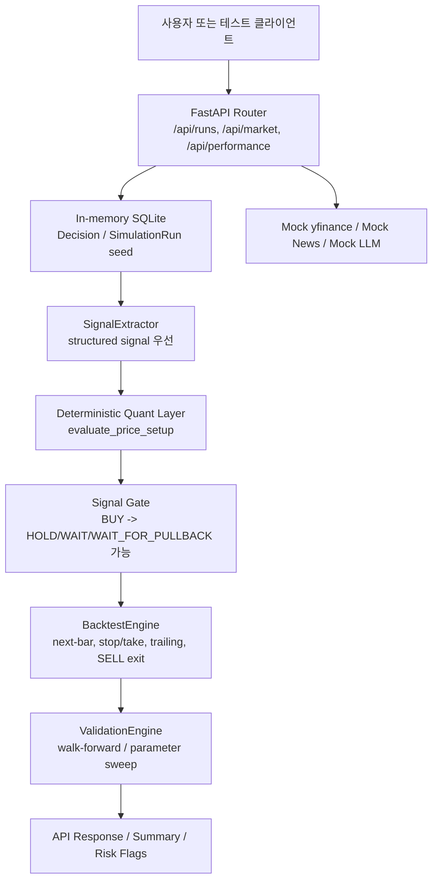
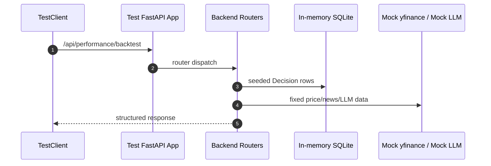
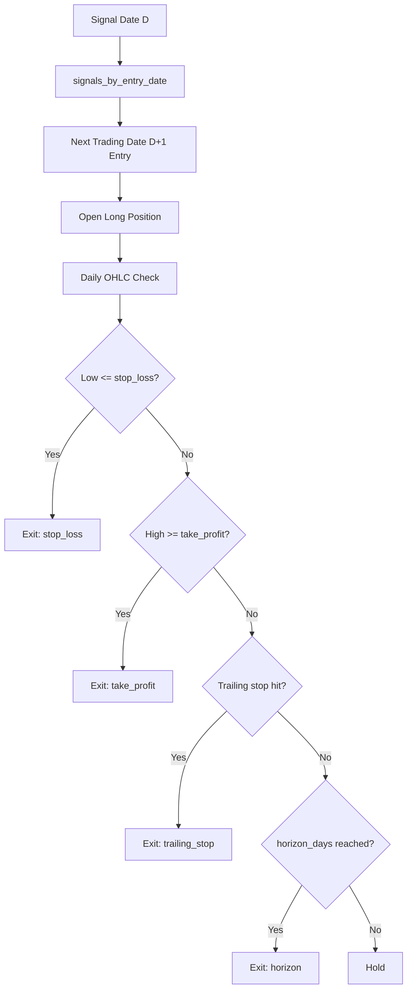
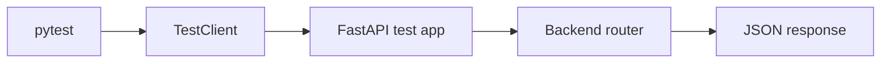
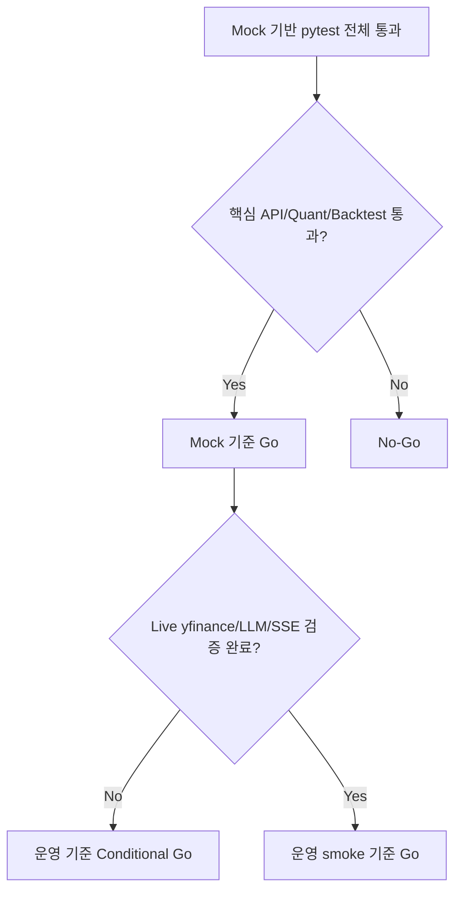

# 백엔드 테스트 및 목적 적합성 검증 리포트

본 문서는 TradingAgents 프로젝트에서 지금까지 진행한 테스트 과정과 결과를 Obsidian 노트 형식으로 정리한 백엔드 중심 검증 리포트입니다. 핵심 목적은 현재 백엔드가 실제 주문·계좌·체결 연동 없이도 **주식 가격 분석, AI 리포트 생성, 정량 가격 레벨 계산, 구조화 신호 저장, 백테스트 및 검증 API**를 기술적으로 수행할 수 있는지 판단하는 것입니다.

관련 문서:

- [[00_master_index.md]]
- [[03_dataflows.md]]
- [[06_backend_api.md]]
- [[09_codex_ai_quant_improvements.md]]
- [[CODEX_MASTER_PLAN.md]]

---

## 1. 최종 결론

> [!SUMMARY]
> **Mock 기반 기술 검증 기준으로는 Go입니다.**  
> 백엔드의 핵심 흐름인 `API 요청 → DB 신호 로드 → structured signal 파싱 → deterministic quant 보정 → signal gate → backtest/validation 결과 반환`은 테스트로 확인되었습니다.

단, 실제 외부 데이터와 LLM 서버까지 붙인 운영 관점에서는 아직 **Conditional Go**입니다.

| 판단 항목 | 결론 | 근거 |
|---|---|---|
| 백엔드 API 계약 | 통과 | TestClient 기반 API 테스트 통과 |
| 구조화 신호 파싱 | 통과 | `raw_json.trade_signal` 우선 사용 검증 |
| 정량 가격 계산 레이어 | 통과 | `evaluate_price_setup()` 단위/통합 테스트 통과 |
| 백테스트 신뢰성 | 통과 | next-bar, no-bfill, stop/take-profit, trailing stop, SELL exit 검증 |
| Phase H 검증 API | 통과 | walk-forward, parameter-sweep, validation-summary 검증 |
| 전체 Python 회귀 | 통과 | `297 passed, 1 skipped` |
| 실제 yfinance/LLM live 실행 | 추가 확인 필요 | 이번 검증은 Mock 중심 |
| 장시간 SSE/background run | 추가 확인 필요 | 단기 API/엔진 검증 중심 |

---

## 2. 검증 범위와 테스트 철학

이번 검증은 다음 원칙으로 진행했습니다.

> [!IMPORTANT]
> 이번 테스트는 수익률을 보장하거나 특정 매매 전략의 성과를 증명하는 테스트가 아닙니다.  
> 목적은 백엔드 코드가 **백테스트 가능한 AI-Quant 분석 시스템으로 기술적으로 연결되는지**를 확인하는 것입니다.

### 포함한 범위

- FastAPI 라우터 계약
- in-memory SQLite 기반 DB 흐름
- `Decision.raw_json.trade_signal` 기반 structured signal 우선 처리
- deterministic quant layer의 OHLCV 기반 가격 계산
- signal gate 적용
- backtest execution rule
- validation engine의 walk-forward / parameter sweep / risk flag 집계
- 전체 Python 테스트 회귀
- frontend build/lint는 보조 확인으로 수행

### 제외한 범위

- 실제 주문 API
- 계좌 연동
- 체결 처리
- 실제 브로커 연동
- 수익률 보장
- 외부 API live 품질 보장
- 실제 LLM 응답 품질 보장

---

## 3. 테스트 구조 개요



이 구조의 핵심은 외부 네트워크나 실제 DB 파일에 의존하지 않고도 백엔드의 주요 연결부를 재현 가능하게 검증한다는 점입니다.

---

## 4. 실행한 테스트 명령과 결과

### 4.1 Python 컴파일 확인

```powershell
.\.venv\Scripts\python.exe -m py_compile backend\app\main.py backend\app\services.py backend\app\quant_engine.py backend\app\validation_engine.py
```

결과:

```text
통과
```

의미:

- 주요 백엔드 모듈에 Python syntax error가 없습니다.
- import 가능한 수준의 문법적 안정성을 확인했습니다.

---

### 4.2 핵심 백엔드 검증 묶음

```powershell
.\.venv\Scripts\python.exe -m pytest tests\test_backend_api_contracts.py tests\test_validation_api.py tests\test_validation_engine.py tests\test_quant_backtest.py tests\test_price_evaluation.py -q
```

결과:

```text
64 passed, 2 warnings
```

검증한 의미:

- API contract 테스트
- validation API 테스트
- validation engine 테스트
- quant backtest 테스트
- deterministic price evaluation 테스트

> [!NOTE]
> 이 묶음은 백엔드 목적 적합성을 판단하는 데 가장 중요한 테스트 세트입니다. 전체 테스트보다 작지만, AI-Quant 분석 시스템의 핵심 경로를 집중 검증합니다.

---

### 4.3 전체 Python 테스트

```powershell
.\.venv\Scripts\python.exe -m pytest -q
```

결과:

```text
297 passed, 1 skipped, 9 warnings, 77 subtests passed
```

의미:

- 기존 에이전트, LLM client, dataflow, ticker validation, signal processing, memory log 관련 테스트까지 함께 통과했습니다.
- 새로 추가된 백엔드 검증 테스트가 기존 테스트들과 충돌하지 않습니다.

skip 항목:

| 항목 | 이유 |
|---|---|
| `tests/test_deepseek_reasoning.py` 일부 live API 테스트 | `DEEPSEEK_API_KEY`가 placeholder라 live 호출 생략 |

warning 항목:

| 경고 | 영향 |
|---|---|
| Starlette TestClient deprecation | 현재 테스트 실패 요인은 아님 |
| FastAPI `regex` deprecation | `/performance/decisions/export` query 옵션에서 향후 `pattern`으로 변경 권장 |
| Anthropic unknown model runtime warning | 테스트용 미래/가상 모델명에 대한 경고, 실패 아님 |

---

### 4.4 Frontend 보조 검증

```powershell
npm.cmd run build
```

결과:

```text
통과
```

추가 경고:

```text
Some chunks are larger than 500 kB after minification
```

의미:

- TypeScript compile과 Vite production build가 성공했습니다.
- 번들 크기 경고는 성능 최적화 이슈이며 기능 실패는 아닙니다.

```powershell
npm.cmd run lint
```

결과:

```text
0 errors, 13 warnings
```

의미:

- lint error는 없습니다.
- unused variable, React hook dependency, prefer-const 같은 warning은 남아 있습니다.

---

## 5. 테스트 파일별 검증 내용

### 5.1 `tests/test_backend_api_contracts.py`

이 테스트는 FastAPI 앱 전체를 직접 import하지 않고, main과 동일한 `/api` prefix로 라우터를 조립한 TestClient 전용 앱을 사용합니다.



검증한 내용:

| 테스트 | 확인 내용 |
|---|---|
| public API prefix | `/api/runs`, `/api/performance`, `/api/market`, `/api/news` 라우터 연결 확인 |
| backtest API | structured signal 기반 백테스트 응답 확인 |
| internal metadata 비노출 | `signal_risk_flags`, `signal_calculation_basis`가 public response에 노출되지 않음 |
| validation summary API | `/api/performance/validation-summary` 응답 구조 확인 |
| legacy performance endpoint | `/summary`, `/by-ticker`, `/decisions` 동작 확인 |
| runs API | 목록, 조회, 취소, 삭제, 생성 경계 확인 |
| market/news endpoint | mock yfinance 기반 OHLCV/news 응답 확인 |
| news interpret endpoint | mock LLM client 기반 해석 응답 확인 |

중요한 점:

- 실제 `trading_platform.db`를 쓰지 않습니다.
- 실제 yfinance 네트워크 호출을 하지 않습니다.
- 실제 LLM 서버를 호출하지 않습니다.
- background worker를 실제로 시작하지 않습니다.

---

### 5.2 `tests/test_validation_api.py`

검증한 내용:

| API | 검증 내용 |
|---|---|
| `POST /performance/walk-forward` | `windows`, `summary`, `risk_flag_counts`, `calculation_basis` 반환 |
| `POST /performance/parameter-sweep` | `best_parameters`, `best_summary`, `results` 반환 |
| `POST /performance/validation-summary` | `base_summary`, `summary`, `risk_flag_details`, breakdown 반환 |
| ticker filter | 요청 ticker만 `calculation_basis.signal_count`에 반영 |
| risk flag watchlist | point-in-time watchlist flag가 0건이어도 응답에 포함 |
| filter flag | 낮은 risk/reward 또는 낮은 price attractiveness가 필터링 flag로 집계 |

의미:

- Phase H 검증 API가 실제 HTTP 요청 형태로 동작합니다.
- DB column보다 `raw_json.trade_signal`이 우선됩니다.
- validation layer가 백테스트 엔진과 연결되어 있습니다.

---

### 5.3 `tests/test_validation_engine.py`

검증한 내용:

| 항목 | 설명 |
|---|---|
| parameter combination | sizing, slippage, risk/reward, attractiveness 조합 수 검증 |
| signal filtering | 낮은 risk/reward, 낮은 attractiveness 필터링 |
| best parameter 선택 | score 기준 최적 파라미터 선택 |
| walk-forward window | train/test window 분리와 summary 계산 |
| risk flag details | signal/filter event count와 실제 completed trade 영향도 분리 |
| affected_trade_count | 실제 완료된 trade에 연결된 flag만 trade 영향도로 집계 |

중요한 의미:

> [!TIP]
> `risk_flag_details[].count`는 "flag가 발견된 이벤트 수"이고,  
> `affected_trade_count`는 "실제로 완료된 백테스트 거래 중 해당 flag가 붙은 원본 signal에서 발생한 거래 수"입니다.

즉, 필터링으로 막힌 신호는 `count`에는 잡히지만 실제 거래가 없으므로 `affected_trade_count`는 0이 될 수 있습니다.

---

### 5.4 `tests/test_quant_backtest.py`

검증한 내용:

| 주제 | 확인 내용 |
|---|---|
| structured signal parsing | `entry_price`, `stop_loss`, `take_profit`, `position_size_pct`, `risk_flags` 보존 |
| DB raw_json 우선 | `Decision.raw_json.trade_signal`이 DB column보다 우선 |
| legacy fallback | raw text나 legacy DB column도 깨지지 않음 |
| next-bar execution | 신호일 당일이 아니라 다음 거래일 진입 |
| final day skip | 마지막 거래일 신호는 진입 불가 |
| no-bfill | leading NaN을 미래 가격으로 채우지 않음 |
| stop_loss | 일봉 low가 stop_loss 도달 시 조기 청산 |
| take_profit | 일봉 high가 take_profit 도달 시 조기 청산 |
| stop first | 같은 일봉에서 stop과 target 모두 도달하면 stop 우선 |
| horizon exit | stop/target 미도달 시 horizon 기준 청산 |
| trailing stop | trailing stop 조기 청산 |
| SELL/UNDERWEIGHT | long-only 구조에서 신규 short이 아니라 기존 long 청산 |
| position sizing | structured `position_size_pct`가 confidence sizing보다 우선 |
| extended metrics | CAGR, Sortino, Calmar, turnover, exposure 등 포함 |

백테스트 흐름:



---

### 5.5 `tests/test_price_evaluation.py`

검증한 내용:

| 함수/영역 | 확인 내용 |
|---|---|
| `validate_ohlcv` | NaN, 짧은 데이터, 0 이하 가격, High < Low 검증 |
| `calculate_atr` | high, low, previous close 기반 True Range 계산 |
| `calculate_trend_score` | 상승/하락/혼조 trend score 검증 |
| `calculate_volatility_regime` | volatility regime 임계값 검증 |
| `calculate_volume_score` | volume 없음, 급증, 감소 검증 |
| `detect_support_resistance` | 최신 행 제외한 support/resistance 계산 |
| `calculate_stop_loss` | long-only stop은 entry보다 낮아야 함 |
| `calculate_take_profit` | target은 entry보다 높아야 함 |
| `calculate_risk_reward` | reward / risk 계산 |
| `calculate_position_size_pct` | confidence가 아닌 손절폭 기반 risk budgeting |
| `evaluate_price_attractiveness` | poor RR, near resistance 등 risk flag 검증 |
| `evaluate_price_setup` | 통합 결과에 BUY/HOLD/SELL action 없음 |

의미:

- AI가 임의로 만든 가격 수치를 그대로 신뢰하지 않고, 실제 OHLCV 기반 계산값으로 백테스트 가능한 필드를 만들 수 있습니다.
- 이 레이어는 네트워크, DB, LLM 호출 없이 순수 계산으로 동작합니다.

---

## 6. 목적별 검증 결과

### 6.1 주식 가격 분석이 가능한가?

결론: **기술적으로 가능**

근거:

- `/api/market/{ticker}`는 OHLCV와 SMA/EMA/RSI/MACD를 반환하는 구조입니다.
- `tradingagents/quant/price_evaluation.py`는 OHLCV DataFrame에서 ATR, trend, volume, support/resistance, stop, target, risk/reward, position size를 계산합니다.
- 테스트에서 OHLCV 기반 계산 결과가 검증되었습니다.

제한:

- live yfinance rate limit, 데이터 누락, 심볼별 품질은 이번 Mock 검증에서 보장하지 않습니다.

---

### 6.2 AI 리포트와 정량 신호가 분리되는가?

결론: **핵심 구조는 분리됨**

근거:

- AI의 자연어 의사결정은 `decision_text`로 보존됩니다.
- 백테스트 가능한 신호는 `raw_json.trade_signal` 아래 structured dict로 저장됩니다.
- `SignalExtractor.parse_stored_decision_to_signal()`은 `raw_json.trade_signal`을 DB column보다 우선합니다.

제한:

- DB schema 자체에는 `stop_loss`, `take_profit`, `risk_reward_ratio` 전용 column이 없습니다.
- 현재는 `raw_json`에 structured signal을 저장하는 방식입니다.

---

### 6.3 AI가 가격 수치를 hallucination해도 방어 가능한가?

결론: **일부 방어 가능**

근거:

- 분석 실행 완료 후 `services.py`에서 `evaluate_price_setup()`을 호출하고, `SignalExtractor.enrich_with_price_setup()`이 deterministic price fields를 덮어씁니다.
- `apply_signal_gate()`가 risk/reward, data quality, price attractiveness, volume, volatility 조건을 검사합니다.

제한:

- `evaluate_price_setup()`이 실패하면 `quant_price_setup_unavailable` flag를 붙이는 fallback 경로로 갑니다.
- 이 경우 완전한 가격 보정은 되지 않으므로 live 실행에서 해당 flag 비율을 모니터링해야 합니다.

---

### 6.4 백테스트가 신뢰 가능한가?

결론: **Mock 기준 핵심 신뢰성 조건은 충족**

확인된 조건:

- no-bfill
- next-bar execution
- stop_loss 조기 청산
- take_profit 조기 청산
- 같은 일봉 내 stop 우선
- trailing stop
- SELL/UNDERWEIGHT long exit
- slippage 반영
- extended performance metrics

제한:

- 일봉 OHLC에서는 intraday 체결 순서를 정확히 알 수 없습니다.
- 그래서 같은 일봉에서 stop과 target이 모두 닿으면 보수적으로 stop 우선 처리합니다.
- 실제 체결가, 호가, 유동성, 주문 체결 실패는 범위 밖입니다.

---

### 6.5 validation API가 전략 검증에 도움이 되는가?

결론: **기술적으로 도움이 됨**

검증된 기능:

- walk-forward validation
- parameter sweep
- risk/reward threshold filtering
- price attractiveness filtering
- risk flag aggregation
- ticker/regime/period breakdown
- insufficient trade count flag

제한:

- v1 scoring은 단순 공식 기반입니다.
- 자동 전략 최적화 시스템이 아니라 검증 관리 콘솔 성격입니다.
- 과최적화 방지는 walk-forward와 sweep 결과 해석을 사용자가 함께 봐야 합니다.

---

## 7. 테스트가 실제로 어떻게 돌아가는가

### 7.1 TestClient 기반 API 테스트란?

TestClient는 실제 서버를 포트에 띄우지 않고도 FastAPI 라우터에 HTTP 요청을 보내는 테스트 도구입니다.



장점:

- 실제 HTTP request/response 형태를 검증합니다.
- 서버 포트를 열지 않아 빠릅니다.
- in-memory DB와 mock data를 연결할 수 있어 재현성이 높습니다.
- 네트워크 실패와 API rate limit에 흔들리지 않습니다.

한계:

- 실제 서버 프로세스, CORS, 브라우저, 네트워크 지연, 장시간 worker 실행은 별도 검증이 필요합니다.

---

### 7.2 monkeypatch란?

테스트 중 특정 함수나 객체를 임시로 바꿔 끼우는 방식입니다.

예:

- `BacktestEngine.fetch_price_history()`를 실제 yfinance 호출 대신 고정 DataFrame 반환으로 교체
- `yf.Ticker`를 fake ticker로 교체
- `create_llm_client()`를 fake LLM client로 교체

의미:

> [!NOTE]
> 테스트는 "외부 서비스가 정상인가"가 아니라 "우리 백엔드 코드가 받은 데이터를 올바르게 처리하는가"를 확인합니다.

---

### 7.3 in-memory SQLite란?

테스트용으로 메모리에만 존재하는 SQLite DB입니다.

장점:

- 실제 `trading_platform.db`를 건드리지 않습니다.
- 테스트가 끝나면 사라집니다.
- seed data를 원하는 형태로 정확히 넣을 수 있습니다.

주의:

- 실제 운영 DB 파일의 잠금, migration, 장기 보존 문제는 별도 검증해야 합니다.

---

## 8. 현재 확인된 리스크와 후속 확인 필요 항목

### P0 - live 실행 전 반드시 확인

| 항목 | 이유 | 확인 방법 |
|---|---|---|
| 실제 yfinance 데이터 호출 | Mock 테스트는 외부 API 품질을 보장하지 않음 | 대표 ticker 3~5개로 `/api/market/{ticker}` smoke test |
| 실제 LLM 서버 연결 | Mock LLM은 응답 품질/지연/오류를 보장하지 않음 | 로컬 LLM 또는 설정된 provider로 `/api/news/interpret`, `/api/runs` smoke test |
| 장시간 `/api/runs` 실행 | Background worker, SSE, DB update가 장시간 안정적인지 별도 확인 필요 | 단일 ticker run을 실제 실행하고 status/log/result 확인 |
| `trading_platform.db` modified 상태 | 테스트/실행 과정에서 실제 DB 파일이 변경될 수 있음 | commit 전 DB 파일 포함 여부 확인 및 필요 시 복구 |

### P1 - 안정성 개선 권장

| 항목 | 이유 | 개선 방향 |
|---|---|---|
| `backend.app.main` import 시 DB table 생성 | 테스트와 운영 side effect가 섞일 수 있음 | startup/lifespan 또는 명시적 init 단계로 분리 검토 |
| FastAPI `regex` deprecation | 향후 버전에서 warning 증가 가능 | `Query(..., pattern=...)`으로 변경 |
| TestClient deprecation warning | Starlette/httpx 버전 호환 경고 | 의존성 버전 정책 정리 또는 httpx2 검토 |
| 한글 로그/문자열 인코딩 깨짐 | 운영 관찰성과 UI 신뢰도 저하 | UTF-8 소스/문서/터미널 인코딩 정비 |

### P2 - 검증 체계 고도화

| 항목 | 이유 | 개선 방향 |
|---|---|---|
| API E2E live smoke | Mock만으로는 운영 환경 차이를 모두 못 잡음 | 별도 `live` marker 테스트 추가 |
| SSE stream 테스트 | 현재 단기 API 검증 중심 | run_id별 stream filtering과 disconnect 테스트 강화 |
| DB migration 전략 | raw_json 중심은 유연하지만 schema 안정성 한계 | migration 승인 후 structured fields 분리 검토 |
| point-in-time 데이터 품질 | fundamentals/news/social data는 시점 정확도 한계 | `as_of_date`, timestamp missing risk flag 강화 |

---

## 9. 사용자가 직접 확인하면 좋은 체크리스트

### 로컬 실행 전

- [ ] `.venv`가 존재하는지 확인
- [ ] `pytest`가 설치되어 있는지 확인
- [ ] `frontend/node_modules`가 설치되어 있는지 확인
- [ ] `.env` 또는 환경변수에 필요한 LLM 설정이 있는지 확인
- [ ] `trading_platform.db`를 git commit에 포함할지 제외할지 확인

### 백엔드 회귀 확인

```powershell
.\.venv\Scripts\python.exe -m pytest tests\test_backend_api_contracts.py tests\test_validation_api.py tests\test_validation_engine.py tests\test_quant_backtest.py tests\test_price_evaluation.py -q
```

기대 결과:

```text
64 passed
```

### 전체 Python 확인

```powershell
.\.venv\Scripts\python.exe -m pytest -q
```

기대 결과:

```text
297 passed, 1 skipped
```

### 프론트 보조 확인

```powershell
cd frontend
npm.cmd run build
npm.cmd run lint
```

기대 결과:

- build 성공
- lint error 0개
- warning은 현재 13개 수준

### live smoke test 후보

> [!CAUTION]
> 아래 항목은 외부 네트워크와 실제 LLM 설정에 의존합니다. Mock 테스트와 달리 환경에 따라 실패할 수 있습니다.

- [ ] `/api/market/AAPL?lookback_days=30`
- [ ] `/api/market/NVDA/news`
- [ ] `/api/news/interpret`
- [ ] `/api/runs` 단일 ticker 분석 실행
- [ ] `/api/performance/backtest`
- [ ] `/api/performance/validation-summary`

---

## 10. Go / Conditional Go 판단 기준



현재 위치:

- Mock 기준: **Go**
- 운영 live 기준: **Conditional Go**

---

## 11. 요약

이번 테스트 과정에서 확인한 핵심은 다음입니다.

- 백엔드 API 라우터는 `/api` prefix 기준으로 정상 연결됩니다.
- TestClient 기반 테스트로 실제 HTTP 요청/응답 형태를 검증했습니다.
- 테스트 DB는 in-memory SQLite를 사용하여 실제 DB 파일 의존을 차단했습니다.
- yfinance, news, LLM은 monkeypatch로 고정 mock을 사용하여 재현성을 확보했습니다.
- structured `raw_json.trade_signal`이 DB column보다 우선됩니다.
- AI가 생성한 가격 수치보다 deterministic quant layer의 계산값을 우선할 수 있는 구조가 있습니다.
- 백테스트는 next-bar execution, no-bfill, stop/take-profit, trailing stop, SELL exit를 반영합니다.
- validation API는 walk-forward, parameter sweep, risk flag 집계까지 반환합니다.
- 전체 Python 테스트는 통과했습니다.
- 실제 live 데이터, 실제 LLM, 장시간 SSE/background run은 아직 별도 확인이 필요합니다.

> [!FINAL]
> 현재 백엔드는 **AI 리포트 생성기**를 넘어 **백테스트 가능한 AI-Quant 분석 시스템**으로 동작할 수 있는 핵심 기술 구조를 갖추고 있습니다.  
> 다만 운영 환경에서 실제 외부 데이터와 LLM까지 포함한 안정성은 live smoke test로 별도 확인해야 합니다.
